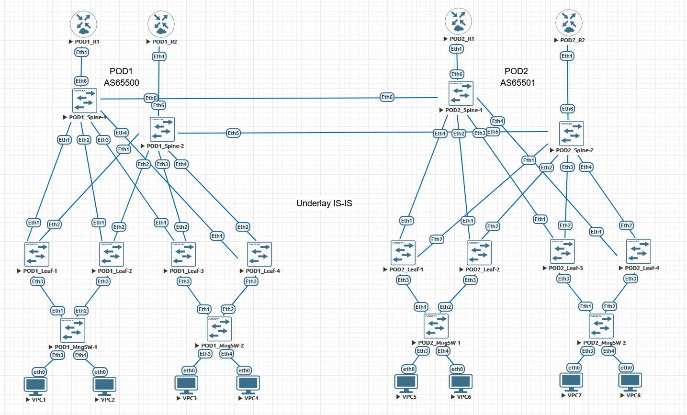

## Проектная работа "Построение распределенного ПАК 374-ФЗ для федерального оператора связи"

### Оглавление
1. [Цель](#цель)
2. [Задачи](#задачи)
3. [Сетевая топология](#Сетевая-топология)
4. [План IP адресации](#План-IP-адресации)
5. [Конфигурация оборудования](#Конфигурация-оборудования)
6. [Диагностика оборудования](#Диагностика-оборудования)

### Цель:
- Разработка архитектуры закрытого сетевого сегмента с использованием VXLAN\EVPN обеспечивающего L2/L3 транспорт для ПАК 374-ФЗ размещенного в двух георазнесенных ЦОД.

### Задачи:

- Проектирование отказоустойчивой и масштабируемой сетевой топологии для двух ЦОД
- Проектирование DCI interconnection 
- Проектирование адресного пространства
- Проектирование сетевых протоколов обеспечивающих оптимальную загрузку линий связи, балансировку трафика, безопасность и быструю сходимость.

### Сетевая топология:

В связи с направлением 90% потоков трафика Запад-Восток для подключения ПАК выбрана сетевая топология Clos. Для обеспечения необходимых L2/L3 сетевых сервисов и дополнительных функций выбрана технология VXLAN EVPN.<br>
DCI interconnection построен на Border Spine коммутаторах в целях оптимизации финансовых затрат на оборудование. Линии связи POD1 и POD2 для Border Spine обеспечиваются поверх двух DWDM каналов между площадками дополнительно зарезервированных средствами транспортной сети оператора связи. В качестве логической архитектуры для DCI выбрана архитектура Multipod.<br> 
Маршрутизаторы оператора связи подключенные в Border Spine обеспечивают внешнюю для VxLAN фабрики (изолированную от Интернет) IP связность (L3VPN) которая необходима для организации удаленного управления и передачи ~10% Data трафика до удаленных компонентов комплекса и потребителей. Коммуникация с оборудованием оператора связи организована по протоколу eBGP с настроенным контролем приема/передачи маршрутной информации (import/export route policy).<br> 
В реальном проекте конечные серверы будут иметь прямые multihome подключения в Leaf коммутаторы интерфейсами 10Gb/s для передачи данных, в учебном проекте данный аспект упрощен в связи с ограничениями мощностей лабораторного стенда.<br> 



### План IP адресации:

<details>
<summary> POD1 </summary>

Device|Interface|IP Address|Subnet Mask|Default GW
---|---|---|---|---
POD1-R-1|Lo1|1.1.1.1|255.255.255.255|-
-|Eth1|10.4.1.11|255.255.255.254|-
POD1-R-2|Lo1|1.1.1.2|255.255.255.255|-
-|Eth1|10.4.2.11|255.255.255.254|-
POD1-Spine-1|Lo1|10.0.1.0|255.255.255.255|-
-|Lo2|10.2.1.0|255.255.255.255|-
-|Eth1|10.4.1.0|255.255.255.254|-
-|Eth2|10.4.1.2|255.255.255.254|-
-|Eth3|10.4.1.4|255.255.255.254|-
-|Eth4|10.4.1.6|255.255.255.254|-
-|Eth5|10.4.1.8|255.255.255.254|-
-|Eth6|10.4.1.10|255.255.255.254|-
POD1-Spine-2|Lo1|10.0.2.0|255.255.255.255|-
-|Lo2|10.2.2.0|255.255.255.255|-
-|Eth1|10.4.2.0|255.255.255.254|-
-|Eth2|10.4.2.2|255.255.255.254|-
-|Eth3|10.4.2.4|255.255.255.254|-
-|Eth4|10.4.2.6|255.255.255.254|-
-|Eth5|10.4.2.8|255.255.255.254|-
-|Eth6|10.4.2.10|255.255.255.254|-
POD1-Leaf-1|Lo1|10.0.0.1|255.255.255.255|-
-|Lo2|10.2.0.1|255.255.255.255|-
-|Eth1|10.4.1.1|255.255.255.254|-
-|Eth2|10.4.2.1|255.255.255.254|-
-|vlan10|192.168.10.1|255.255.255.0|-
-|vlan11|192.168.11.1|255.255.255.0|-
POD1-Leaf-2|Lo1|10.0.0.2|255.255.255.255|-
-|Lo2|10.2.0.2|255.255.255.255|-
-|Eth1|10.4.1.3|255.255.255.254|-
-|Eth2|10.4.2.3|255.255.255.254|-
-|vlan10|192.168.10.1|255.255.255.0|-
-|vlan11|192.168.11.1|255.255.255.0|-
POD1-Leaf-3|Lo1|10.0.0.3|255.255.255.255|-
-|Lo2|10.2.0.3|255.255.255.255|-
-|Eth1|10.4.1.5|255.255.255.254|-
-|Eth2|10.4.2.5|255.255.255.254|-
-|vlan10|192.168.10.1|255.255.255.0|-
-|vlan11|192.168.11.1|255.255.255.0|-
POD1-Leaf-4|Lo1|10.0.0.4|255.255.255.255|-
-|Lo2|10.2.0.4|255.255.255.255|-
-|Eth1|10.4.1.7|255.255.255.254|-
-|Eth2|10.4.2.7|255.255.255.254|-
-|vlan10|192.168.10.1|255.255.255.0|-
-|vlan11|192.168.11.1|255.255.255.0|-
POD1-MngSW-1|vlan10|192.168.10.2|255.255.255.0|192.168.10.1
POD1-MngSW-2|vlan10|192.168.10.3|255.255.255.0|192.168.10.1
POD1-VPC1|Eth0|192.168.10.11|255.255.255.0|192.168.10.1
POD1-VPC2|Eth0|192.168.12.1|255.255.255.0|-
POD1-VPC3|Eth0|192.168.11.11|255.255.255.0|192.168.11.1
POD1-VPC4|Eth0|192.168.12.2|255.255.255.0|-
</details>

<details>
<summary> POD2 </summary>

Device|Interface|IP Address|Subnet Mask|Default GW
---|---|---|---|---
POD2-R-1|Lo1|2.2.2.1|255.255.255.255|-
-|Eth1|10.20.1.11|255.255.255.254|-
POD2-R-2|Lo1|2.2.2.2|255.255.255.255|-
-|Eth1|10.20.2.11|255.255.255.254|-
POD2-Spine-1|Lo1|10.16.1.0|255.255.255.255|-
-|Lo2|10.18.1.0|255.255.255.255|-
-|Eth1|10.20.1.0|255.255.255.254|-
-|Eth2|10.20.1.2|255.255.255.254|-
-|Eth3|10.20.1.4|255.255.255.254|-
-|Eth4|10.20.1.6|255.255.255.254|-
-|Eth5| 10.4.1.9|255.255.255.254|-
-|Eth6|10.20.1.10|255.255.255.254|-
POD2-Spine-2|Lo1|10.16.2.0|255.255.255.255|-
-|Lo2|10.18.2.0|255.255.255.255|-
-|Eth1|10.20.2.0|255.255.255.254|-
-|Eth2|10.20.2.2|255.255.255.254|-
-|Eth3|10.20.2.4|255.255.255.254|-
-|Eth4|10.20.2.6|255.255.255.254|-
-|Eth5|10.4.2.9|255.255.255.254|-
-|Eth6|10.20.2.10|255.255.255.254|-
POD2-Leaf-1|Lo1|10.16.0.1|255.255.255.255|-
-|Lo2|10.18.0.1|255.255.255.255|-
-|Eth1|10.20.1.1|255.255.255.254|-
-|Eth2|10.20.2.1|255.255.255.254|-
-|vlan100|192.168.100.1|255.255.255.0|-
-|vlan111|192.168.111.1|255.255.255.0|-
POD2-Leaf-2|Lo1|10.16.0.2|255.255.255.255|-
-|Lo2|10.18.0.2|255.255.255.255|-
-|Eth1|10.20.1.3|255.255.255.254|-
-|Eth2|10.20.2.3|255.255.255.254|-
-|vlan100|192.168.100.1|255.255.255.0|-
-|vlan111|192.168.111.1|255.255.255.0|-
POD2-Leaf-3|Lo1|10.16.0.3|255.255.255.255|-
-|Lo2|10.18.0.3|255.255.255.255|-
-|Eth1|10.20.1.5|255.255.255.254|-
-|Eth2|10.20.2.5|255.255.255.254|-
-|vlan100|192.168.100.1|255.255.255.0|-
-|vlan111|192.168.111.1|255.255.255.0|-
POD2-Leaf-4|Lo1|10.16.0.4|255.255.255.255|-
-|Lo2|10.18.0.4|255.255.255.255|-
-|Eth1|10.20.1.7|255.255.255.254|-
-|Eth2|10.20.2.7|255.255.255.254|-
-|vlan100|192.168.100.1|255.255.255.0|-
-|vlan111|192.168.111.1|255.255.255.0|-
POD2-MngSW-1|vlan100| 192.168.100.2|255.255.255.0| 192.168.100.1
POD2-MngSW-2|vlan100| 192.168.100.3|255.255.255.0| 192.168.100.1
POD2-VPC5|Eth0|192.168.100.11|255.255.255.0|192.168.100.1
POD2-VPC6|Eth0|192.168.12.3|255.255.255.0|-
POD2-VPC7|Eth0|192.168.111.11|255.255.255.0|192.168.111.1
POD2-VPC8|Eth0|192.168.12.4|255.255.255.0|-
</details>

Предназначение внешних (route type 5) и клиентских адресов.<br>
Адреса 1.1.1.1/32, 1.1.1.2/32, 2.2.2.1/32, 2.2.2.2/32 анонсируемые с маршрутизаторов оператора связи эмулируют подсети внешних компонентов и потребителей.<br>
Для управления серверами выбрыны маршрутизируемые по L3 подсети POD1 192.168.10.0/24 (vlan 10) и POD2 192.168.100.0/24 (vlan 100).<br>
Для передачи данных за пределы комплекса выбрыны маршрутизируемые по L3 подсети POD1 192.168.11.0/24 (vlan 11) и POD2 192.168.111.0/24 (vlan 111).<br>
Для передачи контента внутри фабрики по L2 выбраны подсети общие для обоих POD 192.168.12.0/24 (vlan 12), POD 192.168.13.0/24 (vlan 13), POD 192.168.14.0/24 (vlan 14), POD 192.168.15.0/24 (vlan 15), POD 192.168.16.0/24 (vlan 16), POD 192.168.17.0/24 (vlan 17).<br>
В целях упрощения и сокращения конфигурации проекта часть подсетей для внутреннего L2 взаимодействия POD 192.168.13.0/24 - POD 192.168.17.0/24 на VPC не настроены, т.к. их взаимодействие будет аналогично приведенному взаимодействию хостов в подсети 192.168.12.0/24.<br>

### Конфигурация оборудования:

Для реализации VXLAN EVPN фабрики выбраны и используются следующие протоколы и технологии:<br>
Underlay - протокол IS-IS с оптимизациями level-1 и network point-to-point.<br>
Overlay - протокол iBGP внутри POD и eBGP между POD.<br>
DCI архитектура - Multipod<br>
Для подключения конечных серверов (менедмент коммутаторов) по Multihome используется ESI LAG.<br>
На DCI линках включен протокол BFD (для IS-IS) для ускорения сходимости в случае отказов DWDM каналов между POD.<br>
На eBGP сессиях между POD включена BGP аутентификация.<br>
На маршрутизаторах оператора настроены prefix list на import/export для контроля маршрутной информации между маршрутизаторами оператора и фабрикой.<br>
На интерфейсах между Leaf - Spine, Spine-Spine увеличен MTU до 9000 байт.<br>

<details>
<summary> POD1-R1 </summary>
 
 ```
POD1-R1#show running-config 
! Command: show running-config
! device: POD1-R1 (vEOS-lab, EOS-4.29.2F)
!
! boot system flash:/vEOS-lab.swi
!
no aaa root
!
transceiver qsfp default-mode 4x10G
!
service routing protocols model multi-agent
!
hostname POD1-R1
!
spanning-tree mode mstp
!
interface Ethernet1
   description POD1-Spine-1 | Eth6
   no switchport
   ip address 10.4.1.11/31
!
interface Ethernet2
!
interface Ethernet3
!
interface Ethernet4
!
interface Ethernet5
!
interface Ethernet6
!
interface Ethernet7
!
interface Ethernet8
!
interface Loopback1
   ip address 1.1.1.1/32
!
interface Management1
!
ip routing
!
ip prefix-list routed_net_PAK374_in seq 10 permit 192.168.10.0/24 le 32
ip prefix-list routed_net_PAK374_in seq 20 permit 192.168.11.0/24 le 32
ip prefix-list routed_net_PAK374_in seq 30 permit 192.168.111.0/24 le 32
ip prefix-list routed_net_PAK374_in seq 40 permit 192.168.100.0/24 le 32
ip prefix-list routed_net_PAK374_out seq 10 permit 1.1.1.1/32
!
router bgp 31133
   router-id 1.1.1.1
   neighbor 10.4.1.10 remote-as 65500
   neighbor 10.4.1.10 description to_POD1-Spine-1
   !
   address-family ipv4
      neighbor 10.4.1.10 activate
      neighbor 10.4.1.10 prefix-list routed_net_PAK374_in in
      neighbor 10.4.1.10 prefix-list routed_net_PAK374_out out
      network 1.1.1.1/32
!
end
```
</details>
<details>
<summary> POD1-R2 </summary>
 
 ```
POD1-R2#show running-config 
! Command: show running-config
! device: POD1-R2 (vEOS-lab, EOS-4.29.2F)
!
! boot system flash:/vEOS-lab.swi
!
no aaa root
!
transceiver qsfp default-mode 4x10G
!
service routing protocols model multi-agent
!
hostname POD1-R2
!
spanning-tree mode mstp
!
interface Ethernet1
   description POD1-Spine-2 | Eth6
   no switchport
   ip address 10.4.2.11/31
!
interface Ethernet2
!
interface Ethernet3
!
interface Ethernet4
!
interface Ethernet5
!
interface Ethernet6
!
interface Ethernet7
!
interface Ethernet8
!
interface Loopback1
   ip address 1.1.1.2/32
!
interface Management1
!
ip routing
!
ip prefix-list routed_net_PAK374_in seq 10 permit 192.168.10.0/24 le 32
ip prefix-list routed_net_PAK374_in seq 20 permit 192.168.11.0/24 le 32
ip prefix-list routed_net_PAK374_in seq 30 permit 192.168.111.0/24 le 32
ip prefix-list routed_net_PAK374_in seq 40 permit 192.168.100.0/24 le 32
ip prefix-list routed_net_PAK374_out seq 10 permit 1.1.1.2/32
!
router bgp 31133
   router-id 1.1.1.2
   neighbor 10.4.2.10 remote-as 65500
   neighbor 10.4.2.10 description to_POD1-Spine-2
   !
   address-family ipv4
      neighbor 10.4.2.10 activate
      neighbor 10.4.2.10 prefix-list routed_net_PAK374_in in
      neighbor 10.4.2.10 prefix-list routed_net_PAK374_out out
      network 1.1.1.2/32
!
end
```
</details>
<details>
<summary> POD1-Spine-1 </summary>
 
 ```
POD1-Spine-1#show running-config 
! Command: show running-config
! device: POD1-Spine-1 (vEOS-lab, EOS-4.29.2F)
!
! boot system flash:/vEOS-lab.swi
!
no aaa root
!
transceiver qsfp default-mode 4x10G
!
service routing protocols model multi-agent
!
hostname POD1-Spine-1
!
spanning-tree mode mstp
!
vrf instance vrf-vxlan
!
interface Ethernet1
   description POD1-Leaf-1 | Eth1
   mtu 9000
   no switchport
   ip address 10.4.1.0/31
   isis enable Underlay
   isis network point-to-point
!
interface Ethernet2
   description POD1-Leaf-2 | Eth1
   mtu 9000
   no switchport
   ip address 10.4.1.2/31
   isis enable Underlay
   isis network point-to-point
!
interface Ethernet3
   description POD1-Leaf-3 | Eth1
   mtu 9000
   no switchport
   ip address 10.4.1.4/31
   isis enable Underlay
   isis network point-to-point
!
interface Ethernet4
   description POD1-Leaf-4 | Eth1
   mtu 9000
   no switchport
   ip address 10.4.1.6/31
   isis enable Underlay
   isis network point-to-point
!
interface Ethernet5
   description POD2-Spine-1 | Eth5
   mtu 9000
   no switchport
   ip address 10.4.1.8/31
   isis enable Underlay
   isis bfd
   isis network point-to-point
!
interface Ethernet6
   description POD1-R-1 | Eth1
   no switchport
   vrf vrf-vxlan
   ip address 10.4.1.10/31
!
interface Ethernet7
!
interface Ethernet8
!
interface Loopback1
   description underlay
   ip address 10.0.1.0/32
   isis enable Underlay
   isis passive
!
interface Loopback2
   description overlay
   ip address 10.2.1.0/32
   isis enable Underlay
   isis passive
!
interface Management1
!
interface Vxlan1
   vxlan source-interface Loopback2
   vxlan udp-port 4789
   vxlan vrf vrf-vxlan vni 50000
   vxlan learn-restrict any
!
ip routing
ip routing vrf vrf-vxlan
!
router bgp 65500
   neighbor EVPN-OVERLAY peer group
   neighbor EVPN-OVERLAY remote-as 65500
   neighbor EVPN-OVERLAY update-source Loopback2
   neighbor EVPN-OVERLAY description Leaf's
   neighbor EVPN-OVERLAY route-reflector-client
   neighbor EVPN-OVERLAY send-community extended
   neighbor 10.2.0.1 peer group EVPN-OVERLAY
   neighbor 10.2.0.2 peer group EVPN-OVERLAY
   neighbor 10.2.0.3 peer group EVPN-OVERLAY
   neighbor 10.2.0.4 peer group EVPN-OVERLAY
   neighbor 10.18.1.0 remote-as 65501
   neighbor 10.18.1.0 next-hop-unchanged
   neighbor 10.18.1.0 update-source Loopback2
   neighbor 10.18.1.0 description to_POD2-Spine-1
   neighbor 10.18.1.0 ebgp-multihop 3
   neighbor 10.18.1.0 password 7 yQpyPEcxlArE4k52fv+jfA==
   neighbor 10.18.1.0 send-community extended
   !
   address-family evpn
      neighbor EVPN-OVERLAY activate
      neighbor 10.18.1.0 activate
   !
   address-family ipv4
      neighbor 10.4.1.11 activate
   !
   vrf vrf-vxlan
      rd 10.2.1.0:1
      route-target import evpn 1:50000
      route-target export evpn 1:50000
      neighbor 10.4.1.11 remote-as 31133
      neighbor 10.4.1.11 description to_POD1-R-1
      redistribute connected
!
router isis Underlay
   net 49.0052.0100.0000.1000.00
   is-type level-1
   !
   address-family ipv4 unicast
!
end
```
</details>
<details>
<summary> POD1-Spine-2 </summary>
 
 ```
POD1-Spine-2#show running-config 
! Command: show running-config
! device: POD1-Spine-2 (vEOS-lab, EOS-4.29.2F)
!
! boot system flash:/vEOS-lab.swi
!
no aaa root
!
transceiver qsfp default-mode 4x10G
!
service routing protocols model multi-agent
!
hostname POD1-Spine-2
!
spanning-tree mode mstp
!
vrf instance vrf-vxlan
!
interface Ethernet1
   description POD1-Leaf-1 | Eth2
   mtu 9000
   no switchport
   ip address 10.4.2.0/31
   isis enable Underlay
   isis network point-to-point
!
interface Ethernet2
   description POD1-Leaf-2 | Eth2
   mtu 9000
   no switchport
   ip address 10.4.2.2/31
   isis enable Underlay
   isis network point-to-point
!
interface Ethernet3
   description POD1-Leaf-3 | Eth2
   mtu 9000
   no switchport
   ip address 10.4.2.4/31
   isis enable Underlay
   isis network point-to-point
!
interface Ethernet4
   description POD1-Leaf-4 | Eth2
   mtu 9000
   no switchport
   ip address 10.4.2.6/31
   isis enable Underlay
   isis network point-to-point
!
interface Ethernet5
   description POD2-Spine-2 | Eth5
   mtu 9000
   no switchport
   ip address 10.4.2.8/31
   isis enable Underlay
   isis bfd
   isis network point-to-point
!
interface Ethernet6
   description POD1-R2 | Eth1
   no switchport
   vrf vrf-vxlan
   ip address 10.4.2.10/31
!
interface Ethernet7
!
interface Ethernet8
!
interface Loopback1
   description Underlay
   ip address 10.0.2.0/32
   isis enable Underlay
   isis passive
!
interface Loopback2
   description Overlay
   ip address 10.2.2.0/32
   isis enable Underlay
   isis passive
!
interface Management1
!
interface Vxlan1
   vxlan source-interface Loopback2
   vxlan udp-port 4789
   vxlan vrf vrf-vxlan vni 50000
   vxlan learn-restrict any
!
ip routing
ip routing vrf vrf-vxlan
!
router bgp 65500
   neighbor EVPN-OVERLAY peer group
   neighbor EVPN-OVERLAY remote-as 65500
   neighbor EVPN-OVERLAY update-source Loopback2
   neighbor EVPN-OVERLAY description Leaf's
   neighbor EVPN-OVERLAY route-reflector-client
   neighbor EVPN-OVERLAY send-community extended
   neighbor 10.2.0.1 peer group EVPN-OVERLAY
   neighbor 10.2.0.2 peer group EVPN-OVERLAY
   neighbor 10.2.0.3 peer group EVPN-OVERLAY
   neighbor 10.2.0.4 peer group EVPN-OVERLAY
   neighbor 10.18.2.0 remote-as 65501
   neighbor 10.18.2.0 next-hop-unchanged
   neighbor 10.18.2.0 update-source Loopback2
   neighbor 10.18.2.0 description to_POD2-Spine-2
   neighbor 10.18.2.0 ebgp-multihop 3
   neighbor 10.18.2.0 password 7 xj1WqXRog2AhV2x9eLWo8Q==
   neighbor 10.18.2.0 send-community extended
   !
   address-family evpn
      neighbor EVPN-OVERLAY activate
      neighbor 10.18.2.0 activate
   !
   address-family ipv4
      neighbor 10.4.2.11 activate
   !
   vrf vrf-vxlan
      rd 10.2.2.0:1
      route-target import evpn 1:50000
      route-target export evpn 1:50000
      neighbor 10.4.2.11 remote-as 31133
      neighbor 10.4.2.11 description to_POD1-R-1
      redistribute connected
!
router isis Underlay
   net 49.0052.0100.0000.2000.00
   is-type level-1
   !
   address-family ipv4 unicast
!
end
```
</details>
<details>
<summary> POD1-Leaf-1 </summary>
 
 ```
POD1-Leaf-1#show running-config 
! Command: show running-config
! device: POD1-Leaf-1 (vEOS-lab, EOS-4.29.2F)
!
! boot system flash:/vEOS-lab.swi
!
no aaa root
!
transceiver qsfp default-mode 4x10G
!
service routing protocols model multi-agent
!
hostname POD1-Leaf-1
!
spanning-tree mode mstp
!
vlan 10
   name POD1_Management
!
vlan 11
   name POD1_Data538
!
vlan 12
   name Data374_1
!
vlan 13
   name Data374_2
!
vlan 14
   name Data374_3
!
vlan 15
   name Data374_4
!
vlan 16
   name Data374_5
!
vlan 17
   name Data374_6
!
vrf instance vrf-vxlan
!
interface Port-Channel1
   switchport trunk allowed vlan 10-17
   switchport mode trunk
   !
   evpn ethernet-segment
      identifier 00cc:cccc:cccc:cccc:cccc
      route-target import cc:cc:cc:cc:cc:cc
   lacp system-id 1111.1111.1111
!
interface Ethernet1
   description POD1-Spine-1 | Eth1
   mtu 9000
   no switchport
   ip address 10.4.1.1/31
   isis enable Underlay
   isis network point-to-point
!
interface Ethernet2
   description POD1-Spine-2 | Eth1
   mtu 9000
   no switchport
   ip address 10.4.2.1/31
   isis enable Underlay
   isis network point-to-point
!
interface Ethernet3
   description POD1-MngSW-1 | Eth1
   channel-group 1 mode active
   lacp timer fast
!
interface Ethernet4
!
interface Ethernet5
!
interface Ethernet6
!
interface Ethernet7
!
interface Ethernet8
!
interface Loopback1
   description underlay
   ip address 10.0.0.1/32
   isis enable Underlay
   isis passive
!
interface Loopback2
   description Overlay
   ip address 10.2.0.1/32
   isis enable Underlay
   isis passive
!
interface Management1
!
interface Vlan10
   vrf vrf-vxlan
   ip address virtual 192.168.10.1/24
!
interface Vlan11
   vrf vrf-vxlan
   ip address virtual 192.168.11.1/24
!
interface Vxlan1
   vxlan source-interface Loopback2
   vxlan udp-port 4789
   vxlan vlan 10 vni 1010
   vxlan vlan 11 vni 1011
   vxlan vlan 12 vni 1012
   vxlan vlan 13 vni 1013
   vxlan vlan 14 vni 1014
   vxlan vlan 15 vni 1015
   vxlan vlan 16 vni 1016
   vxlan vlan 17 vni 1017
   vxlan vrf vrf-vxlan vni 50000
   vxlan learn-restrict any
!
ip virtual-router mac-address 00:00:11:22:33:44
!
ip routing
ip routing vrf vrf-vxlan
!
router bgp 65500
   neighbor EVPN-OVERLAY peer group
   neighbor EVPN-OVERLAY remote-as 65500
   neighbor EVPN-OVERLAY update-source Loopback2
   neighbor EVPN-OVERLAY send-community extended
   neighbor 10.2.1.0 peer group EVPN-OVERLAY
   neighbor 10.2.2.0 peer group EVPN-OVERLAY
   !
   vlan 10
      rd 10.2.0.1:1010
      route-target both 1010:1010
      redistribute learned
   !
   vlan 11
      rd 10.2.0.1:1011
      route-target both 1011:1011
      redistribute learned
   !
   vlan 12
      rd 10.2.0.1:1012
      route-target both 1012:1012
      redistribute learned
   !
   vlan 13
      rd 10.2.0.1:1013
      route-target both 1013:1013
      redistribute learned
   !
   vlan 14
      rd 10.2.0.1:1014
      route-target both 1014:1014
      redistribute learned
   !
   vlan 15
      rd 10.2.0.1:1015
      route-target both 1015:1015
      redistribute learned
   !
   vlan 16
      rd 10.2.0.1:1016
      route-target both 1016:1016
      redistribute learned
   !
   vlan 17
      rd 10.2.0.1:1017
      route-target both 1017:1017
      redistribute learned
   !
   address-family evpn
      neighbor EVPN-OVERLAY activate
   !
   vrf vrf-vxlan
      rd 10.2.0.1:1
      route-target import evpn 1:50000
      route-target export evpn 1:50000
      redistribute connected
!
router isis Underlay
   net 49.0052.0100.0000.0001.00
   is-type level-1
   !
   address-family ipv4 unicast
!
end
```
</details>
<details>
<summary> POD1-Leaf-2 </summary>
 
 ```
POD1-Leaf-2#show running-config 
! Command: show running-config
! device: POD1-Leaf-2 (vEOS-lab, EOS-4.29.2F)
!
! boot system flash:/vEOS-lab.swi
!
no aaa root
!
transceiver qsfp default-mode 4x10G
!
service routing protocols model multi-agent
!
hostname POD1-Leaf-2
!
spanning-tree mode mstp
!
vlan 10
   name POD1_Management
!
vlan 11
   name POD1_Data538
!
vlan 12
   name Data374_1
!
vlan 13
   name Data374_2
!
vlan 14
   name Data374_3
!
vlan 15
   name Data374_4
!
vlan 16
   name Data374_5
!
vlan 17
   name Data374_6
!
vrf instance vrf-vxlan
!
interface Port-Channel1
   switchport trunk allowed vlan 10-17
   switchport mode trunk
   !
   evpn ethernet-segment
      identifier 00cc:cccc:cccc:cccc:cccc
      route-target import cc:cc:cc:cc:cc:cc
   lacp system-id 1111.1111.1111
!
interface Ethernet1
   description POD1-Spine-1 | Eth2
   mtu 9000
   no switchport
   ip address 10.4.1.3/31
   isis enable Underlay
   isis network point-to-point
!
interface Ethernet2
   description POD1-Spine-2 | Eth2
   mtu 9000
   no switchport
   ip address 10.4.2.3/31
   isis enable Underlay
   isis network point-to-point
!
interface Ethernet3
   description POD1-MngSW-1 | Eth2
   channel-group 1 mode active
   lacp timer fast
!
interface Ethernet4
!
interface Ethernet5
!
interface Ethernet6
!
interface Ethernet7
!
interface Ethernet8
!
interface Loopback1
   description underlay
   ip address 10.0.0.2/32
   isis enable Underlay
   isis passive
!
interface Loopback2
   description Overlay
   ip address 10.2.0.2/32
   isis enable Underlay
   isis passive
!
interface Management1
!
interface Vlan10
   vrf vrf-vxlan
   ip address virtual 192.168.10.1/24
!
interface Vlan11
   vrf vrf-vxlan
   ip address virtual 192.168.11.1/24
!
interface Vxlan1
   vxlan source-interface Loopback2
   vxlan udp-port 4789
   vxlan vlan 10 vni 1010
   vxlan vlan 11 vni 1011
   vxlan vlan 12 vni 1012
   vxlan vlan 13 vni 1013
   vxlan vlan 14 vni 1014
   vxlan vlan 15 vni 1015
   vxlan vlan 16 vni 1016
   vxlan vlan 17 vni 1017
   vxlan vrf vrf-vxlan vni 50000
   vxlan learn-restrict any
!
ip virtual-router mac-address 00:00:11:22:33:44
!
ip routing
ip routing vrf vrf-vxlan
!
router bgp 65500
   neighbor EVPN-OVERLAY peer group
   neighbor EVPN-OVERLAY remote-as 65500
   neighbor EVPN-OVERLAY update-source Loopback2
   neighbor EVPN-OVERLAY send-community extended
   neighbor 10.2.1.0 peer group EVPN-OVERLAY
   neighbor 10.2.2.0 peer group EVPN-OVERLAY
   !
   vlan 10
      rd 10.2.0.2:1010
      route-target both 1010:1010
      redistribute learned
   !
   vlan 11
      rd 10.2.0.2:1011
      route-target both 1011:1011
      redistribute learned
   !
   vlan 12
      rd 10.2.0.2:1012
      route-target both 1012:1012
      redistribute learned
   !
   vlan 13
      rd 10.2.0.2:1013
      route-target both 1013:1013
      redistribute learned
   !
   vlan 14
      rd 10.2.0.2:1014
      route-target both 1014:1014
      redistribute learned
   !
   vlan 15
      rd 10.2.0.2:1015
      route-target both 1015:1015
      redistribute learned
   !
   vlan 16
      rd 10.2.0.2:1016
      route-target both 1016:1016
      redistribute learned
   !
   vlan 17
      rd 10.2.0.2:1017
      route-target both 1017:1017
      redistribute learned
   !
   address-family evpn
      neighbor EVPN-OVERLAY activate
   !
   vrf vrf-vxlan
      rd 10.2.0.2:1
      route-target import evpn 1:50000
      route-target export evpn 1:50000
      redistribute connected
!
router isis Underlay
   net 49.0052.0100.0000.0002.00
   is-type level-1
   !
   address-family ipv4 unicast
!
end
```
</details>
<details>
<summary> POD1-Leaf-3 </summary>
 
 ```
POD1-Leaf-3#show running-config 
! Command: show running-config
! device: POD1-Leaf-3 (vEOS-lab, EOS-4.29.2F)
!
! boot system flash:/vEOS-lab.swi
!
no aaa root
!
transceiver qsfp default-mode 4x10G
!
service routing protocols model multi-agent
!
hostname POD1-Leaf-3
!
spanning-tree mode mstp
!
vlan 10
   name POD1_Management
!
vlan 11
   name POD1_Data538
!
vlan 12
   name Data374_1
!
vlan 13
   name Data374_2
!
vlan 14
   name Data374_3
!
vlan 15
   name Data374_4
!
vlan 16
   name Data374_5
!
vlan 17
   name Data374_6
!
vrf instance vrf-vxlan
!
interface Port-Channel1
   switchport trunk allowed vlan 10-17
   switchport mode trunk
   !
   evpn ethernet-segment
      identifier 00ee:eeee:eeee:eeee:eeee
      route-target import ee:ee:ee:ee:ee:ee
   lacp system-id 1111.0000.1111
!
interface Port-Channel2
!
interface Ethernet1
   description POD1-Spine-1 | Eth3
   mtu 9000
   no switchport
   ip address 10.4.1.5/31
   isis enable Underlay
   isis network point-to-point
!
interface Ethernet2
   description POD1-Spine-2 | Eth3
   mtu 9000
   no switchport
   ip address 10.4.2.5/31
   isis enable Underlay
   isis network point-to-point
!
interface Ethernet3
   description POD1-MngSW-2 | Eth1
   channel-group 1 mode active
   lacp timer fast
!
interface Ethernet4
!
interface Ethernet5
!
interface Ethernet6
!
interface Ethernet7
!
interface Ethernet8
!
interface Loopback1
   description underlay
   ip address 10.0.0.3/32
   isis enable Underlay
   isis passive
!
interface Loopback2
   description Overlay
   ip address 10.2.0.3/32
   isis enable Underlay
   isis passive
!
interface Management1
!
interface Vlan10
   vrf vrf-vxlan
   ip address virtual 192.168.10.1/24
!
interface Vlan11
   vrf vrf-vxlan
   ip address virtual 192.168.11.1/24
!
interface Vxlan1
   vxlan source-interface Loopback2
   vxlan udp-port 4789
   vxlan vlan 10 vni 1010
   vxlan vlan 11 vni 1011
   vxlan vlan 12 vni 1012
   vxlan vlan 13 vni 1013
   vxlan vlan 14 vni 1014
   vxlan vlan 15 vni 1015
   vxlan vlan 16 vni 1016
   vxlan vlan 17 vni 1017
   vxlan vrf vrf-vxlan vni 50000
   vxlan learn-restrict any
!
ip virtual-router mac-address 00:00:11:22:33:44
!
ip routing
ip routing vrf vrf-vxlan
!
router bgp 65500
   neighbor EVPN-OVERLAY peer group
   neighbor EVPN-OVERLAY remote-as 65500
   neighbor EVPN-OVERLAY update-source Loopback2
   neighbor EVPN-OVERLAY send-community extended
   neighbor 10.2.1.0 peer group EVPN-OVERLAY
   neighbor 10.2.2.0 peer group EVPN-OVERLAY
   !
   vlan 10
      rd 10.2.0.3:1010
      route-target both 1010:1010
      redistribute learned
   !
   vlan 11
      rd 10.2.0.3:1011
      route-target both 1011:1011
      redistribute learned
   !
   vlan 12
      rd 10.2.0.3:1012
      route-target both 1012:1012
      redistribute learned
   !
   vlan 13
      rd 10.2.0.3:1013
      route-target both 1013:1013
      redistribute learned
   !
   vlan 14
      rd 10.2.0.3:1014
      route-target both 1014:1014
      redistribute learned
   !
   vlan 15
      rd 10.2.0.3:1015
      route-target both 1015:1015
      redistribute learned
   !
   vlan 16
      rd 10.2.0.3:1016
      route-target both 1016:1016
      redistribute learned
   !
   vlan 17
      rd 10.2.0.3:1017
      route-target both 1017:1017
      redistribute learned
   !
   address-family evpn
      neighbor EVPN-OVERLAY activate
   !
   vrf vrf-vxlan
      rd 10.2.0.3:1
      route-target import evpn 1:50000
      route-target export evpn 1:50000
      redistribute connected
!
router isis Underlay
   net 49.0052.0100.0000.0003.00
   is-type level-1
   !
   address-family ipv4 unicast
!
end
```
</details>
<details>
<summary> POD1-Leaf-4 </summary>
 
 ```
POD1-Leaf-4#show run
! Command: show running-config
! device: POD1-Leaf-4 (vEOS-lab, EOS-4.29.2F)
!
! boot system flash:/vEOS-lab.swi
!
no aaa root
!
transceiver qsfp default-mode 4x10G
!
service routing protocols model multi-agent
!
hostname POD1-Leaf-4
!
spanning-tree mode mstp
!
vlan 10
   name POD1_Management
!
vlan 11
   name POD1_Data538
!
vlan 12
   name Data374_1
!
vlan 13
   name Data374_2
!
vlan 14
   name Data374_3
!
vlan 15
   name Data374_4
!
vlan 16
   name Data374_5
!
vlan 17
   name Data374_6
!
vrf instance vrf-vxlan
!
interface Port-Channel1
   switchport trunk allowed vlan 10-17
   switchport mode trunk
   !
   evpn ethernet-segment
      identifier 00ee:eeee:eeee:eeee:eeee
      route-target import ee:ee:ee:ee:ee:ee
   lacp system-id 1111.0000.1111
!
interface Port-Channel2
!
interface Ethernet1
   description POD1-Spine-1 | Eth4
   mtu 9000
   no switchport
   ip address 10.4.1.7/31
   isis enable Underlay
   isis network point-to-point
!
interface Ethernet2
   description POD1-Spine-2 | Eth4
   mtu 9000
   no switchport
   ip address 10.4.2.7/31
   isis enable Underlay
   isis network point-to-point
!
interface Ethernet3
   description POD1-MngSW-2 | Eth2
   channel-group 1 mode active
   lacp timer fast
!
interface Ethernet4
!
interface Ethernet5
!
interface Ethernet6
!
interface Ethernet7
!
interface Ethernet8
!
interface Loopback1
   description underlay
   ip address 10.0.0.4/32
   isis enable Underlay
   isis passive
!
interface Loopback2
   description Overlay
   ip address 10.2.0.4/32
   isis enable Underlay
   isis passive
!
interface Management1
!
interface Vlan10
   vrf vrf-vxlan
   ip address virtual 192.168.10.1/24
!
interface Vlan11
   vrf vrf-vxlan
   ip address virtual 192.168.11.1/24
!
interface Vxlan1
   vxlan source-interface Loopback2
   vxlan udp-port 4789
   vxlan vlan 10 vni 1010
   vxlan vlan 11 vni 1011
   vxlan vlan 12 vni 1012
   vxlan vlan 13 vni 1013
   vxlan vlan 14 vni 1014
   vxlan vlan 15 vni 1015
   vxlan vlan 16 vni 1016
   vxlan vlan 17 vni 1017
   vxlan vrf vrf-vxlan vni 50000
   vxlan learn-restrict any
!
ip virtual-router mac-address 00:00:11:22:33:44
!
ip routing
ip routing vrf vrf-vxlan
!
router bgp 65500
   neighbor EVPN-OVERLAY peer group
   neighbor EVPN-OVERLAY remote-as 65500
   neighbor EVPN-OVERLAY update-source Loopback2
   neighbor EVPN-OVERLAY send-community extended
   neighbor 10.2.1.0 peer group EVPN-OVERLAY
   neighbor 10.2.2.0 peer group EVPN-OVERLAY
   !
   vlan 10
      rd 10.2.0.4:1010
      route-target both 1010:1010
      redistribute learned
   !
   vlan 11
      rd 10.2.0.4:1011
      route-target both 1011:1011
      redistribute learned
   !
   vlan 12
      rd 10.2.0.4:1012
      route-target both 1012:1012
      redistribute learned
   !
   vlan 13
      rd 10.2.0.4:1013
      route-target both 1013:1013
      redistribute learned
   !
   vlan 14
      rd 10.2.0.4:1014
      route-target both 1014:1014
      redistribute learned
   !
   vlan 15
      rd 10.2.0.4:1015
      route-target both 1015:1015
      redistribute learned
   !
   vlan 16
      rd 10.2.0.4:1016
      route-target both 1016:1016
      redistribute learned
   !
   vlan 17
      rd 10.2.0.4:1017
      route-target both 1017:1017
      redistribute learned
   !
   address-family evpn
      neighbor EVPN-OVERLAY activate
   !
   vrf vrf-vxlan
      rd 10.2.0.4:1
      route-target import evpn 1:50000
      route-target export evpn 1:50000
      redistribute connected
!
router isis Underlay
   net 49.0052.0100.0000.0004.00
   is-type level-1
   !
   address-family ipv4 unicast
!
end
```
</details>
<details>
<summary> POD1-MngSW-1 </summary>
 
 ```
POD1-MngSW-1#sh running-config 
! Command: show running-config
! device: POD1-MngSW-1 (vEOS-lab, EOS-4.29.2F)
!
! boot system flash:/vEOS-lab.swi
!
no aaa root
!
transceiver qsfp default-mode 4x10G
!
service routing protocols model ribd
!
hostname POD1-MngSW-1
!
spanning-tree mode mstp
!
vlan 10
   name POD1_Management
!
vlan 11
   name POD1_Data538
!
vlan 12
   name Data374_1
!
vlan 13
   name Data374_2
!
vlan 14
   name Data374_3
!
vlan 15
   name Data374_4
!
vlan 16
   name Data374_5
!
vlan 17
   name Data374_6
!
interface Port-Channel1
   switchport trunk allowed vlan 10-17
   switchport mode trunk
!
interface Ethernet1
   description POD1-Leaf-1 | Eth3
   channel-group 1 mode active
   lacp timer fast
!
interface Ethernet2
   description POD1-Leaf-2 | Eth3
   channel-group 1 mode active
   lacp timer fast
!
interface Ethernet3
   switchport access vlan 10
!
interface Ethernet4
   switchport access vlan 12
!
interface Ethernet5
!
interface Ethernet6
!
interface Ethernet7
!
interface Ethernet8
!
interface Management1
!
interface Vlan10
   ip address 192.168.10.2/24
!
no ip routing
!
ip route 0.0.0.0/0 192.168.10.1
!
end
```
</details>

<details>
<summary> POD1-MngSW-2 </summary>
 
 ```
POD1-MngSW-2#show running-config 
! Command: show running-config
! device: POD1-MngSW-2 (vEOS-lab, EOS-4.29.2F)
!
! boot system flash:/vEOS-lab.swi
!
no aaa root
!
transceiver qsfp default-mode 4x10G
!
service routing protocols model ribd
!
hostname POD1-MngSW-2
!
spanning-tree mode mstp
!
vlan 10
   name POD1_Management
!
vlan 11
   name POD1_Data538
!
vlan 12
   name Data374_1
!
vlan 13
   name Data374_2
!
vlan 14
   name Data374_3
!
vlan 15
   name Data374_4
!
vlan 16
   name Data374_5
!
vlan 17
   name Data374_6
!
interface Port-Channel1
   switchport trunk allowed vlan 10-17
   switchport mode trunk
!
interface Ethernet1
   description POD1-Leaf-3 | Eth3
   channel-group 1 mode active
!
interface Ethernet2
   description POD1-Leaf-4 | Eth3
   channel-group 1 mode active
!
interface Ethernet3
   switchport access vlan 11
!
interface Ethernet4
   switchport access vlan 12
!
interface Ethernet5
!
interface Ethernet6
!
interface Ethernet7
!
interface Ethernet8
!
interface Management1
!
interface Vlan10
   ip address 192.168.10.3/24
!
ip routing
!
ip route 0.0.0.0/0 192.168.10.1
!
end
```
</details>
<details>
<summary> POD1-VPC1-4 </summary>
 
 ```
P1VPC1> show ip

NAME        : P1VPC1[1]
IP/MASK     : 192.168.10.11/24
GATEWAY     : 192.168.10.1
DNS         : 
MAC         : 00:50:79:66:68:15
LPORT       : 20000
RHOST:PORT  : 127.0.0.1:30000
MTU         : 1500

P1VPC2> show ip 

NAME        : P1VPC2[1]
IP/MASK     : 192.168.12.1/24
GATEWAY     : 255.255.255.0
DNS         : 
MAC         : 00:50:79:66:68:16
LPORT       : 20000
RHOST:PORT  : 127.0.0.1:30000
MTU         : 1500

P1VPC3> show ip

NAME        : P1VPC3[1]
IP/MASK     : 192.168.11.11/24
GATEWAY     : 192.168.11.1
DNS         : 
MAC         : 00:50:79:66:68:17
LPORT       : 20000
RHOST:PORT  : 127.0.0.1:30000
MTU         : 1500

P1VPC4> show ip

NAME        : P1VPC4[1]
IP/MASK     : 192.168.12.2/24
GATEWAY     : 255.255.255.0
DNS         : 
MAC         : 00:50:79:66:68:18
LPORT       : 20000
RHOST:PORT  : 127.0.0.1:30000
MTU         : 1500
```
</details>
<details>
<summary> POD2-R1 </summary>
 
 ```
POD2-R1#show running-config
! Command: show running-config
! device: POD2-R1 (vEOS-lab, EOS-4.29.2F)
!
! boot system flash:/vEOS-lab.swi
!
no aaa root
!
transceiver qsfp default-mode 4x10G
!
service routing protocols model multi-agent
!
hostname POD2-R1
!
spanning-tree mode mstp
!
interface Ethernet1
   description POD2-Spine-1 | Eth6
   no switchport
   ip address 10.20.1.11/31
!
interface Ethernet2
!
interface Ethernet3
!
interface Ethernet4
!
interface Ethernet5
!
interface Ethernet6
!
interface Ethernet7
!
interface Ethernet8
!
interface Loopback1
   ip address 2.2.2.1/32
!
interface Management1
!
ip routing
!
ip prefix-list routed_net_PAK374_in seq 10 permit 192.168.10.0/24 le 32
ip prefix-list routed_net_PAK374_in seq 20 permit 192.168.11.0/24 le 32
ip prefix-list routed_net_PAK374_in seq 30 permit 192.168.111.0/24 le 32
ip prefix-list routed_net_PAK374_in seq 40 permit 192.168.100.0/24 le 32
ip prefix-list routed_net_PAK374_out seq 10 permit 2.2.2.1/32
!
router bgp 31133
   router-id 2.2.2.1
   neighbor 10.20.1.10 remote-as 65501
   neighbor 10.20.1.10 description to_POD2-Spine-1
   !
   address-family ipv4
      neighbor 10.20.1.10 activate
      neighbor 10.20.1.10 prefix-list routed_net_PAK374_in in
      neighbor 10.20.1.10 prefix-list routed_net_PAK374_out out
      network 2.2.2.1/32
!
end

```
</details>

### Диагностика оборудования:

<details>
<summary> POD1-R1 diag </summary>
 
 ```
POD1-R1#show bgp summary
BGP summary information for VRF default
Router identifier 1.1.1.1, local AS number 31133
Neighbor           AS Session State AFI/SAFI                AFI/SAFI State   NLRI Rcd   NLRI Acc
--------- ----------- ------------- ----------------------- -------------- ---------- ----------
10.4.1.10       65500 Established   IPv4 Unicast            Negotiated              8          6

POD1-R1#show bgp neighbors 10.4.1.10 received-routes
BGP routing table information for VRF default
Router identifier 1.1.1.1, local AS number 31133
Route status codes: s - suppressed contributor, * - valid, > - active, E - ECMP head, e - ECMP
                    S - Stale, c - Contributing to ECMP, b - backup, L - labeled-unicast
                    % - Pending BGP convergence
Origin codes: i - IGP, e - EGP, ? - incomplete
RPKI Origin Validation codes: V - valid, I - invalid, U - unknown
AS Path Attributes: Or-ID - Originator ID, C-LST - Cluster List, LL Nexthop - Link Local Nexthop

          Network                Next Hop              Metric  AIGP       LocPref Weight  Path
          10.4.1.10/31           10.4.1.10             -       -          -       -       65500 i
          10.20.1.10/31          10.4.1.10             -       -          -       -       65500 65501 i
 * >      192.168.10.0/24        10.4.1.10             -       -          -       -       65500 i
 * >      192.168.10.2/32        10.4.1.10             -       -          -       -       65500 i
 * >      192.168.10.3/32        10.4.1.10             -       -          -       -       65500 i
 * >      192.168.10.11/32       10.4.1.10             -       -          -       -       65500 i
 * >      192.168.11.0/24        10.4.1.10             -       -          -       -       65500 i
 * >      192.168.11.11/32       10.4.1.10             -       -          -       -       65500 i
 * >      192.168.100.0/24       10.4.1.10             -       -          -       -       65500 65501 i
 * >      192.168.100.3/32       10.4.1.10             -       -          -       -       65500 65501 i
 * >      192.168.100.11/32      10.4.1.10             -       -          -       -       65500 65501 i
 * >      192.168.111.0/24       10.4.1.10             -       -          -       -       65500 65501 i

POD1-R1#show bgp neighbors 10.4.1.10 advertised-routes
BGP routing table information for VRF default
Router identifier 1.1.1.1, local AS number 31133
Route status codes: s - suppressed contributor, * - valid, > - active, E - ECMP head, e - ECMP
                    S - Stale, c - Contributing to ECMP, b - backup, L - labeled-unicast, q - Queued for advertisement
                    % - Pending BGP convergence
Origin codes: i - IGP, e - EGP, ? - incomplete
RPKI Origin Validation codes: V - valid, I - invalid, U - unknown
AS Path Attributes: Or-ID - Originator ID, C-LST - Cluster List, LL Nexthop - Link Local Nexthop

          Network                Next Hop              Metric  AIGP       LocPref Weight  Path
 * >      1.1.1.1/32             10.4.1.11             -       -          -       -       31133 i
```
</details>
<details>
<summary> POD1-Spine-1 diag </summary>
 
 ```
POD1-Spine-1#show bgp evpn summary
BGP summary information for VRF default
Router identifier 10.2.1.0, local AS number 65500
Neighbor Status Codes: m - Under maintenance
  Description              Neighbor  V AS           MsgRcvd   MsgSent  InQ OutQ  Up/Down State   PfxRcd PfxAcc
  Leaf's                   10.2.0.1  4 65500           8623     32996    0    0    1d20h Estab   24     24
  Leaf's                   10.2.0.2  4 65500           7868     34331    0    0 21:55:53 Estab   22     22
  Leaf's                   10.2.0.3  4 65500           8307     31801    0    0 21:54:53 Estab   22     22
  Leaf's                   10.2.0.4  4 65500           7618     34046    0    0 21:54:16 Estab   22     22
  to_POD2-Spine-1          10.18.1.0 4 65501          12077     13922    0    0 21:52:56 Estab   80     80


POD1-Spine-1#show ip route vrf vrf-vxlan

VRF: vrf-vxlan
Codes: C - connected, S - static, K - kernel,
       O - OSPF, IA - OSPF inter area, E1 - OSPF external type 1,
       E2 - OSPF external type 2, N1 - OSPF NSSA external type 1,
       N2 - OSPF NSSA external type2, B - Other BGP Routes,
       B I - iBGP, B E - eBGP, R - RIP, I L1 - IS-IS level 1,
       I L2 - IS-IS level 2, O3 - OSPFv3, A B - BGP Aggregate,
       A O - OSPF Summary, NG - Nexthop Group Static Route,
       V - VXLAN Control Service, M - Martian,
       DH - DHCP client installed default route,
       DP - Dynamic Policy Route, L - VRF Leaked,
       G  - gRIBI, RC - Route Cache Route

Gateway of last resort is not set

 B E      1.1.1.1/32 [200/0] via 10.4.1.11, Ethernet6
 B E      2.2.2.1/32 [200/0] via VTEP 10.18.1.0 VNI 50000 router-mac 50:00:00:d5:5d:c0 local-interface Vxlan1
 C        10.4.1.10/31 is directly connected, Ethernet6
 B E      10.20.1.10/31 [200/0] via VTEP 10.18.1.0 VNI 50000 router-mac 50:00:00:d5:5d:c0 local-interface Vxlan1
 B I      192.168.10.2/32 [200/0] via VTEP 10.2.0.2 VNI 50000 router-mac 50:00:00:88:fe:27 local-interface Vxlan1
 B I      192.168.10.3/32 [200/0] via VTEP 10.2.0.4 VNI 50000 router-mac 50:00:00:f6:ad:37 local-interface Vxlan1
 B I      192.168.10.11/32 [200/0] via VTEP 10.2.0.2 VNI 50000 router-mac 50:00:00:88:fe:27 local-interface Vxlan1
 B I      192.168.10.0/24 [200/0] via VTEP 10.2.0.4 VNI 50000 router-mac 50:00:00:f6:ad:37 local-interface Vxlan1
 B I      192.168.11.11/32 [200/0] via VTEP 10.2.0.3 VNI 50000 router-mac 50:00:00:45:ab:df local-interface Vxlan1
 B I      192.168.11.0/24 [200/0] via VTEP 10.2.0.4 VNI 50000 router-mac 50:00:00:f6:ad:37 local-interface Vxlan1
 B E      192.168.100.3/32 [200/0] via VTEP 10.18.0.4 VNI 50000 router-mac 50:00:00:af:d3:f6 local-interface Vxlan1
 B E      192.168.100.11/32 [200/0] via VTEP 10.18.0.2 VNI 50000 router-mac 50:00:00:1b:5e:8d local-interface Vxlan1
 B E      192.168.100.0/24 [200/0] via VTEP 10.18.0.4 VNI 50000 router-mac 50:00:00:af:d3:f6 local-interface Vxlan1
 B E      192.168.111.0/24 [200/0] via VTEP 10.18.0.4 VNI 50000 router-mac 50:00:00:af:d3:f6 local-interface Vxlan1

POD1-Spine-1#show interfaces vxlan 1
Vxlan1 is up, line protocol is up (connected)
  Hardware is Vxlan
  Source interface is Loopback2 and is active with 10.2.1.0
  Listening on UDP port 4789
  Replication/Flood Mode is headend with Flood List Source: CLI
  Remote MAC learning is disabled
  VNI mapping to VLANs
  Static VLAN to VNI mapping is
  Dynamic VLAN to VNI mapping for 'evpn' is
    [4094, 50000]
  Note: All Dynamic VLANs used by VCS are internal VLANs.
        Use 'show vxlan vni' for details.
  Static VRF to VNI mapping is
   [vrf-vxlan, 50000]
  Shared Router MAC is 0000.0000.0000

```
</details>
<details>
<summary> POD1-Leaf-1 diag </summary>
 
 ```
POD1-Leaf-1#show bgp evpn summary
BGP summary information for VRF default
Router identifier 10.2.0.1, local AS number 65500
Neighbor Status Codes: m - Under maintenance
  Neighbor V AS           MsgRcvd   MsgSent  InQ OutQ  Up/Down State   PfxRcd PfxAcc
  10.2.1.0 4 65500          30671      6596    0    0    1d20h Estab   146    146
  10.2.2.0 4 65500          29818      6597    0    0    2d11h Estab   146    146

POD1-Leaf-1#show ip route vrf vrf-vxlan

VRF: vrf-vxlan
Codes: C - connected, S - static, K - kernel,
       O - OSPF, IA - OSPF inter area, E1 - OSPF external type 1,
       E2 - OSPF external type 2, N1 - OSPF NSSA external type 1,
       N2 - OSPF NSSA external type2, B - Other BGP Routes,
       B I - iBGP, B E - eBGP, R - RIP, I L1 - IS-IS level 1,
       I L2 - IS-IS level 2, O3 - OSPFv3, A B - BGP Aggregate,
       A O - OSPF Summary, NG - Nexthop Group Static Route,
       V - VXLAN Control Service, M - Martian,
       DH - DHCP client installed default route,
       DP - Dynamic Policy Route, L - VRF Leaked,
       G  - gRIBI, RC - Route Cache Route

Gateway of last resort is not set

 B I      1.1.1.1/32 [200/0] via VTEP 10.2.1.0 VNI 50000 router-mac 50:00:00:d7:ee:0b local-interface Vxlan1
 B I      1.1.1.2/32 [200/0] via VTEP 10.2.2.0 VNI 50000 router-mac 50:00:00:cb:38:c2 local-interface Vxlan1
 B I      2.2.2.1/32 [200/0] via VTEP 10.18.1.0 VNI 50000 router-mac 50:00:00:d5:5d:c0 local-interface Vxlan1
 B I      2.2.2.2/32 [200/0] via VTEP 10.18.2.0 VNI 50000 router-mac 50:00:00:03:37:66 local-interface Vxlan1
 B I      10.4.1.10/31 [200/0] via VTEP 10.2.1.0 VNI 50000 router-mac 50:00:00:d7:ee:0b local-interface Vxlan1
 B I      10.4.2.10/31 [200/0] via VTEP 10.2.2.0 VNI 50000 router-mac 50:00:00:cb:38:c2 local-interface Vxlan1
 B I      10.20.1.10/31 [200/0] via VTEP 10.18.1.0 VNI 50000 router-mac 50:00:00:d5:5d:c0 local-interface Vxlan1
 B I      10.20.2.10/31 [200/0] via VTEP 10.18.2.0 VNI 50000 router-mac 50:00:00:03:37:66 local-interface Vxlan1
 B I      192.168.10.3/32 [200/0] via VTEP 10.2.0.3 VNI 50000 router-mac 50:00:00:45:ab:df local-interface Vxlan1
 C        192.168.10.0/24 is directly connected, Vlan10
 B I      192.168.11.11/32 [200/0] via VTEP 10.2.0.3 VNI 50000 router-mac 50:00:00:45:ab:df local-interface Vxlan1
 C        192.168.11.0/24 is directly connected, Vlan11
 B I      192.168.100.3/32 [200/0] via VTEP 10.18.0.4 VNI 50000 router-mac 50:00:00:af:d3:f6 local-interface Vxlan1
 B I      192.168.100.11/32 [200/0] via VTEP 10.18.0.2 VNI 50000 router-mac 50:00:00:1b:5e:8d local-interface Vxlan1
 B I      192.168.100.0/24 [200/0] via VTEP 10.18.0.4 VNI 50000 router-mac 50:00:00:af:d3:f6 local-interface Vxlan1
 B I      192.168.111.0/24 [200/0] via VTEP 10.18.0.4 VNI 50000 router-mac 50:00:00:af:d3:f6 local-interface Vxlan1

POD1-Leaf-1#show interfaces vxlan 1
Vxlan1 is up, line protocol is up (connected)
  Hardware is Vxlan
  Source interface is Loopback2 and is active with 10.2.0.1
  Listening on UDP port 4789
  Replication/Flood Mode is headend with Flood List Source: EVPN
  Remote MAC learning via EVPN
  VNI mapping to VLANs
  Static VLAN to VNI mapping is
    [10, 1010]        [11, 1011]        [12, 1012]        [13, 1013]
    [14, 1014]        [15, 1015]        [16, 1016]        [17, 1017]

  Dynamic VLAN to VNI mapping for 'evpn' is
    [4094, 50000]
  Note: All Dynamic VLANs used by VCS are internal VLANs.
        Use 'show vxlan vni' for details.
  Static VRF to VNI mapping is
   [vrf-vxlan, 50000]
  Headend replication flood vtep list is:
    10 10.2.0.4        10.2.0.3        10.2.0.2
    11 10.2.0.4        10.2.0.3        10.2.0.2
    12 10.18.0.1       10.2.0.4        10.18.0.2       10.18.0.3       10.2.0.3
       10.2.0.2        10.18.0.4
    13 10.18.0.1       10.2.0.4        10.18.0.2       10.18.0.3       10.2.0.3
       10.2.0.2        10.18.0.4
    14 10.18.0.1       10.2.0.4        10.18.0.2       10.18.0.3       10.2.0.3
       10.2.0.2        10.18.0.4
    15 10.18.0.1       10.2.0.4        10.18.0.2       10.18.0.3       10.2.0.3
       10.2.0.2        10.18.0.4
    16 10.18.0.1       10.2.0.4        10.18.0.2       10.18.0.3       10.2.0.3
       10.2.0.2        10.18.0.4
    17 10.18.0.1       10.2.0.4        10.18.0.2       10.18.0.3       10.2.0.3
       10.2.0.2        10.18.0.4
  Shared Router MAC is 0000.0000.0000

POD1-Leaf-1#show bgp evpn
BGP routing table information for VRF default
Router identifier 10.2.0.1, local AS number 65500
Route status codes: * - valid, > - active, S - Stale, E - ECMP head, e - ECMP
                    c - Contributing to ECMP, % - Pending BGP convergence
Origin codes: i - IGP, e - EGP, ? - incomplete
AS Path Attributes: Or-ID - Originator ID, C-LST - Cluster List, LL Nexthop - Link Local Nexthop

          Network                Next Hop              Metric  LocPref Weight  Path
 * >Ec    RD: 10.18.0.1:1012 auto-discovery 0 00aa:aaaa:aaaa:aaaa:aaaa
                                 10.18.0.1             -       100     0       65501 i
 *  ec    RD: 10.18.0.1:1012 auto-discovery 0 00aa:aaaa:aaaa:aaaa:aaaa
                                 10.18.0.1             -       100     0       65501 i
 * >Ec    RD: 10.18.0.1:1013 auto-discovery 0 00aa:aaaa:aaaa:aaaa:aaaa
                                 10.18.0.1             -       100     0       65501 i
 *  ec    RD: 10.18.0.1:1013 auto-discovery 0 00aa:aaaa:aaaa:aaaa:aaaa
                                 10.18.0.1             -       100     0       65501 i
 * >Ec    RD: 10.18.0.1:1014 auto-discovery 0 00aa:aaaa:aaaa:aaaa:aaaa
                                 10.18.0.1             -       100     0       65501 i
 *  ec    RD: 10.18.0.1:1014 auto-discovery 0 00aa:aaaa:aaaa:aaaa:aaaa
                                 10.18.0.1             -       100     0       65501 i
 * >Ec    RD: 10.18.0.1:1015 auto-discovery 0 00aa:aaaa:aaaa:aaaa:aaaa
                                 10.18.0.1             -       100     0       65501 i
 *  ec    RD: 10.18.0.1:1015 auto-discovery 0 00aa:aaaa:aaaa:aaaa:aaaa
                                 10.18.0.1             -       100     0       65501 i
 * >Ec    RD: 10.18.0.1:1016 auto-discovery 0 00aa:aaaa:aaaa:aaaa:aaaa
                                 10.18.0.1             -       100     0       65501 i
 *  ec    RD: 10.18.0.1:1016 auto-discovery 0 00aa:aaaa:aaaa:aaaa:aaaa
                                 10.18.0.1             -       100     0       65501 i
 * >Ec    RD: 10.18.0.1:1017 auto-discovery 0 00aa:aaaa:aaaa:aaaa:aaaa
                                 10.18.0.1             -       100     0       65501 i
 *  ec    RD: 10.18.0.1:1017 auto-discovery 0 00aa:aaaa:aaaa:aaaa:aaaa
                                 10.18.0.1             -       100     0       65501 i
 * >Ec    RD: 10.18.0.1:10100 auto-discovery 0 00aa:aaaa:aaaa:aaaa:aaaa
                                 10.18.0.1             -       100     0       65501 i
 *  ec    RD: 10.18.0.1:10100 auto-discovery 0 00aa:aaaa:aaaa:aaaa:aaaa
                                 10.18.0.1             -       100     0       65501 i
 * >Ec    RD: 10.18.0.2:1012 auto-discovery 0 00aa:aaaa:aaaa:aaaa:aaaa
                                 10.18.0.2             -       100     0       65501 i
 *  ec    RD: 10.18.0.2:1012 auto-discovery 0 00aa:aaaa:aaaa:aaaa:aaaa
                                 10.18.0.2             -       100     0       65501 i
 * >Ec    RD: 10.18.0.2:1013 auto-discovery 0 00aa:aaaa:aaaa:aaaa:aaaa
                                 10.18.0.2             -       100     0       65501 i
 *  ec    RD: 10.18.0.2:1013 auto-discovery 0 00aa:aaaa:aaaa:aaaa:aaaa
                                 10.18.0.2             -       100     0       65501 i
 * >Ec    RD: 10.18.0.2:1014 auto-discovery 0 00aa:aaaa:aaaa:aaaa:aaaa
                                 10.18.0.2             -       100     0       65501 i
 *  ec    RD: 10.18.0.2:1014 auto-discovery 0 00aa:aaaa:aaaa:aaaa:aaaa
                                 10.18.0.2             -       100     0       65501 i
 * >Ec    RD: 10.18.0.2:1015 auto-discovery 0 00aa:aaaa:aaaa:aaaa:aaaa
                                 10.18.0.2             -       100     0       65501 i
 *  ec    RD: 10.18.0.2:1015 auto-discovery 0 00aa:aaaa:aaaa:aaaa:aaaa
                                 10.18.0.2             -       100     0       65501 i
 * >Ec    RD: 10.18.0.2:1016 auto-discovery 0 00aa:aaaa:aaaa:aaaa:aaaa
                                 10.18.0.2             -       100     0       65501 i
 *  ec    RD: 10.18.0.2:1016 auto-discovery 0 00aa:aaaa:aaaa:aaaa:aaaa
                                 10.18.0.2             -       100     0       65501 i
 * >Ec    RD: 10.18.0.2:1017 auto-discovery 0 00aa:aaaa:aaaa:aaaa:aaaa
                                 10.18.0.2             -       100     0       65501 i
 *  ec    RD: 10.18.0.2:1017 auto-discovery 0 00aa:aaaa:aaaa:aaaa:aaaa
                                 10.18.0.2             -       100     0       65501 i
 * >Ec    RD: 10.18.0.2:10100 auto-discovery 0 00aa:aaaa:aaaa:aaaa:aaaa
                                 10.18.0.2             -       100     0       65501 i
 *  ec    RD: 10.18.0.2:10100 auto-discovery 0 00aa:aaaa:aaaa:aaaa:aaaa
                                 10.18.0.2             -       100     0       65501 i
 * >Ec    RD: 10.18.0.1:1 auto-discovery 00aa:aaaa:aaaa:aaaa:aaaa
                                 10.18.0.1             -       100     0       65501 i
 *  ec    RD: 10.18.0.1:1 auto-discovery 00aa:aaaa:aaaa:aaaa:aaaa
                                 10.18.0.1             -       100     0       65501 i
 * >Ec    RD: 10.18.0.2:1 auto-discovery 00aa:aaaa:aaaa:aaaa:aaaa
                                 10.18.0.2             -       100     0       65501 i
 *  ec    RD: 10.18.0.2:1 auto-discovery 00aa:aaaa:aaaa:aaaa:aaaa
                                 10.18.0.2             -       100     0       65501 i
 * >Ec    RD: 10.18.0.3:1012 auto-discovery 0 00bb:bbbb:bbbb:bbbb:bbbb
                                 10.18.0.3             -       100     0       65501 i
 *  ec    RD: 10.18.0.3:1012 auto-discovery 0 00bb:bbbb:bbbb:bbbb:bbbb
                                 10.18.0.3             -       100     0       65501 i
 * >Ec    RD: 10.18.0.3:1013 auto-discovery 0 00bb:bbbb:bbbb:bbbb:bbbb
                                 10.18.0.3             -       100     0       65501 i
 *  ec    RD: 10.18.0.3:1013 auto-discovery 0 00bb:bbbb:bbbb:bbbb:bbbb
                                 10.18.0.3             -       100     0       65501 i
 * >Ec    RD: 10.18.0.3:1014 auto-discovery 0 00bb:bbbb:bbbb:bbbb:bbbb
                                 10.18.0.3             -       100     0       65501 i
 *  ec    RD: 10.18.0.3:1014 auto-discovery 0 00bb:bbbb:bbbb:bbbb:bbbb
                                 10.18.0.3             -       100     0       65501 i
 * >Ec    RD: 10.18.0.3:1015 auto-discovery 0 00bb:bbbb:bbbb:bbbb:bbbb
                                 10.18.0.3             -       100     0       65501 i
 *  ec    RD: 10.18.0.3:1015 auto-discovery 0 00bb:bbbb:bbbb:bbbb:bbbb
                                 10.18.0.3             -       100     0       65501 i
 * >Ec    RD: 10.18.0.3:1016 auto-discovery 0 00bb:bbbb:bbbb:bbbb:bbbb
                                 10.18.0.3             -       100     0       65501 i
 *  ec    RD: 10.18.0.3:1016 auto-discovery 0 00bb:bbbb:bbbb:bbbb:bbbb
                                 10.18.0.3             -       100     0       65501 i
 * >Ec    RD: 10.18.0.3:1017 auto-discovery 0 00bb:bbbb:bbbb:bbbb:bbbb
                                 10.18.0.3             -       100     0       65501 i
 *  ec    RD: 10.18.0.3:1017 auto-discovery 0 00bb:bbbb:bbbb:bbbb:bbbb
                                 10.18.0.3             -       100     0       65501 i
 * >Ec    RD: 10.18.0.3:10100 auto-discovery 0 00bb:bbbb:bbbb:bbbb:bbbb
                                 10.18.0.3             -       100     0       65501 i
 *  ec    RD: 10.18.0.3:10100 auto-discovery 0 00bb:bbbb:bbbb:bbbb:bbbb
                                 10.18.0.3             -       100     0       65501 i
 * >Ec    RD: 10.18.0.4:1012 auto-discovery 0 00bb:bbbb:bbbb:bbbb:bbbb
                                 10.18.0.4             -       100     0       65501 i
 *  ec    RD: 10.18.0.4:1012 auto-discovery 0 00bb:bbbb:bbbb:bbbb:bbbb
                                 10.18.0.4             -       100     0       65501 i
 * >Ec    RD: 10.18.0.4:1013 auto-discovery 0 00bb:bbbb:bbbb:bbbb:bbbb
                                 10.18.0.4             -       100     0       65501 i
 *  ec    RD: 10.18.0.4:1013 auto-discovery 0 00bb:bbbb:bbbb:bbbb:bbbb
                                 10.18.0.4             -       100     0       65501 i
 * >Ec    RD: 10.18.0.4:1014 auto-discovery 0 00bb:bbbb:bbbb:bbbb:bbbb
                                 10.18.0.4             -       100     0       65501 i
 *  ec    RD: 10.18.0.4:1014 auto-discovery 0 00bb:bbbb:bbbb:bbbb:bbbb
                                 10.18.0.4             -       100     0       65501 i
 * >Ec    RD: 10.18.0.4:1015 auto-discovery 0 00bb:bbbb:bbbb:bbbb:bbbb
                                 10.18.0.4             -       100     0       65501 i
 *  ec    RD: 10.18.0.4:1015 auto-discovery 0 00bb:bbbb:bbbb:bbbb:bbbb
                                 10.18.0.4             -       100     0       65501 i
 * >Ec    RD: 10.18.0.4:1016 auto-discovery 0 00bb:bbbb:bbbb:bbbb:bbbb
                                 10.18.0.4             -       100     0       65501 i
 *  ec    RD: 10.18.0.4:1016 auto-discovery 0 00bb:bbbb:bbbb:bbbb:bbbb
                                 10.18.0.4             -       100     0       65501 i
 * >Ec    RD: 10.18.0.4:1017 auto-discovery 0 00bb:bbbb:bbbb:bbbb:bbbb
                                 10.18.0.4             -       100     0       65501 i
 *  ec    RD: 10.18.0.4:1017 auto-discovery 0 00bb:bbbb:bbbb:bbbb:bbbb
                                 10.18.0.4             -       100     0       65501 i
 * >Ec    RD: 10.18.0.4:10100 auto-discovery 0 00bb:bbbb:bbbb:bbbb:bbbb
                                 10.18.0.4             -       100     0       65501 i
 *  ec    RD: 10.18.0.4:10100 auto-discovery 0 00bb:bbbb:bbbb:bbbb:bbbb
                                 10.18.0.4             -       100     0       65501 i
 * >Ec    RD: 10.18.0.3:1 auto-discovery 00bb:bbbb:bbbb:bbbb:bbbb
                                 10.18.0.3             -       100     0       65501 i
 *  ec    RD: 10.18.0.3:1 auto-discovery 00bb:bbbb:bbbb:bbbb:bbbb
                                 10.18.0.3             -       100     0       65501 i
 * >Ec    RD: 10.18.0.4:1 auto-discovery 00bb:bbbb:bbbb:bbbb:bbbb
                                 10.18.0.4             -       100     0       65501 i
 *  ec    RD: 10.18.0.4:1 auto-discovery 00bb:bbbb:bbbb:bbbb:bbbb
                                 10.18.0.4             -       100     0       65501 i
 * >      RD: 10.2.0.1:1010 auto-discovery 0 00cc:cccc:cccc:cccc:cccc
                                 -                     -       -       0       i
 * >      RD: 10.2.0.1:1011 auto-discovery 0 00cc:cccc:cccc:cccc:cccc
                                 -                     -       -       0       i
 * >      RD: 10.2.0.1:1012 auto-discovery 0 00cc:cccc:cccc:cccc:cccc
                                 -                     -       -       0       i
 * >      RD: 10.2.0.1:1013 auto-discovery 0 00cc:cccc:cccc:cccc:cccc
                                 -                     -       -       0       i
 * >      RD: 10.2.0.1:1014 auto-discovery 0 00cc:cccc:cccc:cccc:cccc
                                 -                     -       -       0       i
 * >      RD: 10.2.0.1:1015 auto-discovery 0 00cc:cccc:cccc:cccc:cccc
                                 -                     -       -       0       i
 * >      RD: 10.2.0.1:1016 auto-discovery 0 00cc:cccc:cccc:cccc:cccc
                                 -                     -       -       0       i
 * >      RD: 10.2.0.1:1017 auto-discovery 0 00cc:cccc:cccc:cccc:cccc
                                 -                     -       -       0       i
 * >Ec    RD: 10.2.0.2:1010 auto-discovery 0 00cc:cccc:cccc:cccc:cccc
                                 10.2.0.2              -       100     0       i Or-ID: 10.2.0.2 C-LST: 10.2.2.0
 *  ec    RD: 10.2.0.2:1010 auto-discovery 0 00cc:cccc:cccc:cccc:cccc
                                 10.2.0.2              -       100     0       i Or-ID: 10.2.0.2 C-LST: 10.2.1.0
 * >Ec    RD: 10.2.0.2:1011 auto-discovery 0 00cc:cccc:cccc:cccc:cccc
                                 10.2.0.2              -       100     0       i Or-ID: 10.2.0.2 C-LST: 10.2.2.0
 *  ec    RD: 10.2.0.2:1011 auto-discovery 0 00cc:cccc:cccc:cccc:cccc
                                 10.2.0.2              -       100     0       i Or-ID: 10.2.0.2 C-LST: 10.2.1.0
 * >Ec    RD: 10.2.0.2:1012 auto-discovery 0 00cc:cccc:cccc:cccc:cccc
                                 10.2.0.2              -       100     0       i Or-ID: 10.2.0.2 C-LST: 10.2.2.0
 *  ec    RD: 10.2.0.2:1012 auto-discovery 0 00cc:cccc:cccc:cccc:cccc
                                 10.2.0.2              -       100     0       i Or-ID: 10.2.0.2 C-LST: 10.2.1.0
 * >Ec    RD: 10.2.0.2:1013 auto-discovery 0 00cc:cccc:cccc:cccc:cccc
                                 10.2.0.2              -       100     0       i Or-ID: 10.2.0.2 C-LST: 10.2.2.0
 *  ec    RD: 10.2.0.2:1013 auto-discovery 0 00cc:cccc:cccc:cccc:cccc
                                 10.2.0.2              -       100     0       i Or-ID: 10.2.0.2 C-LST: 10.2.1.0
 * >Ec    RD: 10.2.0.2:1014 auto-discovery 0 00cc:cccc:cccc:cccc:cccc
                                 10.2.0.2              -       100     0       i Or-ID: 10.2.0.2 C-LST: 10.2.2.0
 *  ec    RD: 10.2.0.2:1014 auto-discovery 0 00cc:cccc:cccc:cccc:cccc
                                 10.2.0.2              -       100     0       i Or-ID: 10.2.0.2 C-LST: 10.2.1.0
 * >Ec    RD: 10.2.0.2:1015 auto-discovery 0 00cc:cccc:cccc:cccc:cccc
                                 10.2.0.2              -       100     0       i Or-ID: 10.2.0.2 C-LST: 10.2.2.0
 *  ec    RD: 10.2.0.2:1015 auto-discovery 0 00cc:cccc:cccc:cccc:cccc
                                 10.2.0.2              -       100     0       i Or-ID: 10.2.0.2 C-LST: 10.2.1.0
 * >Ec    RD: 10.2.0.2:1016 auto-discovery 0 00cc:cccc:cccc:cccc:cccc
                                 10.2.0.2              -       100     0       i Or-ID: 10.2.0.2 C-LST: 10.2.2.0
 *  ec    RD: 10.2.0.2:1016 auto-discovery 0 00cc:cccc:cccc:cccc:cccc
                                 10.2.0.2              -       100     0       i Or-ID: 10.2.0.2 C-LST: 10.2.1.0
 * >Ec    RD: 10.2.0.2:1017 auto-discovery 0 00cc:cccc:cccc:cccc:cccc
                                 10.2.0.2              -       100     0       i Or-ID: 10.2.0.2 C-LST: 10.2.2.0
 *  ec    RD: 10.2.0.2:1017 auto-discovery 0 00cc:cccc:cccc:cccc:cccc
                                 10.2.0.2              -       100     0       i Or-ID: 10.2.0.2 C-LST: 10.2.1.0
 * >      RD: 10.2.0.1:1 auto-discovery 00cc:cccc:cccc:cccc:cccc
                                 -                     -       -       0       i
 * >Ec    RD: 10.2.0.2:1 auto-discovery 00cc:cccc:cccc:cccc:cccc
                                 10.2.0.2              -       100     0       i Or-ID: 10.2.0.2 C-LST: 10.2.2.0
 *  ec    RD: 10.2.0.2:1 auto-discovery 00cc:cccc:cccc:cccc:cccc
                                 10.2.0.2              -       100     0       i Or-ID: 10.2.0.2 C-LST: 10.2.1.0
 * >Ec    RD: 10.2.0.3:1010 auto-discovery 0 00ee:eeee:eeee:eeee:eeee
                                 10.2.0.3              -       100     0       i Or-ID: 10.2.0.3 C-LST: 10.2.2.0
 *  ec    RD: 10.2.0.3:1010 auto-discovery 0 00ee:eeee:eeee:eeee:eeee
                                 10.2.0.3              -       100     0       i Or-ID: 10.2.0.3 C-LST: 10.2.1.0
 * >Ec    RD: 10.2.0.3:1011 auto-discovery 0 00ee:eeee:eeee:eeee:eeee
                                 10.2.0.3              -       100     0       i Or-ID: 10.2.0.3 C-LST: 10.2.1.0
 *  ec    RD: 10.2.0.3:1011 auto-discovery 0 00ee:eeee:eeee:eeee:eeee
                                 10.2.0.3              -       100     0       i Or-ID: 10.2.0.3 C-LST: 10.2.2.0
 * >Ec    RD: 10.2.0.3:1012 auto-discovery 0 00ee:eeee:eeee:eeee:eeee
                                 10.2.0.3              -       100     0       i Or-ID: 10.2.0.3 C-LST: 10.2.2.0
 *  ec    RD: 10.2.0.3:1012 auto-discovery 0 00ee:eeee:eeee:eeee:eeee
                                 10.2.0.3              -       100     0       i Or-ID: 10.2.0.3 C-LST: 10.2.1.0
 * >Ec    RD: 10.2.0.3:1013 auto-discovery 0 00ee:eeee:eeee:eeee:eeee
                                 10.2.0.3              -       100     0       i Or-ID: 10.2.0.3 C-LST: 10.2.2.0
 *  ec    RD: 10.2.0.3:1013 auto-discovery 0 00ee:eeee:eeee:eeee:eeee
                                 10.2.0.3              -       100     0       i Or-ID: 10.2.0.3 C-LST: 10.2.1.0
 * >Ec    RD: 10.2.0.3:1014 auto-discovery 0 00ee:eeee:eeee:eeee:eeee
                                 10.2.0.3              -       100     0       i Or-ID: 10.2.0.3 C-LST: 10.2.1.0
 *  ec    RD: 10.2.0.3:1014 auto-discovery 0 00ee:eeee:eeee:eeee:eeee
                                 10.2.0.3              -       100     0       i Or-ID: 10.2.0.3 C-LST: 10.2.2.0
 * >Ec    RD: 10.2.0.3:1015 auto-discovery 0 00ee:eeee:eeee:eeee:eeee
                                 10.2.0.3              -       100     0       i Or-ID: 10.2.0.3 C-LST: 10.2.2.0
 *  ec    RD: 10.2.0.3:1015 auto-discovery 0 00ee:eeee:eeee:eeee:eeee
                                 10.2.0.3              -       100     0       i Or-ID: 10.2.0.3 C-LST: 10.2.1.0
 * >Ec    RD: 10.2.0.3:1016 auto-discovery 0 00ee:eeee:eeee:eeee:eeee
                                 10.2.0.3              -       100     0       i Or-ID: 10.2.0.3 C-LST: 10.2.1.0
 *  ec    RD: 10.2.0.3:1016 auto-discovery 0 00ee:eeee:eeee:eeee:eeee
                                 10.2.0.3              -       100     0       i Or-ID: 10.2.0.3 C-LST: 10.2.2.0
 * >Ec    RD: 10.2.0.3:1017 auto-discovery 0 00ee:eeee:eeee:eeee:eeee
                                 10.2.0.3              -       100     0       i Or-ID: 10.2.0.3 C-LST: 10.2.2.0
 *  ec    RD: 10.2.0.3:1017 auto-discovery 0 00ee:eeee:eeee:eeee:eeee
                                 10.2.0.3              -       100     0       i Or-ID: 10.2.0.3 C-LST: 10.2.1.0
 * >Ec    RD: 10.2.0.4:1010 auto-discovery 0 00ee:eeee:eeee:eeee:eeee
                                 10.2.0.4              -       100     0       i Or-ID: 10.2.0.4 C-LST: 10.2.2.0
 *  ec    RD: 10.2.0.4:1010 auto-discovery 0 00ee:eeee:eeee:eeee:eeee
                                 10.2.0.4              -       100     0       i Or-ID: 10.2.0.4 C-LST: 10.2.1.0
 * >Ec    RD: 10.2.0.4:1011 auto-discovery 0 00ee:eeee:eeee:eeee:eeee
                                 10.2.0.4              -       100     0       i Or-ID: 10.2.0.4 C-LST: 10.2.2.0
 *  ec    RD: 10.2.0.4:1011 auto-discovery 0 00ee:eeee:eeee:eeee:eeee
                                 10.2.0.4              -       100     0       i Or-ID: 10.2.0.4 C-LST: 10.2.1.0
 * >Ec    RD: 10.2.0.4:1012 auto-discovery 0 00ee:eeee:eeee:eeee:eeee
                                 10.2.0.4              -       100     0       i Or-ID: 10.2.0.4 C-LST: 10.2.2.0
 *  ec    RD: 10.2.0.4:1012 auto-discovery 0 00ee:eeee:eeee:eeee:eeee
                                 10.2.0.4              -       100     0       i Or-ID: 10.2.0.4 C-LST: 10.2.1.0
 * >Ec    RD: 10.2.0.4:1013 auto-discovery 0 00ee:eeee:eeee:eeee:eeee
                                 10.2.0.4              -       100     0       i Or-ID: 10.2.0.4 C-LST: 10.2.2.0
 *  ec    RD: 10.2.0.4:1013 auto-discovery 0 00ee:eeee:eeee:eeee:eeee
                                 10.2.0.4              -       100     0       i Or-ID: 10.2.0.4 C-LST: 10.2.1.0
 * >Ec    RD: 10.2.0.4:1014 auto-discovery 0 00ee:eeee:eeee:eeee:eeee
                                 10.2.0.4              -       100     0       i Or-ID: 10.2.0.4 C-LST: 10.2.2.0
 *  ec    RD: 10.2.0.4:1014 auto-discovery 0 00ee:eeee:eeee:eeee:eeee
                                 10.2.0.4              -       100     0       i Or-ID: 10.2.0.4 C-LST: 10.2.1.0
 * >Ec    RD: 10.2.0.4:1015 auto-discovery 0 00ee:eeee:eeee:eeee:eeee
                                 10.2.0.4              -       100     0       i Or-ID: 10.2.0.4 C-LST: 10.2.2.0
 *  ec    RD: 10.2.0.4:1015 auto-discovery 0 00ee:eeee:eeee:eeee:eeee
                                 10.2.0.4              -       100     0       i Or-ID: 10.2.0.4 C-LST: 10.2.1.0
 * >Ec    RD: 10.2.0.4:1016 auto-discovery 0 00ee:eeee:eeee:eeee:eeee
                                 10.2.0.4              -       100     0       i Or-ID: 10.2.0.4 C-LST: 10.2.2.0
 *  ec    RD: 10.2.0.4:1016 auto-discovery 0 00ee:eeee:eeee:eeee:eeee
                                 10.2.0.4              -       100     0       i Or-ID: 10.2.0.4 C-LST: 10.2.1.0
 * >Ec    RD: 10.2.0.4:1017 auto-discovery 0 00ee:eeee:eeee:eeee:eeee
                                 10.2.0.4              -       100     0       i Or-ID: 10.2.0.4 C-LST: 10.2.2.0
 *  ec    RD: 10.2.0.4:1017 auto-discovery 0 00ee:eeee:eeee:eeee:eeee
                                 10.2.0.4              -       100     0       i Or-ID: 10.2.0.4 C-LST: 10.2.1.0
 * >Ec    RD: 10.2.0.3:1 auto-discovery 00ee:eeee:eeee:eeee:eeee
                                 10.2.0.3              -       100     0       i Or-ID: 10.2.0.3 C-LST: 10.2.1.0
 *  ec    RD: 10.2.0.3:1 auto-discovery 00ee:eeee:eeee:eeee:eeee
                                 10.2.0.3              -       100     0       i Or-ID: 10.2.0.3 C-LST: 10.2.2.0
 * >Ec    RD: 10.2.0.4:1 auto-discovery 00ee:eeee:eeee:eeee:eeee
                                 10.2.0.4              -       100     0       i Or-ID: 10.2.0.4 C-LST: 10.2.1.0
 *  ec    RD: 10.2.0.4:1 auto-discovery 00ee:eeee:eeee:eeee:eeee
                                 10.2.0.4              -       100     0       i Or-ID: 10.2.0.4 C-LST: 10.2.2.0
 * >      RD: 10.2.0.1:1010 mac-ip 0050.7966.6815
                                 -                     -       -       0       i
 * >      RD: 10.2.0.1:1010 mac-ip 0050.7966.6815 192.168.10.11
                                 -                     -       -       0       i
 * >Ec    RD: 10.2.0.2:1010 mac-ip 0050.7966.6815 192.168.10.11
                                 10.2.0.2              -       100     0       i Or-ID: 10.2.0.2 C-LST: 10.2.2.0
 *  ec    RD: 10.2.0.2:1010 mac-ip 0050.7966.6815 192.168.10.11
                                 10.2.0.2              -       100     0       i Or-ID: 10.2.0.2 C-LST: 10.2.1.0
 * >Ec    RD: 10.2.0.3:1011 mac-ip 0050.7966.6817 192.168.11.11
                                 10.2.0.3              -       100     0       i Or-ID: 10.2.0.3 C-LST: 10.2.2.0
 *  ec    RD: 10.2.0.3:1011 mac-ip 0050.7966.6817 192.168.11.11
                                 10.2.0.3              -       100     0       i Or-ID: 10.2.0.3 C-LST: 10.2.1.0
 * >Ec    RD: 10.2.0.4:1011 mac-ip 0050.7966.6817 192.168.11.11
                                 10.2.0.4              -       100     0       i Or-ID: 10.2.0.4 C-LST: 10.2.2.0
 *  ec    RD: 10.2.0.4:1011 mac-ip 0050.7966.6817 192.168.11.11
                                 10.2.0.4              -       100     0       i Or-ID: 10.2.0.4 C-LST: 10.2.1.0
 * >Ec    RD: 10.18.0.1:10100 mac-ip 0050.7966.6819
                                 10.18.0.1             -       100     0       65501 i
 *  ec    RD: 10.18.0.1:10100 mac-ip 0050.7966.6819
                                 10.18.0.1             -       100     0       65501 i
 * >Ec    RD: 10.18.0.1:10100 mac-ip 0050.7966.6819 192.168.100.11
                                 10.18.0.1             -       100     0       65501 i
 *  ec    RD: 10.18.0.1:10100 mac-ip 0050.7966.6819 192.168.100.11
                                 10.18.0.1             -       100     0       65501 i
 * >Ec    RD: 10.18.0.2:10100 mac-ip 0050.7966.6819 192.168.100.11
                                 10.18.0.2             -       100     0       65501 i
 *  ec    RD: 10.18.0.2:10100 mac-ip 0050.7966.6819 192.168.100.11
                                 10.18.0.2             -       100     0       65501 i
 * >Ec    RD: 10.2.0.3:1010 mac-ip 5000.0009.ef21 192.168.10.3
                                 10.2.0.3              -       100     0       i Or-ID: 10.2.0.3 C-LST: 10.2.1.0
 *  ec    RD: 10.2.0.3:1010 mac-ip 5000.0009.ef21 192.168.10.3
                                 10.2.0.3              -       100     0       i Or-ID: 10.2.0.3 C-LST: 10.2.2.0
 * >Ec    RD: 10.2.0.4:1010 mac-ip 5000.0009.ef21 192.168.10.3
                                 10.2.0.4              -       100     0       i Or-ID: 10.2.0.4 C-LST: 10.2.2.0
 *  ec    RD: 10.2.0.4:1010 mac-ip 5000.0009.ef21 192.168.10.3
                                 10.2.0.4              -       100     0       i Or-ID: 10.2.0.4 C-LST: 10.2.1.0
 * >Ec    RD: 10.18.0.3:10100 mac-ip 5000.0068.a17f 192.168.100.3
                                 10.18.0.3             -       100     0       65501 i
 *  ec    RD: 10.18.0.3:10100 mac-ip 5000.0068.a17f 192.168.100.3
                                 10.18.0.3             -       100     0       65501 i
 * >Ec    RD: 10.18.0.4:10100 mac-ip 5000.0068.a17f 192.168.100.3
                                 10.18.0.4             -       100     0       65501 i
 *  ec    RD: 10.18.0.4:10100 mac-ip 5000.0068.a17f 192.168.100.3
                                 10.18.0.4             -       100     0       65501 i
 * >Ec    RD: 10.18.0.1:10100 mac-ip 5000.00d5.e2ad
                                 10.18.0.1             -       100     0       65501 i
 *  ec    RD: 10.18.0.1:10100 mac-ip 5000.00d5.e2ad
                                 10.18.0.1             -       100     0       65501 i
 * >Ec    RD: 10.18.0.1:10100 mac-ip 5000.00d5.e2ad 192.168.100.2
                                 10.18.0.1             -       100     0       65501 i
 *  ec    RD: 10.18.0.1:10100 mac-ip 5000.00d5.e2ad 192.168.100.2
                                 10.18.0.1             -       100     0       65501 i
 * >Ec    RD: 10.18.0.2:10100 mac-ip 5000.00d5.e2ad 192.168.100.2
                                 10.18.0.2             -       100     0       65501 i
 *  ec    RD: 10.18.0.2:10100 mac-ip 5000.00d5.e2ad 192.168.100.2
                                 10.18.0.2             -       100     0       65501 i
 * >      RD: 10.2.0.1:1010 imet 10.2.0.1
                                 -                     -       -       0       i
 * >      RD: 10.2.0.1:1011 imet 10.2.0.1
                                 -                     -       -       0       i
 * >      RD: 10.2.0.1:1012 imet 10.2.0.1
                                 -                     -       -       0       i
 * >      RD: 10.2.0.1:1013 imet 10.2.0.1
                                 -                     -       -       0       i
 * >      RD: 10.2.0.1:1014 imet 10.2.0.1
                                 -                     -       -       0       i
 * >      RD: 10.2.0.1:1015 imet 10.2.0.1
                                 -                     -       -       0       i
 * >      RD: 10.2.0.1:1016 imet 10.2.0.1
                                 -                     -       -       0       i
 * >      RD: 10.2.0.1:1017 imet 10.2.0.1
                                 -                     -       -       0       i
 * >Ec    RD: 10.2.0.2:1010 imet 10.2.0.2
                                 10.2.0.2              -       100     0       i Or-ID: 10.2.0.2 C-LST: 10.2.2.0
 *  ec    RD: 10.2.0.2:1010 imet 10.2.0.2
                                 10.2.0.2              -       100     0       i Or-ID: 10.2.0.2 C-LST: 10.2.1.0
 * >Ec    RD: 10.2.0.2:1011 imet 10.2.0.2
                                 10.2.0.2              -       100     0       i Or-ID: 10.2.0.2 C-LST: 10.2.2.0
 *  ec    RD: 10.2.0.2:1011 imet 10.2.0.2
                                 10.2.0.2              -       100     0       i Or-ID: 10.2.0.2 C-LST: 10.2.1.0
 * >Ec    RD: 10.2.0.2:1012 imet 10.2.0.2
                                 10.2.0.2              -       100     0       i Or-ID: 10.2.0.2 C-LST: 10.2.2.0
 *  ec    RD: 10.2.0.2:1012 imet 10.2.0.2
                                 10.2.0.2              -       100     0       i Or-ID: 10.2.0.2 C-LST: 10.2.1.0
 * >Ec    RD: 10.2.0.2:1013 imet 10.2.0.2
                                 10.2.0.2              -       100     0       i Or-ID: 10.2.0.2 C-LST: 10.2.2.0
 *  ec    RD: 10.2.0.2:1013 imet 10.2.0.2
                                 10.2.0.2              -       100     0       i Or-ID: 10.2.0.2 C-LST: 10.2.1.0
 * >Ec    RD: 10.2.0.2:1014 imet 10.2.0.2
                                 10.2.0.2              -       100     0       i Or-ID: 10.2.0.2 C-LST: 10.2.2.0
 *  ec    RD: 10.2.0.2:1014 imet 10.2.0.2
                                 10.2.0.2              -       100     0       i Or-ID: 10.2.0.2 C-LST: 10.2.1.0
 * >Ec    RD: 10.2.0.2:1015 imet 10.2.0.2
                                 10.2.0.2              -       100     0       i Or-ID: 10.2.0.2 C-LST: 10.2.2.0
 *  ec    RD: 10.2.0.2:1015 imet 10.2.0.2
                                 10.2.0.2              -       100     0       i Or-ID: 10.2.0.2 C-LST: 10.2.1.0
 * >Ec    RD: 10.2.0.2:1016 imet 10.2.0.2
                                 10.2.0.2              -       100     0       i Or-ID: 10.2.0.2 C-LST: 10.2.2.0
 *  ec    RD: 10.2.0.2:1016 imet 10.2.0.2
                                 10.2.0.2              -       100     0       i Or-ID: 10.2.0.2 C-LST: 10.2.1.0
 * >Ec    RD: 10.2.0.2:1017 imet 10.2.0.2
                                 10.2.0.2              -       100     0       i Or-ID: 10.2.0.2 C-LST: 10.2.2.0
 *  ec    RD: 10.2.0.2:1017 imet 10.2.0.2
                                 10.2.0.2              -       100     0       i Or-ID: 10.2.0.2 C-LST: 10.2.1.0
 * >Ec    RD: 10.2.0.3:1010 imet 10.2.0.3
                                 10.2.0.3              -       100     0       i Or-ID: 10.2.0.3 C-LST: 10.2.1.0
 *  ec    RD: 10.2.0.3:1010 imet 10.2.0.3
                                 10.2.0.3              -       100     0       i Or-ID: 10.2.0.3 C-LST: 10.2.2.0
 * >Ec    RD: 10.2.0.3:1011 imet 10.2.0.3
                                 10.2.0.3              -       100     0       i Or-ID: 10.2.0.3 C-LST: 10.2.1.0
 *  ec    RD: 10.2.0.3:1011 imet 10.2.0.3
                                 10.2.0.3              -       100     0       i Or-ID: 10.2.0.3 C-LST: 10.2.2.0
 * >Ec    RD: 10.2.0.3:1012 imet 10.2.0.3
                                 10.2.0.3              -       100     0       i Or-ID: 10.2.0.3 C-LST: 10.2.1.0
 *  ec    RD: 10.2.0.3:1012 imet 10.2.0.3
                                 10.2.0.3              -       100     0       i Or-ID: 10.2.0.3 C-LST: 10.2.2.0
 * >Ec    RD: 10.2.0.3:1013 imet 10.2.0.3
                                 10.2.0.3              -       100     0       i Or-ID: 10.2.0.3 C-LST: 10.2.1.0
 *  ec    RD: 10.2.0.3:1013 imet 10.2.0.3
                                 10.2.0.3              -       100     0       i Or-ID: 10.2.0.3 C-LST: 10.2.2.0
 * >Ec    RD: 10.2.0.3:1014 imet 10.2.0.3
                                 10.2.0.3              -       100     0       i Or-ID: 10.2.0.3 C-LST: 10.2.1.0
 *  ec    RD: 10.2.0.3:1014 imet 10.2.0.3
                                 10.2.0.3              -       100     0       i Or-ID: 10.2.0.3 C-LST: 10.2.2.0
 * >Ec    RD: 10.2.0.3:1015 imet 10.2.0.3
                                 10.2.0.3              -       100     0       i Or-ID: 10.2.0.3 C-LST: 10.2.1.0
 *  ec    RD: 10.2.0.3:1015 imet 10.2.0.3
                                 10.2.0.3              -       100     0       i Or-ID: 10.2.0.3 C-LST: 10.2.2.0
 * >Ec    RD: 10.2.0.3:1016 imet 10.2.0.3
                                 10.2.0.3              -       100     0       i Or-ID: 10.2.0.3 C-LST: 10.2.1.0
 *  ec    RD: 10.2.0.3:1016 imet 10.2.0.3
                                 10.2.0.3              -       100     0       i Or-ID: 10.2.0.3 C-LST: 10.2.2.0
 * >Ec    RD: 10.2.0.3:1017 imet 10.2.0.3
                                 10.2.0.3              -       100     0       i Or-ID: 10.2.0.3 C-LST: 10.2.1.0
 *  ec    RD: 10.2.0.3:1017 imet 10.2.0.3
                                 10.2.0.3              -       100     0       i Or-ID: 10.2.0.3 C-LST: 10.2.2.0
 * >Ec    RD: 10.2.0.4:1010 imet 10.2.0.4
                                 10.2.0.4              -       100     0       i Or-ID: 10.2.0.4 C-LST: 10.2.2.0
 *  ec    RD: 10.2.0.4:1010 imet 10.2.0.4
                                 10.2.0.4              -       100     0       i Or-ID: 10.2.0.4 C-LST: 10.2.1.0
 * >Ec    RD: 10.2.0.4:1011 imet 10.2.0.4
                                 10.2.0.4              -       100     0       i Or-ID: 10.2.0.4 C-LST: 10.2.2.0
 *  ec    RD: 10.2.0.4:1011 imet 10.2.0.4
                                 10.2.0.4              -       100     0       i Or-ID: 10.2.0.4 C-LST: 10.2.1.0
 * >Ec    RD: 10.2.0.4:1012 imet 10.2.0.4
                                 10.2.0.4              -       100     0       i Or-ID: 10.2.0.4 C-LST: 10.2.2.0
 *  ec    RD: 10.2.0.4:1012 imet 10.2.0.4
                                 10.2.0.4              -       100     0       i Or-ID: 10.2.0.4 C-LST: 10.2.1.0
 * >Ec    RD: 10.2.0.4:1013 imet 10.2.0.4
                                 10.2.0.4              -       100     0       i Or-ID: 10.2.0.4 C-LST: 10.2.2.0
 *  ec    RD: 10.2.0.4:1013 imet 10.2.0.4
                                 10.2.0.4              -       100     0       i Or-ID: 10.2.0.4 C-LST: 10.2.1.0
 * >Ec    RD: 10.2.0.4:1014 imet 10.2.0.4
                                 10.2.0.4              -       100     0       i Or-ID: 10.2.0.4 C-LST: 10.2.2.0
 *  ec    RD: 10.2.0.4:1014 imet 10.2.0.4
                                 10.2.0.4              -       100     0       i Or-ID: 10.2.0.4 C-LST: 10.2.1.0
 * >Ec    RD: 10.2.0.4:1015 imet 10.2.0.4
                                 10.2.0.4              -       100     0       i Or-ID: 10.2.0.4 C-LST: 10.2.2.0
 *  ec    RD: 10.2.0.4:1015 imet 10.2.0.4
                                 10.2.0.4              -       100     0       i Or-ID: 10.2.0.4 C-LST: 10.2.1.0
 * >Ec    RD: 10.2.0.4:1016 imet 10.2.0.4
                                 10.2.0.4              -       100     0       i Or-ID: 10.2.0.4 C-LST: 10.2.2.0
 *  ec    RD: 10.2.0.4:1016 imet 10.2.0.4
                                 10.2.0.4              -       100     0       i Or-ID: 10.2.0.4 C-LST: 10.2.1.0
 * >Ec    RD: 10.2.0.4:1017 imet 10.2.0.4
                                 10.2.0.4              -       100     0       i Or-ID: 10.2.0.4 C-LST: 10.2.2.0
 *  ec    RD: 10.2.0.4:1017 imet 10.2.0.4
                                 10.2.0.4              -       100     0       i Or-ID: 10.2.0.4 C-LST: 10.2.1.0
 * >Ec    RD: 10.18.0.1:1012 imet 10.18.0.1
                                 10.18.0.1             -       100     0       65501 i
 *  ec    RD: 10.18.0.1:1012 imet 10.18.0.1
                                 10.18.0.1             -       100     0       65501 i
 * >Ec    RD: 10.18.0.1:1013 imet 10.18.0.1
                                 10.18.0.1             -       100     0       65501 i
 *  ec    RD: 10.18.0.1:1013 imet 10.18.0.1
                                 10.18.0.1             -       100     0       65501 i
 * >Ec    RD: 10.18.0.1:1014 imet 10.18.0.1
                                 10.18.0.1             -       100     0       65501 i
 *  ec    RD: 10.18.0.1:1014 imet 10.18.0.1
                                 10.18.0.1             -       100     0       65501 i
 * >Ec    RD: 10.18.0.1:1015 imet 10.18.0.1
                                 10.18.0.1             -       100     0       65501 i
 *  ec    RD: 10.18.0.1:1015 imet 10.18.0.1
                                 10.18.0.1             -       100     0       65501 i
 * >Ec    RD: 10.18.0.1:1016 imet 10.18.0.1
                                 10.18.0.1             -       100     0       65501 i
 *  ec    RD: 10.18.0.1:1016 imet 10.18.0.1
                                 10.18.0.1             -       100     0       65501 i
 * >Ec    RD: 10.18.0.1:1017 imet 10.18.0.1
                                 10.18.0.1             -       100     0       65501 i
 *  ec    RD: 10.18.0.1:1017 imet 10.18.0.1
                                 10.18.0.1             -       100     0       65501 i
 * >Ec    RD: 10.18.0.1:10100 imet 10.18.0.1
                                 10.18.0.1             -       100     0       65501 i
 *  ec    RD: 10.18.0.1:10100 imet 10.18.0.1
                                 10.18.0.1             -       100     0       65501 i
 * >Ec    RD: 10.18.0.2:1012 imet 10.18.0.2
                                 10.18.0.2             -       100     0       65501 i
 *  ec    RD: 10.18.0.2:1012 imet 10.18.0.2
                                 10.18.0.2             -       100     0       65501 i
 * >Ec    RD: 10.18.0.2:1013 imet 10.18.0.2
                                 10.18.0.2             -       100     0       65501 i
 *  ec    RD: 10.18.0.2:1013 imet 10.18.0.2
                                 10.18.0.2             -       100     0       65501 i
 * >Ec    RD: 10.18.0.2:1014 imet 10.18.0.2
                                 10.18.0.2             -       100     0       65501 i
 *  ec    RD: 10.18.0.2:1014 imet 10.18.0.2
                                 10.18.0.2             -       100     0       65501 i
 * >Ec    RD: 10.18.0.2:1015 imet 10.18.0.2
                                 10.18.0.2             -       100     0       65501 i
 *  ec    RD: 10.18.0.2:1015 imet 10.18.0.2
                                 10.18.0.2             -       100     0       65501 i
 * >Ec    RD: 10.18.0.2:1016 imet 10.18.0.2
                                 10.18.0.2             -       100     0       65501 i
 *  ec    RD: 10.18.0.2:1016 imet 10.18.0.2
                                 10.18.0.2             -       100     0       65501 i
 * >Ec    RD: 10.18.0.2:1017 imet 10.18.0.2
                                 10.18.0.2             -       100     0       65501 i
 *  ec    RD: 10.18.0.2:1017 imet 10.18.0.2
                                 10.18.0.2             -       100     0       65501 i
 * >Ec    RD: 10.18.0.2:10100 imet 10.18.0.2
                                 10.18.0.2             -       100     0       65501 i
 *  ec    RD: 10.18.0.2:10100 imet 10.18.0.2
                                 10.18.0.2             -       100     0       65501 i
 * >Ec    RD: 10.18.0.3:1012 imet 10.18.0.3
                                 10.18.0.3             -       100     0       65501 i
 *  ec    RD: 10.18.0.3:1012 imet 10.18.0.3
                                 10.18.0.3             -       100     0       65501 i
 * >Ec    RD: 10.18.0.3:1013 imet 10.18.0.3
                                 10.18.0.3             -       100     0       65501 i
 *  ec    RD: 10.18.0.3:1013 imet 10.18.0.3
                                 10.18.0.3             -       100     0       65501 i
 * >Ec    RD: 10.18.0.3:1014 imet 10.18.0.3
                                 10.18.0.3             -       100     0       65501 i
 *  ec    RD: 10.18.0.3:1014 imet 10.18.0.3
                                 10.18.0.3             -       100     0       65501 i
 * >Ec    RD: 10.18.0.3:1015 imet 10.18.0.3
                                 10.18.0.3             -       100     0       65501 i
 *  ec    RD: 10.18.0.3:1015 imet 10.18.0.3
                                 10.18.0.3             -       100     0       65501 i
 * >Ec    RD: 10.18.0.3:1016 imet 10.18.0.3
                                 10.18.0.3             -       100     0       65501 i
 *  ec    RD: 10.18.0.3:1016 imet 10.18.0.3
                                 10.18.0.3             -       100     0       65501 i
 * >Ec    RD: 10.18.0.3:1017 imet 10.18.0.3
                                 10.18.0.3             -       100     0       65501 i
 *  ec    RD: 10.18.0.3:1017 imet 10.18.0.3
                                 10.18.0.3             -       100     0       65501 i
 * >Ec    RD: 10.18.0.3:10100 imet 10.18.0.3
                                 10.18.0.3             -       100     0       65501 i
 *  ec    RD: 10.18.0.3:10100 imet 10.18.0.3
                                 10.18.0.3             -       100     0       65501 i
 * >Ec    RD: 10.18.0.4:1012 imet 10.18.0.4
                                 10.18.0.4             -       100     0       65501 i
 *  ec    RD: 10.18.0.4:1012 imet 10.18.0.4
                                 10.18.0.4             -       100     0       65501 i
 * >Ec    RD: 10.18.0.4:1013 imet 10.18.0.4
                                 10.18.0.4             -       100     0       65501 i
 *  ec    RD: 10.18.0.4:1013 imet 10.18.0.4
                                 10.18.0.4             -       100     0       65501 i
 * >Ec    RD: 10.18.0.4:1014 imet 10.18.0.4
                                 10.18.0.4             -       100     0       65501 i
 *  ec    RD: 10.18.0.4:1014 imet 10.18.0.4
                                 10.18.0.4             -       100     0       65501 i
 * >Ec    RD: 10.18.0.4:1015 imet 10.18.0.4
                                 10.18.0.4             -       100     0       65501 i
 *  ec    RD: 10.18.0.4:1015 imet 10.18.0.4
                                 10.18.0.4             -       100     0       65501 i
 * >Ec    RD: 10.18.0.4:1016 imet 10.18.0.4
                                 10.18.0.4             -       100     0       65501 i
 *  ec    RD: 10.18.0.4:1016 imet 10.18.0.4
                                 10.18.0.4             -       100     0       65501 i
 * >Ec    RD: 10.18.0.4:1017 imet 10.18.0.4
                                 10.18.0.4             -       100     0       65501 i
 *  ec    RD: 10.18.0.4:1017 imet 10.18.0.4
                                 10.18.0.4             -       100     0       65501 i
 * >Ec    RD: 10.18.0.4:10100 imet 10.18.0.4
                                 10.18.0.4             -       100     0       65501 i
 *  ec    RD: 10.18.0.4:10100 imet 10.18.0.4
                                 10.18.0.4             -       100     0       65501 i
 * >Ec    RD: 10.18.0.1:1 ethernet-segment 00aa:aaaa:aaaa:aaaa:aaaa 10.18.0.1
                                 10.18.0.1             -       100     0       65501 i
 *  ec    RD: 10.18.0.1:1 ethernet-segment 00aa:aaaa:aaaa:aaaa:aaaa 10.18.0.1
                                 10.18.0.1             -       100     0       65501 i
 * >Ec    RD: 10.18.0.2:1 ethernet-segment 00aa:aaaa:aaaa:aaaa:aaaa 10.18.0.2
                                 10.18.0.2             -       100     0       65501 i
 *  ec    RD: 10.18.0.2:1 ethernet-segment 00aa:aaaa:aaaa:aaaa:aaaa 10.18.0.2
                                 10.18.0.2             -       100     0       65501 i
 * >Ec    RD: 10.18.0.3:1 ethernet-segment 00bb:bbbb:bbbb:bbbb:bbbb 10.18.0.3
                                 10.18.0.3             -       100     0       65501 i
 *  ec    RD: 10.18.0.3:1 ethernet-segment 00bb:bbbb:bbbb:bbbb:bbbb 10.18.0.3
                                 10.18.0.3             -       100     0       65501 i
 * >Ec    RD: 10.18.0.4:1 ethernet-segment 00bb:bbbb:bbbb:bbbb:bbbb 10.18.0.4
                                 10.18.0.4             -       100     0       65501 i
 *  ec    RD: 10.18.0.4:1 ethernet-segment 00bb:bbbb:bbbb:bbbb:bbbb 10.18.0.4
                                 10.18.0.4             -       100     0       65501 i
 * >      RD: 10.2.0.1:1 ethernet-segment 00cc:cccc:cccc:cccc:cccc 10.2.0.1
                                 -                     -       -       0       i
 * >Ec    RD: 10.2.0.2:1 ethernet-segment 00cc:cccc:cccc:cccc:cccc 10.2.0.2
                                 10.2.0.2              -       100     0       i Or-ID: 10.2.0.2 C-LST: 10.2.2.0
 *  ec    RD: 10.2.0.2:1 ethernet-segment 00cc:cccc:cccc:cccc:cccc 10.2.0.2
                                 10.2.0.2              -       100     0       i Or-ID: 10.2.0.2 C-LST: 10.2.1.0
 * >Ec    RD: 10.2.0.3:1 ethernet-segment 00ee:eeee:eeee:eeee:eeee 10.2.0.3
                                 10.2.0.3              -       100     0       i Or-ID: 10.2.0.3 C-LST: 10.2.1.0
 *  ec    RD: 10.2.0.3:1 ethernet-segment 00ee:eeee:eeee:eeee:eeee 10.2.0.3
                                 10.2.0.3              -       100     0       i Or-ID: 10.2.0.3 C-LST: 10.2.2.0
 * >Ec    RD: 10.2.0.4:1 ethernet-segment 00ee:eeee:eeee:eeee:eeee 10.2.0.4
                                 10.2.0.4              -       100     0       i Or-ID: 10.2.0.4 C-LST: 10.2.2.0
 *  ec    RD: 10.2.0.4:1 ethernet-segment 00ee:eeee:eeee:eeee:eeee 10.2.0.4
                                 10.2.0.4              -       100     0       i Or-ID: 10.2.0.4 C-LST: 10.2.1.0
 * >      RD: 10.2.1.0:1 ip-prefix 1.1.1.1/32
                                 10.2.1.0              -       100     0       31133 i
 * >      RD: 10.2.2.0:1 ip-prefix 1.1.1.2/32
                                 10.2.2.0              -       100     0       31133 i
 * >      RD: 10.18.1.0:1 ip-prefix 2.2.2.1/32
                                 10.18.1.0             -       100     0       65501 31133 i
 * >      RD: 10.18.2.0:1 ip-prefix 2.2.2.2/32
                                 10.18.2.0             -       100     0       65501 31133 i
 * >      RD: 10.2.1.0:1 ip-prefix 10.4.1.10/31
                                 10.2.1.0              -       100     0       i
 * >      RD: 10.2.2.0:1 ip-prefix 10.4.2.10/31
                                 10.2.2.0              -       100     0       i
 * >      RD: 10.18.1.0:1 ip-prefix 10.20.1.10/31
                                 10.18.1.0             -       100     0       65501 i
 * >      RD: 10.18.2.0:1 ip-prefix 10.20.2.10/31
                                 10.18.2.0             -       100     0       65501 i
 * >      RD: 10.2.0.1:1 ip-prefix 192.168.10.0/24
                                 -                     -       -       0       i
 * >      RD: 10.2.0.2:1 ip-prefix 192.168.10.0/24
                                 10.2.0.2              -       100     0       i Or-ID: 10.2.0.2 C-LST: 10.2.1.0
 *        RD: 10.2.0.2:1 ip-prefix 192.168.10.0/24
                                 10.2.0.2              -       100     0       i Or-ID: 10.2.0.2 C-LST: 10.2.2.0
 * >      RD: 10.2.0.3:1 ip-prefix 192.168.10.0/24
                                 10.2.0.3              -       100     0       i Or-ID: 10.2.0.3 C-LST: 10.2.1.0
 *        RD: 10.2.0.3:1 ip-prefix 192.168.10.0/24
                                 10.2.0.3              -       100     0       i Or-ID: 10.2.0.3 C-LST: 10.2.2.0
 * >      RD: 10.2.0.4:1 ip-prefix 192.168.10.0/24
                                 10.2.0.4              -       100     0       i Or-ID: 10.2.0.4 C-LST: 10.2.1.0
 *        RD: 10.2.0.4:1 ip-prefix 192.168.10.0/24
                                 10.2.0.4              -       100     0       i Or-ID: 10.2.0.4 C-LST: 10.2.2.0
 * >      RD: 10.2.0.1:1 ip-prefix 192.168.11.0/24
                                 -                     -       -       0       i
 * >      RD: 10.2.0.2:1 ip-prefix 192.168.11.0/24
                                 10.2.0.2              -       100     0       i Or-ID: 10.2.0.2 C-LST: 10.2.1.0
 *        RD: 10.2.0.2:1 ip-prefix 192.168.11.0/24
                                 10.2.0.2              -       100     0       i Or-ID: 10.2.0.2 C-LST: 10.2.2.0
 * >      RD: 10.2.0.3:1 ip-prefix 192.168.11.0/24
                                 10.2.0.3              -       100     0       i Or-ID: 10.2.0.3 C-LST: 10.2.1.0
 *        RD: 10.2.0.3:1 ip-prefix 192.168.11.0/24
                                 10.2.0.3              -       100     0       i Or-ID: 10.2.0.3 C-LST: 10.2.2.0
 * >      RD: 10.2.0.4:1 ip-prefix 192.168.11.0/24
                                 10.2.0.4              -       100     0       i Or-ID: 10.2.0.4 C-LST: 10.2.1.0
 *        RD: 10.2.0.4:1 ip-prefix 192.168.11.0/24
                                 10.2.0.4              -       100     0       i Or-ID: 10.2.0.4 C-LST: 10.2.2.0
 * >      RD: 10.18.0.1:1 ip-prefix 192.168.100.0/24
                                 10.18.0.1             -       100     0       65501 i
 *        RD: 10.18.0.1:1 ip-prefix 192.168.100.0/24
                                 10.18.0.1             -       100     0       65501 i
 * >      RD: 10.18.0.2:1 ip-prefix 192.168.100.0/24
                                 10.18.0.2             -       100     0       65501 i
 *        RD: 10.18.0.2:1 ip-prefix 192.168.100.0/24
                                 10.18.0.2             -       100     0       65501 i
 * >      RD: 10.18.0.3:1 ip-prefix 192.168.100.0/24
                                 10.18.0.3             -       100     0       65501 i
 *        RD: 10.18.0.3:1 ip-prefix 192.168.100.0/24
                                 10.18.0.3             -       100     0       65501 i
 * >      RD: 10.18.0.4:1 ip-prefix 192.168.100.0/24
                                 10.18.0.4             -       100     0       65501 i
 *        RD: 10.18.0.4:1 ip-prefix 192.168.100.0/24
                                 10.18.0.4             -       100     0       65501 i
 * >      RD: 10.18.0.1:1 ip-prefix 192.168.111.0/24
                                 10.18.0.1             -       100     0       65501 i
 *        RD: 10.18.0.1:1 ip-prefix 192.168.111.0/24
                                 10.18.0.1             -       100     0       65501 i
 * >      RD: 10.18.0.2:1 ip-prefix 192.168.111.0/24
                                 10.18.0.2             -       100     0       65501 i
 *        RD: 10.18.0.2:1 ip-prefix 192.168.111.0/24
                                 10.18.0.2             -       100     0       65501 i
 * >      RD: 10.18.0.3:1 ip-prefix 192.168.111.0/24
                                 10.18.0.3             -       100     0       65501 i
 *        RD: 10.18.0.3:1 ip-prefix 192.168.111.0/24
                                 10.18.0.3             -       100     0       65501 i
 * >      RD: 10.18.0.4:1 ip-prefix 192.168.111.0/24
                                 10.18.0.4             -       100     0       65501 i
 *        RD: 10.18.0.4:1 ip-prefix 192.168.111.0/24
                                 10.18.0.4             -       100     0       65501 i

```
</details>
<details>
<summary> POD2-R2 diag </summary>
 
 ```
POD2-R2#show bgp summary
BGP summary information for VRF default
Router identifier 2.2.2.2, local AS number 31133
Neighbor            AS Session State AFI/SAFI                AFI/SAFI State   NLRI Rcd   NLRI Acc
---------- ----------- ------------- ----------------------- -------------- ---------- ----------
10.20.2.10       65501 Established   IPv4 Unicast            Negotiated             13         11

POD2-R2#show bgp neighbors 10.20.2.10 received-routes
BGP routing table information for VRF default
Router identifier 2.2.2.2, local AS number 31133
Route status codes: s - suppressed contributor, * - valid, > - active, E - ECMP head, e - ECMP
                    S - Stale, c - Contributing to ECMP, b - backup, L - labeled-unicast
                    % - Pending BGP convergence
Origin codes: i - IGP, e - EGP, ? - incomplete
RPKI Origin Validation codes: V - valid, I - invalid, U - unknown
AS Path Attributes: Or-ID - Originator ID, C-LST - Cluster List, LL Nexthop - Link Local Nexthop

          Network                Next Hop              Metric  AIGP       LocPref Weight  Path
          10.4.2.10/31           10.20.2.10            -       -          -       -       65501 65500 i
          10.20.2.10/31          10.20.2.10            -       -          -       -       65501 i
 * >      192.168.10.0/24        10.20.2.10            -       -          -       -       65501 65500 i
 * >      192.168.10.2/32        10.20.2.10            -       -          -       -       65501 65500 i
 * >      192.168.10.3/32        10.20.2.10            -       -          -       -       65501 65500 i
 * >      192.168.10.11/32       10.20.2.10            -       -          -       -       65501 65500 i
 * >      192.168.11.0/24        10.20.2.10            -       -          -       -       65501 65500 i
 * >      192.168.11.11/32       10.20.2.10            -       -          -       -       65501 65500 i
 * >      192.168.100.0/24       10.20.2.10            -       -          -       -       65501 i
 * >      192.168.100.2/32       10.20.2.10            -       -          -       -       65501 i
 * >      192.168.100.3/32       10.20.2.10            -       -          -       -       65501 i
 * >      192.168.100.11/32      10.20.2.10            -       -          -       -       65501 i
 * >      192.168.111.0/24       10.20.2.10            -       -          -       -       65501 i

POD2-R2#show bgp neighbors 10.20.2.10 advertised-routes
BGP routing table information for VRF default
Router identifier 2.2.2.2, local AS number 31133
Route status codes: s - suppressed contributor, * - valid, > - active, E - ECMP head, e - ECMP
                    S - Stale, c - Contributing to ECMP, b - backup, L - labeled-unicast, q - Queued for advertisement
                    % - Pending BGP convergence
Origin codes: i - IGP, e - EGP, ? - incomplete
RPKI Origin Validation codes: V - valid, I - invalid, U - unknown
AS Path Attributes: Or-ID - Originator ID, C-LST - Cluster List, LL Nexthop - Link Local Nexthop

          Network                Next Hop              Metric  AIGP       LocPref Weight  Path
 * >      2.2.2.2/32             10.20.2.11            -       -          -       -       31133 i

```
</details>
