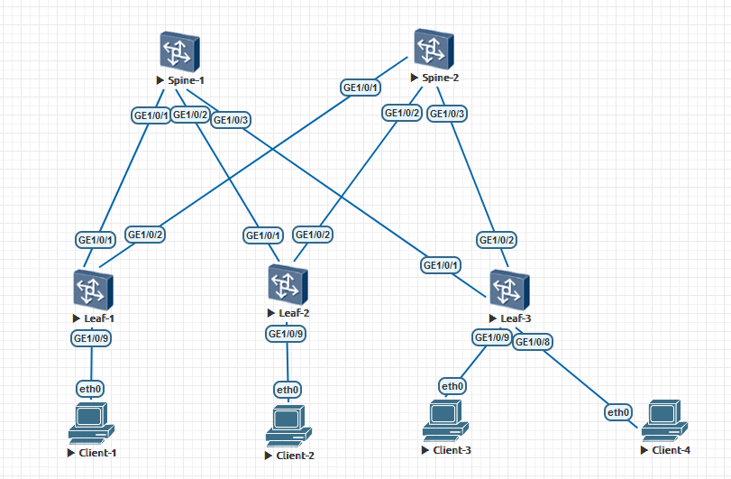

### Проектирование адресного пространства

### Цели:
- 1: Собрать схему CLOS;
- 2: Распределить адресное пространство;

### Собрана топология:

### IP адресация:
Принцип распределения IP адресов - немного изменил пример с занятия в сторону увеличения количества адресов на каждый DC /12, всего до 16 DC.

DC1  
0 – Lo1 (/15) (16*(N-1))  
10.0.0.0/15  
2 – Lo2 (/15) (16*(N-1) + 2)  
10.2.0.0/15  
Суммарный для Lo1 и Lo2 – 10.0.0.0/14  

4 – p2p links (/15) (16*(N-1) + 4)  
10.4.0.0/15  
6 – резерв (/15) (16*(N-1) + 6)  
10.6.0.0/15  
Суммарный для p2p и резерва – 10.4.0.0/14  

[8 .. 15] – services (/16) (16*(N-1) + [8 .. 15])  
10.8.0.0/16  
10.9.0.0/16  
10.10.0.0/16  
10.11.0.0/16  
10.12.0.0/16  
10.13.0.0/16  
10.14.0.0/16  
10.15.0.0/16  
Суммарный – 10.8.0.0/13  

DC1 – 10.0.0.0/12  
DC2 – 10.16.0.0/12  
…  
DCN – 10.16*(N-1).0.0/12  
N = [1 .. 16]  
