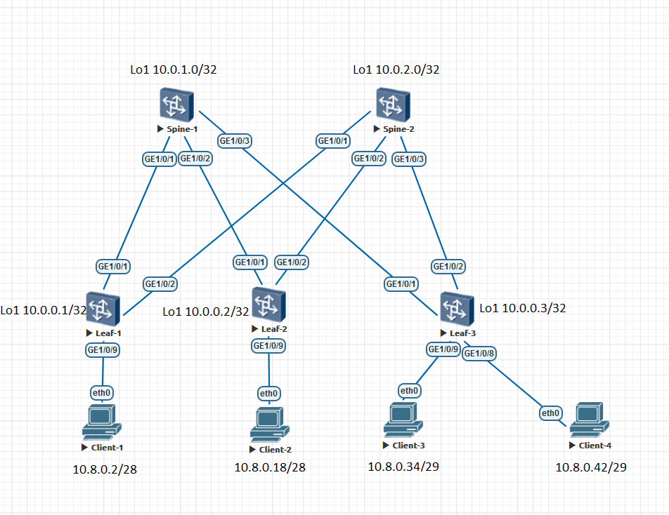

### Underlay OSPF

### Цели:
- 1: Настроить OSPF для Underlay сети

### Собрана топология:

### Особенности настройки:
Изменены стандартные таймеры OSPF на интерфейсах  Timers: Hello 3, Dead 12. 
На Leaf'ах коммутаторах включен silent-interface all (passive interface default), который отключен только на интерфейсах в сторону Spine'ов.

#### Конфигурация на оборудовании Huawei

 Spine-1 

# 
sysname Spine-1 
# 
interface GE1/0/1 
 undo portswitch 
 description to Leaf-1 
 undo shutdown 
 ip address 10.4.1.0 255.255.255.254 
 ospf network-type p2p 
 ospf timer hello 3 
# 
interface GE1/0/2 
 undo portswitch 
 description to Leaf-2 
 undo shutdown 
 ip address 10.4.1.2 255.255.255.254 
 ospf network-type p2p 
 ospf timer hello 3 
# 
interface GE1/0/3 
 undo portswitch 
 description to Leaf-3 
 undo shutdown 
 ip address 10.4.1.4 255.255.255.254 
 ospf network-type p2p 
 ospf timer hello 3 
# 
interface LoopBack1 
 description underlay 
 ip address 10.0.1.0 255.255.255.255 
# 
interface LoopBack2 
 description overlay 
 ip address 10.2.1.0 255.255.255.255 
# 
ospf 555 router-id 10.0.1.0 
 area 0.0.0.0 
  network 10.0.1.0 0.0.0.0 description underlay Loopback1 
  network 10.2.1.0 0.0.0.0 description overlay Loopback2 
  network 10.4.1.0 0.0.0.1 description PtP to Leaf-1 
  network 10.4.1.2 0.0.0.1 description PtP to Leaf-2 
  network 10.4.1.4 0.0.0.1 description PtP to Leaf-3 
# 

