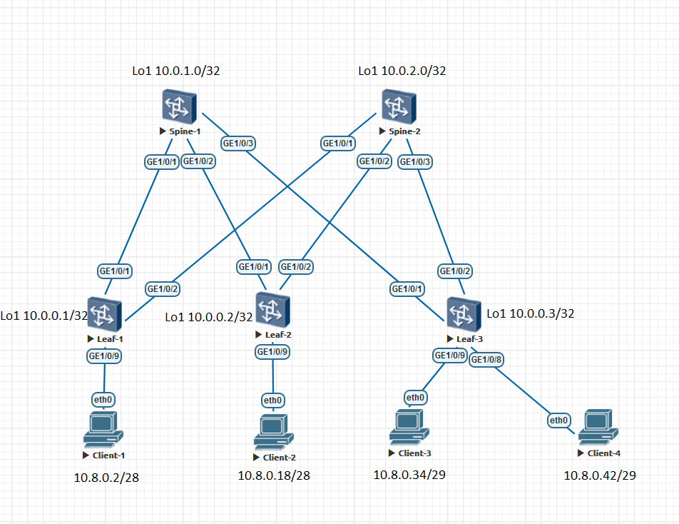

### Underlay IS-IS

### Цели:
- 1: Настроить IS-IS для Underlay сети

### Собрана топология:


### Особенности настройки:
IS-IS на Spine/Leaf сконфигурирован только как уровень L1 для взаимодействия в рамках одной зоны.<br>
На всех IS-IS устройствах настроена Wide метрика.<br>
Включен BFD для IS-IS с целью улучшения сходимости протокола.<br>
На интерфейсах настроен isis circuit-type p2p для оптимизации работы протокола.<br>
Заданы is-name для передачи информации о hostname ISIS соседям в пределах общей зоны.<br>
На Leaf'ах на интерфейсах подключения клиентов настроен режим isis silent (passive interface), чтобы не отправлять hello в клиентские порты.<br>

### IP план:
Device|Interface|IP Address|Subnet Mask
---|---|---|---
Spine-1|Lo1|10.0.1.0|255.255.255.255
-|Lo2|10.2.1.0|255.255.255.255
-|GE1/0/1|10.4.1.0|255.255.255.254
-|GE1/0/2|10.4.1.2|255.255.255.254
-|GE1/0/3|10.4.1.4|255.255.255.254
Spine-2|Lo1|10.0.2.0|255.255.255.255
-|Lo2|10.2.2.0|255.255.255.255
-|GE1/0/1|10.4.2.0|255.255.255.254
-|GE1/0/2|10.4.2.2|255.255.255.254
-|GE1/0/3|10.4.2.4|255.255.255.254
Leaf-1|Lo1|10.0.0.1|255.255.255.255
-|Lo2|10.2.0.1|255.255.255.255
-|GE1/0/1|10.4.1.1|255.255.255.254
-|GE1/0/2|10.4.2.1|255.255.255.254
-|GE1/0/9|10.8.0.1|255.255.255.240
Leaf-2|Lo1|10.0.0.2|255.255.255.255
-|Lo2|10.2.0.2|255.255.255.255
-|GE1/0/1|10.4.1.3|255.255.255.254
-|GE1/0/2|10.4.2.3|255.255.255.254
-|GE1/0/9|10.8.0.17|255.255.255.240
Leaf-3|Lo1|10.0.0.3|255.255.255.255
-|Lo2|10.2.0.3|255.255.255.255
-|GE1/0/1|10.4.1.5|255.255.255.254
-|GE1/0/2|10.4.2.5|255.255.255.254
-|GE1/0/9|10.8.0.33|255.255.255.248
-|GE1/0/8|10.8.0.41|255.255.255.248
Client-1|eth0|10.8.0.2|255.255.255.240
Client-2|eth0|10.8.0.18|255.255.255.240
Client-3|eth0|10.8.0.34|255.255.255.248
Client-4|eth0|10.8.0.42|255.255.255.248

#### Конфигурация на оборудовании Huawei
<details>
<summary> Spine-1 </summary>
#<br>
sysname Spine-1<br>
#<br>
bfd<br>
#<br>
isis 33<br>         
 is-level level-1<br>
 cost-style wide<br>
 network-entity 49.0052.0100.0000.1000.00<br>
 is-name Spine-1<br>
#<br>
interface GE1/0/1<br>
 undo portswitch<br>
 description to Leaf-1<br>
 undo shutdown<br>
 ip address 10.4.1.0 255.255.255.254<br>
 isis enable 33<br>
 isis circuit-type p2p<br>
 isis bfd static<br>
#<br>
interface GE1/0/2<br>
 undo portswitch<br>
 description to Leaf-2<br>
 undo shutdown<br>
 ip address 10.4.1.2 255.255.255.254<br>
 isis enable 33<br>
 isis circuit-type p2p<br>
 isis bfd static<br>
#<br>
interface GE1/0/3<br>
 undo portswitch<br>
 description to Leaf-3<br>
 undo shutdown<br>
 ip address 10.4.1.4 255.255.255.254<br>
 isis enable 33<br>
 isis circuit-type p2p<br>
 isis bfd static<br>
#<br>
interface LoopBack1<br>
 description underlay<br>
 ip address 10.0.1.0 255.255.255.255<br>
 isis enable 33<br>
#<br>
interface LoopBack2<br>
 description overlay<br>
 ip address 10.2.1.0 255.255.255.255<br>
 isis enable 33<br>
#<br>
bfd To_Leaf-1 bind peer-ip 10.4.1.1 interface GE1/0/1<br>
 discriminator local 101<br>
 discriminator remote 11<br>
#<br>
bfd To_Leaf-2 bind peer-ip 10.4.1.3 interface GE1/0/2<br>
 discriminator local 201<br>
 discriminator remote 21<br>
#<br>
bfd To_Leaf-3 bind peer-ip 10.4.1.5 interface GE1/0/3<br>
 discriminator local 301<br>
 discriminator remote 31<br>
#<br>
</details>
<details>
<summary> Spine-2 </summary>
#<br>
sysname Spine-2<br>
#<br>
bfd<br>
#<br>
isis 33<br>         
 is-level level-1<br>
 cost-style wide<br>
 network-entity 49.0052.0100.0000.2000.00<br>
 is-name Spine-2<br>
#<br>
interface GE1/0/1<br>
 undo portswitch<br>
 description to Leaf-1<br>
 undo shutdown<br>
 ip address 10.4.2.0 255.255.255.254<br>
 isis enable 33<br>
 isis circuit-type p2p<br>
 isis bfd static<br>
#<br>
interface GE1/0/2<br>
 undo portswitch<br>
 description to Leaf-2<br>
 undo shutdown<br>
 ip address 10.4.2.2 255.255.255.254<br>
 isis enable 33<br>
 isis circuit-type p2p<br>
 isis bfd static<br>
#<br>
interface GE1/0/3<br>
 undo portswitch<br>
 description to Leaf-3<br>
 undo shutdown<br>
 ip address 10.4.2.4 255.255.255.254<br>
 isis enable 33<br>
 isis circuit-type p2p<br>
 isis bfd static<br>
#<br>
interface LoopBack1<br>
 description underlay<br>
 ip address 10.0.2.0 255.255.255.255<br>
 isis enable 33<br>
#<br>
interface LoopBack2<br>
 description overlay<br>
 ip address 10.2.2.0 255.255.255.255<br>
 isis enable 33<br>
#<br>
bfd To_Leaf-1 bind peer-ip 10.4.2.1 interface GE1/0/1<br>
 discriminator local 102<br>
 discriminator remote 12<br>
#<br>
bfd To_Leaf-2 bind peer-ip 10.4.2.3 interface GE1/0/2<br>
 discriminator local 202<br>
 discriminator remote 22<br>
#<br>
bfd To_Leaf-3 bind peer-ip 10.4.2.5 interface GE1/0/3<br>
 discriminator local 302<br>
 discriminator remote 32<br>
#<br>
</details>
<details>
<summary> Leaf-1 </summary>
#<br>
sysname Leaf-1<br>
#<br>
bfd<br>
#<br>
isis 33<br>
 is-level level-1<br>
 cost-style wide<br>
 network-entity 49.0052.0100.0000.0001.00<br>
 is-name Leaf-1<br>
#<br>
interface GE1/0/1<br>
 undo portswitch<br>
 description to Spine-1<br>
 undo shutdown<br>
 ip address 10.4.1.1 255.255.255.254<br>
 isis enable 33<br>
 isis circuit-type p2p<br>
 isis bfd static<br>
#<br>
interface GE1/0/2<br>
 undo portswitch<br>
 description to Spine-2<br>
 undo shutdown<br>
 ip address 10.4.2.1 255.255.255.254<br>
 isis enable 33<br>
 isis circuit-type p2p<br>
 isis bfd static<br>
#<br>
interface GE1/0/9<br>
 undo portswitch<br>
 description to Client-1<br>
 undo shutdown<br>
 ip address 10.8.0.1 255.255.255.240<br>
 isis enable 33<br>
 isis silent <br>
#<br>
interface LoopBack1<br>
 description underlay<br>
 ip address 10.0.0.1 255.255.255.255<br>
 isis enable 33<br>
#<br>
interface LoopBack2<br>
 description overlay<br>
 ip address 10.2.0.1 255.255.255.255<br>
 isis enable 33<br>
#<br>
bfd to_Spine-1 bind peer-ip 10.4.1.0 interface GE1/0/1<br>
 discriminator local 11<br>
 discriminator remote 101<br>
#<br>
bfd to_Spine-2 bind peer-ip 10.4.2.0 interface GE1/0/2<br>
 discriminator local 12<br>
 discriminator remote 102<br>
#<br>
</details>
<details>
<summary> Leaf-2 </summary>
#<br>
sysname Leaf-2<br>
#<br>
bfd<br>
#<br>
isis 33<br>
 is-level level-1<br>
 cost-style wide<br>
 network-entity 49.0052.0100.0000.0002.00<br>
 is-name Leaf-2<br>
#<br>
interface GE1/0/1<br>
 undo portswitch<br>
 description to Spine-1<br>
 undo shutdown<br>
 ip address 10.4.1.3 255.255.255.254<br>
 isis enable 33<br>
 isis circuit-type p2p<br>
 isis bfd static<br>
#<br>
interface GE1/0/2<br>
 undo portswitch<br>
 description to Spine-2<br>
 undo shutdown<br>
 ip address 10.4.2.3 255.255.255.254<br>
 isis enable 33<br>
 isis circuit-type p2p<br>
 isis bfd static<br>
#<br>
interface GE1/0/9<br>
 undo portswitch<br>
 description to Client-2<br>
 undo shutdown<br>
 ip address 10.8.0.17 255.255.255.240<br>
 isis enable 33<br>
 isis silent <br>
#<br>
interface LoopBack1<br>
 description underlay<br>
 ip address 10.0.0.2 255.255.255.255<br>
 isis enable 33<br>
#<br>
interface LoopBack2<br>
 description overlay<br>
 ip address 10.2.0.2 255.255.255.255<br>
 isis enable 33<br>
#<br>
bfd to_Spine-1 bind peer-ip 10.4.1.2 interface GE1/0/1<br>
 discriminator local 21<br>
 discriminator remote 201<br>
#<br>
bfd to_Spine-2 bind peer-ip 10.4.2.2 interface GE1/0/2<br>
 discriminator local 22<br>
 discriminator remote 202<br>
#<br>
</details>
<details>
<summary> Leaf-3 </summary>
#<br>
 sysname Leaf-3<br>
#<br>
bfd<br>
#<br>
isis 33<br>
 is-level level-1<br>
 cost-style wide<br>
 network-entity 49.0052.0100.0000.0003.00<br>
 is-name Leaf-3<br>
#<br>
interface GE1/0/1<br>
 undo portswitch<br>
 description to Spine-1<br>
 undo shutdown<br>
 ip address 10.4.1.5 255.255.255.254<br>
 isis enable 33<br>
 isis circuit-type p2p<br>
 isis bfd static<br>
#<br>
interface GE1/0/2<br>
 undo portswitch<br>
 description to Spine-2<br>
 undo shutdown<br>
 ip address 10.4.2.5 255.255.255.254<br>
 isis enable 33<br>
 isis circuit-type p2p<br>
 isis bfd static<br>
#<br>
interface GE1/0/8<br>
 undo portswitch<br>
 description to Client-4<br>
 undo shutdown<br>
 ip address 10.8.0.41 255.255.255.248<br>
 isis enable 33<br>
 isis silent <br>
#<br>
interface GE1/0/9<br>
 undo portswitch<br>
 description to Client-3<br>
 undo shutdown<br>
 ip address 10.8.0.33 255.255.255.248<br>
 isis enable 33<br>
 isis silent <br>
#<br>
interface LoopBack1<br>
 description underlay<br>
 ip address 10.0.0.3 255.255.255.255<br>
 isis enable 33<br>
#<br>
interface LoopBack2<br>
 description overlay<br>
 ip address 10.2.0.3 255.255.255.255<br>
 isis enable 33 <br>
#<br>
bfd to_Spine-1 bind peer-ip 10.4.1.4 interface GE1/0/1<br>
 discriminator local 31<br>
 discriminator remote 301<br>
#<br>
bfd to_Spine-2 bind peer-ip 10.4.2.4 interface GE1/0/2<br>
 discriminator local 32<br>
 discriminator remote 302<br>
#<br>
</details>
#### Диагностика Spine/Leaf

<details>
<summary> Spine-1 diag </summary>
 
 ```
<Spine-1>display ip routing-table
Proto: Protocol        Pre: Preference
Route Flags: R - relay, D - download to fib, T - to vpn-instance, B - black hole route
------------------------------------------------------------------------------
Routing Table : _public_
         Destinations : 27       Routes : 31        

Destination/Mask    Proto   Pre  Cost        Flags NextHop         Interface

       10.0.0.1/32  ISIS-L1 15   10            D   10.4.1.1        GE1/0/1
       10.0.0.2/32  ISIS-L1 15   10            D   10.4.1.3        GE1/0/2
       10.0.0.3/32  ISIS-L1 15   10            D   10.4.1.5        GE1/0/3
       10.0.1.0/32  Direct  0    0             D   127.0.0.1       LoopBack1
       10.0.2.0/32  ISIS-L1 15   20            D   10.4.1.1        GE1/0/1
                    ISIS-L1 15   20            D   10.4.1.3        GE1/0/2
                    ISIS-L1 15   20            D   10.4.1.5        GE1/0/3
       10.2.0.1/32  ISIS-L1 15   10            D   10.4.1.1        GE1/0/1
       10.2.0.2/32  ISIS-L1 15   10            D   10.4.1.3        GE1/0/2
       10.2.0.3/32  ISIS-L1 15   10            D   10.4.1.5        GE1/0/3
       10.2.1.0/32  Direct  0    0             D   127.0.0.1       LoopBack2
       10.2.2.0/32  ISIS-L1 15   20            D   10.4.1.1        GE1/0/1
                    ISIS-L1 15   20            D   10.4.1.3        GE1/0/2
                    ISIS-L1 15   20            D   10.4.1.5        GE1/0/3
       10.4.1.0/31  Direct  0    0             D   10.4.1.0        GE1/0/1
       10.4.1.0/32  Direct  0    0             D   127.0.0.1       GE1/0/1
       10.4.1.2/31  Direct  0    0             D   10.4.1.2        GE1/0/2
       10.4.1.2/32  Direct  0    0             D   127.0.0.1       GE1/0/2
       10.4.1.4/31  Direct  0    0             D   10.4.1.4        GE1/0/3
       10.4.1.4/32  Direct  0    0             D   127.0.0.1       GE1/0/3
       10.4.2.0/31  ISIS-L1 15   20            D   10.4.1.1        GE1/0/1
       10.4.2.2/31  ISIS-L1 15   20            D   10.4.1.3        GE1/0/2
       10.4.2.4/31  ISIS-L1 15   20            D   10.4.1.5        GE1/0/3
       10.8.0.0/28  ISIS-L1 15   20            D   10.4.1.1        GE1/0/1
      10.8.0.16/28  ISIS-L1 15   20            D   10.4.1.3        GE1/0/2
      10.8.0.32/29  ISIS-L1 15   20            D   10.4.1.5        GE1/0/3
      10.8.0.40/29  ISIS-L1 15   20            D   10.4.1.5        GE1/0/3
      127.0.0.0/8   Direct  0    0             D   127.0.0.1       InLoopBack0
      127.0.0.1/32  Direct  0    0             D   127.0.0.1       InLoopBack0
127.255.255.255/32  Direct  0    0             D   127.0.0.1       InLoopBack0
255.255.255.255/32  Direct  0    0             D   127.0.0.1       InLoopBack0

<Spine-1>display isis peer 

Peer Information for ISIS(33)
--------------------------------------------------------------------------------
                         
  System Id     Interface       Circuit Id        State HoldTime(s) Type     PRI
--------------------------------------------------------------------------------
Leaf-1          GE1/0/1         0000000006         Up            28 L1       -- 
Leaf-2          GE1/0/2         0000000006         Up            30 L1       -- 
Leaf-3          GE1/0/3         0000000006         Up            29 L1       -- 

Total Peer(s): 3

<Spine-1>display isis bfd session all

BFD session information for ISIS(33)
------------------------------------------------------------------------------
Peer System ID : Leaf-1                Interface : GE1/0/1            
TX : 1000          BFD State : up      Peer IP Address : 10.4.1.1
RX : 1000          LocDis : 101        Local IP Address: 0.0.0.0
Multiplier : 3     RemDis : 11         Type : L1  
Diag : No diagnostic information
Peer System ID : Leaf-2                Interface : GE1/0/2            
TX : 1000          BFD State : up      Peer IP Address : 10.4.1.3
RX : 1000          LocDis : 201        Local IP Address: 0.0.0.0
Multiplier : 3     RemDis : 21         Type : L1  
Diag : No diagnostic information
Peer System ID : Leaf-3                Interface : GE1/0/3            
TX : 1000          BFD State : up      Peer IP Address : 10.4.1.5
RX : 1000          LocDis : 301        Local IP Address: 0.0.0.0
Multiplier : 3     RemDis : 31         Type : L1  
Diag : No diagnostic information
Total BFD session(s): 3
```
</details>
