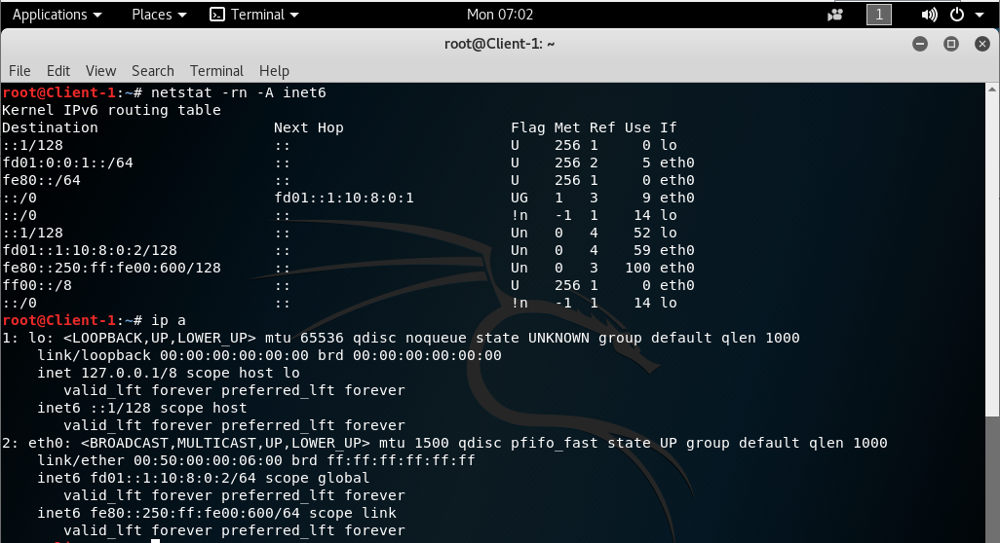

### Underlay BGP

### Цели:
- 1: Настроить BGP для Underlay сети

### Собрана топология:

Spine и Leaf - Huawei CE12800, Clients - Linux<br>

### Особенности настройки:
В качестве протокола динамической маршрутизации для Undelay выбран EBGP<br>
В качестве протокола сетевого уровня выбран IPv6<br>
На всех маршрутизаторах настроена аутентификация MD5 для BGP пиров .<br>
Уменьшены таймеры BGP - timer keepalive 3 hold 9.<br>
route-update-interval установлен =0 (по дефолту для EBGP было 30сек.) 

### IP план:
Device|Interface|IPv6 Address|Prefix
---|---|---|---
Spine-1|Lo1|fd01::10:0:1:0|/128
-|Lo2|fd01::10:2:1:0|/128
-|GE1/0/1|fd01::10:4:1:0|/127
-|GE1/0/2|fd01::10:4:1:2|/127
-|GE1/0/3|fd01::10:4:1:4|/127
Spine-2|Lo1|fd01::10:0:2:0|/128
-|Lo2|fd01::10:2:2:0|/128
-|GE1/0/1|fd01::10:4:2:0|/127
-|GE1/0/2|fd01::10:4:2:2|/127
-|GE1/0/3|fd01::10:4:2:4|/127
Leaf-1|Lo1|fd01::10:0:0:1|/128
-|Lo2|fd01::10:2:0:1|/128
-|GE1/0/1|fd01::10:4:1:1|/127
-|GE1/0/2|fd01::10:4:2:1|/127
-|GE1/0/9|fd01::1:10:8:0:1|/64
Leaf-2|Lo1|fd01::10:0:0:2|/128
-|Lo2|fd01::10:2:0:2|/128
-|GE1/0/1|fd01::10:4:1:3|/127
-|GE1/0/2|fd01::10:4:2:3|/127
-|GE1/0/9|fd01::2:10:8:0:17|/64
Leaf-3|Lo1|fd01::10:0:0:3|/128
-|Lo2|fd01::10:2:0:3|/128
-|GE1/0/1|fd01::10:4:1:5|/127
-|GE1/0/2|fd01::10:4:2:5|/127
-|GE1/0/9|fd01::3:10:8:0:33|/64
-|GE1/0/8|fd01::4:10:8:0:41|/64
Client-1|eth0|fd01::1:10:8:0:2|/64
Client-2|eth0|fd01::2:10:8:0:18|/64
Client-3|eth0|fd01::3:10:8:0:34|/64
Client-4|eth0|fd01::4:10:8:0:42|/64

#### Конфигурация на оборудовании Huawei
<details>
<summary> Spine-1 </summary>
#<br>
sysname Spine-1<br>
#<br>
as-notation plain<br>
#<br>
interface GE1/0/1<br>
 undo portswitch<br>
 description to Leaf-1<br>
 undo shutdown<br>
 ipv6 enable<br>
 ipv6 address FD01::10:4:1:0/127<br>
#<br>
interface GE1/0/2<br>
 undo portswitch<br>
 description to Leaf-2<br>
 undo shutdown<br>
 ipv6 enable<br>
 ipv6 address FD01::10:4:1:2/127<br>
#<br>
interface GE1/0/3<br>
 undo portswitch<br>
 description to Leaf-3<br>
 undo shutdown<br>
 ipv6 enable<br>
 ipv6 address FD01::10:4:1:4/127<br>
#<br>
interface LoopBack1<br>
 ipv6 enable<br>
 ipv6 address FD01::10:0:1:0/128<br>
#<br>
interface LoopBack2<br>
 ipv6 enable<br>
 ipv6 address FD01::10:2:1:0/128<br>
#<br>
bgp 4200000001<br>
 router-id 10.0.1.0<br>
 timer keepalive 3 hold 9<br>
 peer FD01::10:4:1:1 as-number 4200000011<br>
 peer FD01::10:4:1:1 description Leaf-1<br>
 peer FD01::10:4:1:1 password cipher %^%#1`tQG=.lB1\i$"N|b&>=;B&sSzH*BQn9Fu;DL_@9%^%#<br>
 peer FD01::10:4:1:3 as-number 4200000012<br>
 peer FD01::10:4:1:3 description Leaf-2<br>
 peer FD01::10:4:1:3 password cipher %^%#rv[U&i:I8R]7;:&P97+H9G+`I3-gC,C4\T<3tQY%^%#<br>
 peer FD01::10:4:1:5 as-number 4200000013<br>
 peer FD01::10:4:1:5 description Leaf-3<br>
 peer FD01::10:4:1:5 password cipher %^%#t[RpO-[\I&6#5^1E=+@&DcI#KmwMa1K)/^,^mxqR%^%#<br>
 #<br>
 ipv6-family unicast<br>
  network FD01::10:0:1:0 128<br>
  network FD01::10:2:1:0 128<br>
  network FD01::10:4:1:0 127<br>
  network FD01::10:4:1:2 127<br>
  network FD01::10:4:1:4 127<br>
  peer FD01::10:4:1:1 enable<br>
  peer FD01::10:4:1:1 route-update-interval 0<br>
  peer FD01::10:4:1:3 enable<br>
  peer FD01::10:4:1:3 route-update-interval 0<br>
  peer FD01::10:4:1:5 enable<br>
  peer FD01::10:4:1:5 route-update-interval 0<br>
#<br>
</details>
<details>
<summary> Spine-2 </summary>
#<br>
sysname Spine-2<br>
#<br>
as-notation plain<br>
#<br>
interface GE1/0/1<br>
 undo portswitch<br>
 description to Leaf-1<br>
 undo shutdown<br>
 ipv6 enable<br>
 ipv6 address FD01::10:4:2:0/127<br>
#<br>
interface GE1/0/2<br>
 undo portswitch<br>
 description to Leaf-2<br>
 undo shutdown<br>
 ipv6 enable<br>
 ipv6 address FD01::10:4:2:2/127<br>
#<br>
interface GE1/0/3<br>
 undo portswitch<br>
 description to Leaf-3<br>
 undo shutdown<br>
 ipv6 enable<br>
 ipv6 address FD01::10:4:2:4/127<br>
#<br>
interface LoopBack1<br>
 ipv6 enable<br>
 ipv6 address FD01::10:0:2:0/128<br>
#<br>
interface LoopBack2<br>
 ipv6 enable<br>
 ipv6 address FD01::10:2:2:0/128<br>
#<br>
bgp 4200000001<br>
 router-id 10.0.2.0<br>
 timer keepalive 3 hold 9<br>
 peer FD01::10:4:2:1 as-number 4200000011<br>
 peer FD01::10:4:2:1 description Leaf-1<br>
 peer FD01::10:4:2:1 password cipher %^%#_7Wk*6xNp3Sz!M;"bj"H{rbv.1SuA(M.YgBM0CW&%^%#<br>
 peer FD01::10:4:2:3 as-number 4200000012<br>
 peer FD01::10:4:2:3 description Leaf-2<br>
 peer FD01::10:4:2:3 password cipher %^%#hD]yHe4[8HCbN+%}ly~DGmC9C$QcxHsTVuV)z2dC%^%#<br>
 peer FD01::10:4:2:5 as-number 4200000013<br>
 peer FD01::10:4:2:5 description Leaf-3<br>
 peer FD01::10:4:2:5 password cipher %^%#=r|xFh(u$MKmhGS:9{mBB-3I:9X--PQ>eL-v@f}F%^%#<br>
 #<br>
 ipv6-family unicast<br>
  network FD01::10:0:2:0 128<br>
  network FD01::10:2:2:0 128<br>
  network FD01::10:4:2:0 127<br>
  network FD01::10:4:2:2 127<br>
  network FD01::10:4:2:4 127<br>
  peer FD01::10:4:2:1 enable<br>
  peer FD01::10:4:2:1 route-update-interval 0<br>
  peer FD01::10:4:2:3 enable<br>
  peer FD01::10:4:2:3 route-update-interval 0<br>
  peer FD01::10:4:2:5 enable<br>
  peer FD01::10:4:2:5 route-update-interval 0<br>
#<br>
</details>
<details>
<summary> Leaf-1 </summary>
#<br>
sysname Leaf-1<br>
#<br>
as-notation plain<br>
#<br>
interface GE1/0/1<br>
 undo portswitch<br>
 description to Spine-1<br>
 undo shutdown<br>
 ipv6 enable<br>
 ipv6 address FD01::10:4:1:1/127<br>
#<br>
interface GE1/0/2<br>
 undo portswitch<br>
 description to Spine-2<br>
 undo shutdown<br>
 ipv6 enable<br>
 ipv6 address FD01::10:4:2:1/127<br>
#<br>
interface GE1/0/9<br>
 undo portswitch<br>
 description to Client-1<br>
 undo shutdown<br>
 ipv6 enable<br>
 ipv6 address FD01::1:10:8:0:1/64<br>
#<br>
interface LoopBack1<br>
 ipv6 enable<br>
 ipv6 address FD01::10:0:0:1/128<br>
#<br>
interface LoopBack2<br>
 ipv6 enable<br>
 ipv6 address FD01::10:2:0:1/128<br>
#<br>
bgp 4200000011<br>
 router-id 10.0.0.1<br>
 timer keepalive 3 hold 9<br>
 peer FD01::10:4:1:0 as-number 4200000001<br>
 peer FD01::10:4:1:0 description Spine-1<br>
 peer FD01::10:4:1:0 password cipher %^%#uTh@5'|]YR7S)!TsyH!So-rPJg^Ty83pg|#c(I\E%^%#<br>
 peer FD01::10:4:2:0 as-number 4200000001<br>
 peer FD01::10:4:2:0 description Spine-2<br>
 peer FD01::10:4:2:0 password cipher %^%#/#luU_d$D2"0blE){-529WJ$>OQ$!UOOZz6tNgHX%^%#<br>
 #<br>
  ipv6-family unicast<br>
  network FD01::10:0:0:1 128<br>
  network FD01::10:2:0:1 128<br>
  network FD01::10:4:1:0 127<br>
  network FD01::10:4:2:0 127<br>
  network FD01:0:0:1:: 64<br>
  peer FD01::10:4:1:0 enable<br>
  peer FD01::10:4:1:0 route-update-interval 0<br>
  peer FD01::10:4:2:0 enable<br>
  peer FD01::10:4:2:0 route-update-interval 0<br>
#<br>
</details>
<details>
<summary> Leaf-2 </summary>
#<br>
sysname Leaf-2<br>
#<br>
as-notation plain<br>
#<br>
interface GE1/0/1<br>
 undo portswitch<br>
 description to Spine-1<br>
 undo shutdown<br>
 ipv6 enable<br>
 ipv6 address FD01::10:4:1:3/127<br>
#<br>
interface GE1/0/2<br>
 undo portswitch<br>
 description to Spine-2<br>
 undo shutdown<br>
 ipv6 enable<br>
 ipv6 address FD01::10:4:2:3/127<br>
#<br>
interface GE1/0/9<br>
 undo portswitch<br>
 description to Client-2<br>
 undo shutdown<br>
 ipv6 enable<br>
 ipv6 address FD01::2:10:8:0:17/64<br>
#<br>
interface LoopBack1<br>
 ipv6 enable<br>
 ipv6 address FD01::10:0:0:2/128<br>
#<br>
interface LoopBack2<br>
 ipv6 enable<br>
 ipv6 address FD01::10:2:0:2/128<br>
#<br>
bgp 4200000012<br>
 router-id 10.0.0.2<br>
 timer keepalive 3 hold 9<br>
 peer FD01::10:4:1:2 as-number 4200000001<br>
 peer FD01::10:4:1:2 description Spine-1<br>
 peer FD01::10:4:1:2 password cipher %^%#uTh@5'|]YR7S)!TsyH!So-rPJg^Ty83pg|#c(I\E%^%#<br>
 peer FD01::10:4:2:2 as-number 4200000001<br>
 peer FD01::10:4:2:2 description Spine-2<br>
 peer FD01::10:4:2:2 password cipher %^%#/#luU_d$D2"0blE){-529WJ$>OQ$!UOOZz6tNgHX%^%#<br>
 #<br>
 ipv6-family unicast<br>
  network FD01::10:0:0:2 128<br>
  network FD01::10:2:0:2 128<br>
  network FD01::10:4:1:2 127<br>
  network FD01::10:4:2:2 127<br>
  network FD01:0:0:2:: 64<br>
  peer FD01::10:4:1:2 enable<br>
  peer FD01::10:4:1:2 route-update-interval 0<br>
  peer FD01::10:4:2:2 enable<br>
  peer FD01::10:4:2:2 route-update-interval 0<br>
#<br>
</details>
<details>
<summary> Leaf-3 </summary>
#<br>
 sysname Leaf-3<br>
#<br>
as-notation plain<br>
#<br>
interface GE1/0/1<br>
 undo portswitch<br>
 description to Spine-1<br>
 undo shutdown<br>
 ipv6 enable<br>
 ipv6 address FD01::10:4:1:5/127<br>
#<br>
interface GE1/0/2<br>
 undo portswitch<br>
 description to Spine-2<br>
 undo shutdown<br>
 ipv6 enable<br>
 ipv6 address FD01::10:4:2:5/127<br>
#<br>
interface GE1/0/8<br>
 undo portswitch<br>
 description to Client-4<br>
 undo shutdown<br>
 ipv6 enable<br>
 ipv6 address FD01::4:10:8:0:41/64<br>
#<br>
interface GE1/0/9<br>
 undo portswitch<br>
 description to Client-3<br>
 undo shutdown<br>
 ipv6 enable<br>
 ipv6 address FD01::3:10:8:0:33/64<br>
#<br>
interface LoopBack1<br>
 ipv6 enable<br>
 ipv6 address FD01::10:0:0:3/128<br>
#<br>
interface LoopBack2<br>
 ipv6 enable<br>
 ipv6 address FD01::10:2:0:3/128<br>
#<br>
bgp 4200000013<br>
 router-id 10.0.0.3<br>
 timer keepalive 3 hold 9<br>
 peer FD01::10:4:1:4 as-number 4200000001<br>
 peer FD01::10:4:1:4 description Spine-1<br>
 peer FD01::10:4:1:4 password cipher %^%#uTh@5'|]YR7S)!TsyH!So-rPJg^Ty83pg|#c(I\E%^%#<br>
 peer FD01::10:4:2:4 as-number 4200000001<br>
 peer FD01::10:4:2:4 description Spine-2<br>
 peer FD01::10:4:2:4 password cipher %^%#/#luU_d$D2"0blE){-529WJ$>OQ$!UOOZz6tNgHX%^%#<br>
 #<br>
 ipv6-family unicast<br>
  network FD01::10:0:0:3 128<br>
  network FD01::10:2:0:3 128<br>
  network FD01::10:4:1:4 127<br>
  network FD01::10:4:2:4 127<br>
  network FD01:0:0:3:: 64<br>
  network FD01:0:0:4:: 64<br>
  peer FD01::10:4:1:4 enable<br>
  peer FD01::10:4:1:4 route-update-interval 0<br>
  peer FD01::10:4:2:4 enable<br>
  peer FD01::10:4:2:4 route-update-interval 0<br>
#<br>
</details>

#### Диагностика Spine/Leaf

<details>
<summary> Spine-1 diag </summary>
 
 ```
<Spine-1>display ipv6 routing-table simple
Route Flags: R - relay, D - download to fib, T - to vpn-instance, B - black hole route
-----------------------------------------------------------------------------------------------------------------------------------
Routing Table : _public_
         Destinations : 25       Routes : 25

Destination/Mask                             Proto   Pre  Cost        Flags NextHop                                 Interface


::1/128                                      Direct  0    0           D     ::1                                     InLoopBack0
::FFFF:127.0.0.0/104                         Direct  0    0           D     ::FFFF:127.0.0.1                        InLoopBack0
::FFFF:127.0.0.1/128                         Direct  0    0           D     ::1                                     InLoopBack0
FD01::10:0:0:1/128                           EBGP    255  0           RD    FD01::10:4:1:1                          GE1/0/1
FD01::10:0:0:2/128                           EBGP    255  0           RD    FD01::10:4:1:3                          GE1/0/2
FD01::10:0:0:3/128                           EBGP    255  0           RD    FD01::10:4:1:5                          GE1/0/3
FD01::10:0:1:0/128                           Direct  0    0           D     ::1                                     LoopBack1
FD01::10:2:0:1/128                           EBGP    255  0           RD    FD01::10:4:1:1                          GE1/0/1
FD01::10:2:0:2/128                           EBGP    255  0           RD    FD01::10:4:1:3                          GE1/0/2
FD01::10:2:0:3/128                           EBGP    255  0           RD    FD01::10:4:1:5                          GE1/0/3
FD01::10:2:1:0/128                           Direct  0    0           D     ::1                                     LoopBack2
FD01::10:4:1:0/127                           Direct  0    0           D     FD01::10:4:1:0                          GE1/0/1
FD01::10:4:1:0/128                           Direct  0    0           D     ::1                                     GE1/0/1
FD01::10:4:1:2/127                           Direct  0    0           D     FD01::10:4:1:2                          GE1/0/2
FD01::10:4:1:2/128                           Direct  0    0           D     ::1                                     GE1/0/2
FD01::10:4:1:4/127                           Direct  0    0           D     FD01::10:4:1:4                          GE1/0/3
FD01::10:4:1:4/128                           Direct  0    0           D     ::1                                     GE1/0/3
FD01::10:4:2:0/127                           EBGP    255  0           RD    FD01::10:4:1:1                          GE1/0/1
FD01::10:4:2:2/127                           EBGP    255  0           RD    FD01::10:4:1:3                          GE1/0/2
FD01::10:4:2:4/127                           EBGP    255  0           RD    FD01::10:4:1:5                          GE1/0/3
FD01:0:0:1::/64                              EBGP    255  0           RD    FD01::10:4:1:1                          GE1/0/1
FD01:0:0:2::/64                              EBGP    255  0           RD    FD01::10:4:1:3                          GE1/0/2
FD01:0:0:3::/64                              EBGP    255  0           RD    FD01::10:4:1:5                          GE1/0/3
FD01:0:0:4::/64                              EBGP    255  0           RD    FD01::10:4:1:5                          GE1/0/3
FE80::/10                                    Direct  0    0           DB    ::                                      NULL0

<Spine-1> display bgp ipv6 peer
 BGP local router ID        : 10.0.1.0
 Local AS number            : 4200000001
 Total number of peers      : 3
 Peers in established state : 3

  Peer            V          AS  MsgRcvd  MsgSent  OutQ  Up/Down       State  PrefRcv
  FD01::10:4:1:1  4  4200000011     1829     1808     0 01:00:56 Established        5
  FD01::10:4:1:3  4  4200000012     1821     1809     0 01:00:56 Established        5
  FD01::10:4:1:5  4  4200000013     1827     1801     0 01:00:58 Established        6

<Spine-1> display bgp ipv6 peer verbose
 BGP Peer is FD01::10:4:1:1,  remote AS 4200000011
 Type: EBGP link
 Peer's description: "Leaf-1"
 BGP version 4, Remote router ID 10.0.0.1
 Update-group ID: 2
 BGP current state: Established, Up for 01h01m05s
 BGP current event: KATimerExpired
 BGP last state: OpenConfirm
 BGP Peer Up count: 4
 Received total routes: 5
 Received active routes total: 4
 Advertised total routes: 18
 Port: Local - 179        Remote - 55958
 Configured: Connect-retry Time: 32 sec
 Configured: Min Hold Time: 0 sec
 Configured: Active Hold Time: 9 sec   Keepalive Time:3 sec
 Received  : Active Hold Time: 9 sec
 Negotiated: Active Hold Time: 9 sec   Keepalive Time:3 sec
 Peer optional capabilities:
  Peer supports bgp multi-protocol extension
  Peer supports bgp route refresh capability
  Peer supports bgp 4-byte-as capability
  Address family IPv6 Unicast: advertised and received
 Received:
                  Total  messages                1833
                  Update messages                30
                  Open messages                  1
                  KeepAlive messages             1802
                  Notification messages          0
                  Refresh messages               0
 Sent    :
                  Total  messages                1813
                  Update messages                12
                  Open messages                  2
                  KeepAlive messages             1799
                  Notification messages          0
                  Refresh messages               0
 Authentication type configured: MD5
  Last keepalive received: 2024-07-01 09:14:20+00:00
  Last keepalive sent    : 2024-07-01 09:14:21+00:00
  Last update received   : 2024-07-01 08:14:19+00:00
  Last update sent       : 2024-07-01 08:13:16+00:00
  No refresh received since peer has been configured
  No refresh sent since peer has been configured
 Minimum route advertisement interval is 0 seconds
 Optional capabilities:
 Route refresh capability has been enabled
 4-byte-as capability has been enabled
 Peer Preferred Value: 0
 Routing policy configured:
 No routing policy is configured
 
 BGP Peer is FD01::10:4:1:3,  remote AS 4200000012
 Type: EBGP link
 Peer's description: "Leaf-2"
 BGP version 4, Remote router ID 10.0.0.2
 Update-group ID: 2
 BGP current state: Established, Up for 01h01m05s
 BGP current event: KATimerExpired
 BGP last state: OpenConfirm
 BGP Peer Up count: 3
 Received total routes: 5
 Received active routes total: 4
 Advertised total routes: 18
 Port: Local - 179        Remote - 50174
 Configured: Connect-retry Time: 32 sec
 Configured: Min Hold Time: 0 sec
 Configured: Active Hold Time: 9 sec   Keepalive Time:3 sec
 Received  : Active Hold Time: 9 sec
 Negotiated: Active Hold Time: 9 sec   Keepalive Time:3 sec
 Peer optional capabilities:
  Peer supports bgp multi-protocol extension
  Peer supports bgp route refresh capability
  Peer supports bgp 4-byte-as capability
  Address family IPv6 Unicast: advertised and received
 Received:
                  Total  messages                1825
                  Update messages                31
                  Open messages                  1
                  KeepAlive messages             1793
                  Notification messages          0
                  Refresh messages               0
 Sent    :
                  Total  messages                1814
                  Update messages                8
                  Open messages                  2
                  KeepAlive messages             1804
                  Notification messages          0
                  Refresh messages               0
 Authentication type configured: MD5
  Last keepalive received: 2024-07-01 09:14:20+00:00
  Last keepalive sent    : 2024-07-01 09:14:21+00:00
  Last update received   : 2024-07-01 08:14:18+00:00
  Last update sent       : 2024-07-01 08:13:16+00:00
  No refresh received since peer has been configured
  No refresh sent since peer has been configured
 Minimum route advertisement interval is 0 seconds
 Optional capabilities:
 Route refresh capability has been enabled
 4-byte-as capability has been enabled
 Peer Preferred Value: 0
 Routing policy configured:
 No routing policy is configured
 
 BGP Peer is FD01::10:4:1:5,  remote AS 4200000013
 Type: EBGP link
 Peer's description: "Leaf-3"
 BGP version 4, Remote router ID 10.0.0.3
 Update-group ID: 2
 BGP current state: Established, Up for 01h01m07s
 BGP current event: KATimerExpired
 BGP last state: OpenConfirm
 BGP Peer Up count: 3
 Received total routes: 6
 Received active routes total: 5
 Advertised total routes: 18
 Port: Local - 179        Remote - 61158
 Configured: Connect-retry Time: 32 sec
 Configured: Min Hold Time: 0 sec
 Configured: Active Hold Time: 9 sec   Keepalive Time:3 sec
 Received  : Active Hold Time: 9 sec
 Negotiated: Active Hold Time: 9 sec   Keepalive Time:3 sec
 Peer optional capabilities:
  Peer supports bgp multi-protocol extension
  Peer supports bgp route refresh capability
  Peer supports bgp 4-byte-as capability
  Address family IPv6 Unicast: advertised and received
 Received:
                  Total  messages                1832
                  Update messages                30
                  Open messages                  1
                  KeepAlive messages             1801
                  Notification messages          0
                  Refresh messages               0
 Sent    :
                  Total  messages                1806
                  Update messages                5
                  Open messages                  2
                  KeepAlive messages             1799
                  Notification messages          0
                  Refresh messages               0
 Authentication type configured: MD5
  Last keepalive received: 2024-07-01 09:14:20+00:00
  Last keepalive sent    : 2024-07-01 09:14:20+00:00
  Last update received   : 2024-07-01 08:14:18+00:00
  Last update sent       : 2024-07-01 08:13:16+00:00
  No refresh received since peer has been configured
  No refresh sent since peer has been configured
 Minimum route advertisement interval is 0 seconds
 Optional capabilities:
 Route refresh capability has been enabled
 4-byte-as capability has been enabled
 Peer Preferred Value: 0
 Routing policy configured:
 No routing policy is configured
```
</details>
<details>
<summary> Spine-2 diag </summary>
 
 ```
<Spine-2>display ipv6 routing-table simple
Route Flags: R - relay, D - download to fib, T - to vpn-instance, B - black hole route
-----------------------------------------------------------------------------------------------------------------------------------
Routing Table : _public_
         Destinations : 25       Routes : 25

Destination/Mask                             Proto   Pre  Cost        Flags NextHop                                 Interface


::1/128                                      Direct  0    0           D     ::1                                     InLoopBack0
::FFFF:127.0.0.0/104                         Direct  0    0           D     ::FFFF:127.0.0.1                        InLoopBack0
::FFFF:127.0.0.1/128                         Direct  0    0           D     ::1                                     InLoopBack0
FD01::10:0:0:1/128                           EBGP    255  0           RD    FD01::10:4:2:1                          GE1/0/1
FD01::10:0:0:2/128                           EBGP    255  0           RD    FD01::10:4:2:3                          GE1/0/2
FD01::10:0:0:3/128                           EBGP    255  0           RD    FD01::10:4:2:5                          GE1/0/3
FD01::10:0:2:0/128                           Direct  0    0           D     ::1                                     LoopBack1
FD01::10:2:0:1/128                           EBGP    255  0           RD    FD01::10:4:2:1                          GE1/0/1
FD01::10:2:0:2/128                           EBGP    255  0           RD    FD01::10:4:2:3                          GE1/0/2
FD01::10:2:0:3/128                           EBGP    255  0           RD    FD01::10:4:2:5                          GE1/0/3
FD01::10:2:2:0/128                           Direct  0    0           D     ::1                                     LoopBack2
FD01::10:4:1:0/127                           EBGP    255  0           RD    FD01::10:4:2:1                          GE1/0/1
FD01::10:4:1:2/127                           EBGP    255  0           RD    FD01::10:4:2:3                          GE1/0/2
FD01::10:4:1:4/127                           EBGP    255  0           RD    FD01::10:4:2:5                          GE1/0/3
FD01::10:4:2:0/127                           Direct  0    0           D     FD01::10:4:2:0                          GE1/0/1
FD01::10:4:2:0/128                           Direct  0    0           D     ::1                                     GE1/0/1
FD01::10:4:2:2/127                           Direct  0    0           D     FD01::10:4:2:2                          GE1/0/2
FD01::10:4:2:2/128                           Direct  0    0           D     ::1                                     GE1/0/2
FD01::10:4:2:4/127                           Direct  0    0           D     FD01::10:4:2:4                          GE1/0/3
FD01::10:4:2:4/128                           Direct  0    0           D     ::1                                     GE1/0/3
FD01:0:0:1::/64                              EBGP    255  0           RD    FD01::10:4:2:1                          GE1/0/1
FD01:0:0:2::/64                              EBGP    255  0           RD    FD01::10:4:2:3                          GE1/0/2
FD01:0:0:3::/64                              EBGP    255  0           RD    FD01::10:4:2:5                          GE1/0/3
FD01:0:0:4::/64                              EBGP    255  0           RD    FD01::10:4:2:5                          GE1/0/3
FE80::/10                                    Direct  0    0           DB    ::                                      NULL0

<Spine-2>display bgp ipv6 peer
 BGP local router ID        : 10.0.2.0
 Local AS number            : 4200000001
 Total number of peers      : 3
 Peers in established state : 3

  Peer            V          AS  MsgRcvd  MsgSent  OutQ  Up/Down       State  PrefRcv
  FD01::10:4:2:1  4  4200000011     1952     1950     0 01:05:44 Established        5
  FD01::10:4:2:3  4  4200000012     1956     1950     0 01:05:45 Established        5
  FD01::10:4:2:5  4  4200000013     1958     1943     0 01:05:45 Established        6

<Spine-2>display bgp ipv6 peer verbose
 BGP Peer is FD01::10:4:2:1,  remote AS 4200000011
 Type: EBGP link
 Peer's description: "Leaf-1"
 BGP version 4, Remote router ID 10.0.0.1
 Update-group ID: 2
 BGP current state: Established, Up for 01h06m05s
 BGP current event: RecvKeepalive
 BGP last state: OpenConfirm
 BGP Peer Up count: 4
 Received total routes: 5
 Received active routes total: 4
 Advertised total routes: 18
 Port: Local - 64934        Remote - 179
 Configured: Connect-retry Time: 32 sec
 Configured: Min Hold Time: 0 sec
 Configured: Active Hold Time: 9 sec   Keepalive Time:3 sec
 Received  : Active Hold Time: 9 sec
 Negotiated: Active Hold Time: 9 sec   Keepalive Time:3 sec
 Peer optional capabilities:
  Peer supports bgp multi-protocol extension
  Peer supports bgp route refresh capability
  Peer supports bgp 4-byte-as capability
  Address family IPv6 Unicast: advertised and received
 Received:
                  Total  messages                1963
                  Update messages                16
                  Open messages                  1
                  KeepAlive messages             1946
                  Notification messages          0
                  Refresh messages               0
 Sent    :
                  Total  messages                1960
                  Update messages                13
                  Open messages                  1
                  KeepAlive messages             1946
                  Notification messages          0
                  Refresh messages               0
 Authentication type configured: MD5
  Last keepalive received: 2024-07-01 09:20:26+00:00
  Last keepalive sent    : 2024-07-01 09:20:24+00:00
  Last update received   : 2024-07-01 08:14:20+00:00
  Last update sent       : 2024-07-01 08:14:20+00:00
  No refresh received since peer has been configured
  No refresh sent since peer has been configured
 Minimum route advertisement interval is 0 seconds
 Optional capabilities:
 Route refresh capability has been enabled
 4-byte-as capability has been enabled
 Peer Preferred Value: 0
 Routing policy configured:
 No routing policy is configured
 
 BGP Peer is FD01::10:4:2:3,  remote AS 4200000012
 Type: EBGP link
 Peer's description: "Leaf-2"
 BGP version 4, Remote router ID 10.0.0.2
 Update-group ID: 2
 BGP current state: Established, Up for 01h06m06s
 BGP current event: KATimerExpired
 BGP last state: OpenConfirm
 BGP Peer Up count: 3
 Received total routes: 5
 Received active routes total: 4
 Advertised total routes: 18
 Port: Local - 179        Remote - 57586
 Configured: Connect-retry Time: 32 sec
 Configured: Min Hold Time: 0 sec
 Configured: Active Hold Time: 9 sec   Keepalive Time:3 sec
 Received  : Active Hold Time: 9 sec
 Negotiated: Active Hold Time: 9 sec   Keepalive Time:3 sec
 Peer optional capabilities:
  Peer supports bgp multi-protocol extension
  Peer supports bgp route refresh capability
  Peer supports bgp 4-byte-as capability
  Address family IPv6 Unicast: advertised and received
 Received:
                  Total  messages                1966
                  Update messages                18
                  Open messages                  1
                  KeepAlive messages             1947
                  Notification messages          0
                  Refresh messages               0
 Sent    :
                  Total  messages                1960
                  Update messages                10
                  Open messages                  2
                  KeepAlive messages             1948
                  Notification messages          0
                  Refresh messages               0
 Authentication type configured: MD5
  Last keepalive received: 2024-07-01 09:20:25+00:00
  Last keepalive sent    : 2024-07-01 09:20:25+00:00
  Last update received   : 2024-07-01 08:14:19+00:00
  Last update sent       : 2024-07-01 08:14:20+00:00
  No refresh received since peer has been configured
  No refresh sent since peer has been configured
 Minimum route advertisement interval is 0 seconds
 Optional capabilities:
 Route refresh capability has been enabled
 4-byte-as capability has been enabled
 Peer Preferred Value: 0
 Routing policy configured:
 No routing policy is configured
 
 BGP Peer is FD01::10:4:2:5,  remote AS 4200000013
 Type: EBGP link
 Peer's description: "Leaf-3"
 BGP version 4, Remote router ID 10.0.0.3
 Update-group ID: 2
 BGP current state: Established, Up for 01h06m06s
 BGP current event: RecvKeepalive
 BGP last state: OpenConfirm
 BGP Peer Up count: 3
 Received total routes: 6
 Received active routes total: 5
 Advertised total routes: 18
 Port: Local - 61678        Remote - 179
 Configured: Connect-retry Time: 32 sec
 Configured: Min Hold Time: 0 sec
 Configured: Active Hold Time: 9 sec   Keepalive Time:3 sec
 Received  : Active Hold Time: 9 sec
 Negotiated: Active Hold Time: 9 sec   Keepalive Time:3 sec
 Peer optional capabilities:
  Peer supports bgp multi-protocol extension
  Peer supports bgp route refresh capability
  Peer supports bgp 4-byte-as capability
  Address family IPv6 Unicast: advertised and received
 Received:
                  Total  messages                1969
                  Update messages                17
                  Open messages                  1
                  KeepAlive messages             1951
                  Notification messages          0
                  Refresh messages               0
 Sent    :
                  Total  messages                1953
                  Update messages                5
                  Open messages                  1
                  KeepAlive messages             1947
                  Notification messages          0
                  Refresh messages               0
 Authentication type configured: MD5
  Last keepalive received: 2024-07-01 09:20:25+00:00
  Last keepalive sent    : 2024-07-01 09:20:24+00:00
  Last update received   : 2024-07-01 08:14:19+00:00
  Last update sent       : 2024-07-01 08:14:20+00:00
  No refresh received since peer has been configured
  No refresh sent since peer has been configured
 Minimum route advertisement interval is 0 seconds
 Optional capabilities:
 Route refresh capability has been enabled
 4-byte-as capability has been enabled
 Peer Preferred Value: 0
 Routing policy configured:
 No routing policy is configured
```
</details>
<details>
<summary> Leaf-1 diag </summary>
 
 ```
<Leaf-1>display ipv6 routing-table simple
Route Flags: R - relay, D - download to fib, T - to vpn-instance, B - black hole route
-----------------------------------------------------------------------------------------------------------------------------------
Routing Table : _public_
         Destinations : 27       Routes : 27

Destination/Mask                             Proto   Pre  Cost        Flags NextHop                                 Interface


::1/128                                      Direct  0    0           D     ::1                                     InLoopBack0
::FFFF:127.0.0.0/104                         Direct  0    0           D     ::FFFF:127.0.0.1                        InLoopBack0
::FFFF:127.0.0.1/128                         Direct  0    0           D     ::1                                     InLoopBack0
FD01::10:0:0:1/128                           Direct  0    0           D     ::1                                     LoopBack1
FD01::10:0:0:2/128                           EBGP    255  0           RD    FD01::10:4:1:0                          GE1/0/1
FD01::10:0:0:3/128                           EBGP    255  0           RD    FD01::10:4:1:0                          GE1/0/1
FD01::10:0:1:0/128                           EBGP    255  0           RD    FD01::10:4:1:0                          GE1/0/1
FD01::10:0:2:0/128                           EBGP    255  0           RD    FD01::10:4:2:0                          GE1/0/2
FD01::10:2:0:1/128                           Direct  0    0           D     ::1                                     LoopBack2
FD01::10:2:0:2/128                           EBGP    255  0           RD    FD01::10:4:1:0                          GE1/0/1
FD01::10:2:0:3/128                           EBGP    255  0           RD    FD01::10:4:1:0                          GE1/0/1
FD01::10:2:1:0/128                           EBGP    255  0           RD    FD01::10:4:1:0                          GE1/0/1
FD01::10:2:2:0/128                           EBGP    255  0           RD    FD01::10:4:2:0                          GE1/0/2
FD01::10:4:1:0/127                           Direct  0    0           D     FD01::10:4:1:1                          GE1/0/1
FD01::10:4:1:1/128                           Direct  0    0           D     ::1                                     GE1/0/1
FD01::10:4:1:2/127                           EBGP    255  0           RD    FD01::10:4:1:0                          GE1/0/1
FD01::10:4:1:4/127                           EBGP    255  0           RD    FD01::10:4:1:0                          GE1/0/1
FD01::10:4:2:0/127                           Direct  0    0           D     FD01::10:4:2:1                          GE1/0/2
FD01::10:4:2:1/128                           Direct  0    0           D     ::1                                     GE1/0/2
FD01::10:4:2:2/127                           EBGP    255  0           RD    FD01::10:4:2:0                          GE1/0/2
FD01::10:4:2:4/127                           EBGP    255  0           RD    FD01::10:4:2:0                          GE1/0/2
FD01:0:0:1::/64                              Direct  0    0           D     FD01::1:10:8:0:1                        GE1/0/9
FD01::1:10:8:0:1/128                         Direct  0    0           D     ::1                                     GE1/0/9
FD01:0:0:2::/64                              EBGP    255  0           RD    FD01::10:4:1:0                          GE1/0/1
FD01:0:0:3::/64                              EBGP    255  0           RD    FD01::10:4:1:0                          GE1/0/1
FD01:0:0:4::/64                              EBGP    255  0           RD    FD01::10:4:1:0                          GE1/0/1
FE80::/10                                    Direct  0    0           DB    ::                                      NULL0

<Leaf-1> display bgp ipv6 peer
 BGP local router ID        : 10.0.0.1
 Local AS number            : 4200000011
 Total number of peers      : 2
 Peers in established state : 2

  Peer            V          AS  MsgRcvd  MsgSent  OutQ  Up/Down       State  PrefRcv
  FD01::10:4:1:0  4  4200000001     2067     2089     0 01:09:51 Established       14
  FD01::10:4:2:0  4  4200000001     2040     2044     0 01:08:47 Established       14

<Leaf-1> display bgp ipv6 peer verbose
 BGP Peer is FD01::10:4:1:0,  remote AS 4200000001
 Type: EBGP link
 Peer's description: "Spine-1"
 BGP version 4, Remote router ID 10.0.1.0
 Update-group ID: 2
 BGP current state: Established, Up for 01h10m06s
 BGP current event: KATimerExpired
 BGP last state: OpenConfirm
 BGP Peer Up count: 4
 Received total routes: 14
 Received active routes total: 11
 Advertised total routes: 20
 Port: Local - 55958        Remote - 179
 Configured: Connect-retry Time: 32 sec
 Configured: Min Hold Time: 0 sec
 Configured: Active Hold Time: 9 sec   Keepalive Time:3 sec
 Received  : Active Hold Time: 9 sec
 Negotiated: Active Hold Time: 9 sec   Keepalive Time:3 sec
 Peer optional capabilities:
  Peer supports bgp multi-protocol extension
  Peer supports bgp route refresh capability
  Peer supports bgp 4-byte-as capability
  Address family IPv6 Unicast: advertised and received
 Received:
                  Total  messages                2074
                  Update messages                12
                  Open messages                  1
                  KeepAlive messages             2061
                  Notification messages          0
                  Refresh messages               0
 Sent    :
                  Total  messages                2096
                  Update messages                30
                  Open messages                  1
                  KeepAlive messages             2065
                  Notification messages          0
                  Refresh messages               0
 Authentication type configured: MD5
  Last keepalive received: 2024-07-01 09:23:18+00:00
  Last keepalive sent    : 2024-07-01 09:23:18+00:00
  Last update received   : 2024-07-01 08:13:15+00:00
  Last update sent       : 2024-07-01 08:14:19+00:00
  No refresh received since peer has been configured
  No refresh sent since peer has been configured
 Minimum route advertisement interval is 0 seconds
 Optional capabilities:
 Route refresh capability has been enabled
 4-byte-as capability has been enabled
 Peer Preferred Value: 0
 Routing policy configured:
 No routing policy is configured

 BGP Peer is FD01::10:4:2:0,  remote AS 4200000001
 Type: EBGP link
 Peer's description: "Spine-2"
 BGP version 4, Remote router ID 10.0.2.0
 Update-group ID: 2
 BGP current state: Established, Up for 01h09m02s
 BGP current event: KATimerExpired
 BGP last state: OpenConfirm
 BGP Peer Up count: 4
 Received total routes: 14
 Received active routes total: 4
 Advertised total routes: 20
 Port: Local - 179        Remote - 64934
 Configured: Connect-retry Time: 32 sec
 Configured: Min Hold Time: 0 sec
 Configured: Active Hold Time: 9 sec   Keepalive Time:3 sec
 Received  : Active Hold Time: 9 sec
 Negotiated: Active Hold Time: 9 sec   Keepalive Time:3 sec
 Peer optional capabilities:
  Peer supports bgp multi-protocol extension
  Peer supports bgp route refresh capability
  Peer supports bgp 4-byte-as capability
  Address family IPv6 Unicast: advertised and received
 Received:
                  Total  messages                2048
                  Update messages                13
                  Open messages                  1
                  KeepAlive messages             2034
                  Notification messages          0
                  Refresh messages               0
 Sent    :
                  Total  messages                2052
                  Update messages                16
                  Open messages                  2
                  KeepAlive messages             2034
                  Notification messages          0
                  Refresh messages               0
 Authentication type configured: MD5
  Last keepalive received: 2024-07-01 09:23:20+00:00
  Last keepalive sent    : 2024-07-01 09:23:20+00:00
  Last update received   : 2024-07-01 08:14:19+00:00
  Last update sent       : 2024-07-01 08:14:19+00:00
  No refresh received since peer has been configured
  No refresh sent since peer has been configured
 Minimum route advertisement interval is 0 seconds
 Optional capabilities:
 Route refresh capability has been enabled
 4-byte-as capability has been enabled
 Peer Preferred Value: 0
 Routing policy configured:
 No routing policy is configured
```
</details>
<details>
<summary> Leaf-2 diag </summary>
 
 ```
<Leaf-2>display ipv6 routing-table simple
Route Flags: R - relay, D - download to fib, T - to vpn-instance, B - black hole route
-----------------------------------------------------------------------------------------------------------------------------------
Routing Table : _public_
         Destinations : 27       Routes : 27

Destination/Mask                             Proto   Pre  Cost        Flags NextHop                                 Interface


::1/128                                      Direct  0    0           D     ::1                                     InLoopBack0
::FFFF:127.0.0.0/104                         Direct  0    0           D     ::FFFF:127.0.0.1                        InLoopBack0
::FFFF:127.0.0.1/128                         Direct  0    0           D     ::1                                     InLoopBack0
FD01::10:0:0:1/128                           EBGP    255  0           RD    FD01::10:4:1:2                          GE1/0/1
FD01::10:0:0:2/128                           Direct  0    0           D     ::1                                     LoopBack1
FD01::10:0:0:3/128                           EBGP    255  0           RD    FD01::10:4:1:2                          GE1/0/1
FD01::10:0:1:0/128                           EBGP    255  0           RD    FD01::10:4:1:2                          GE1/0/1
FD01::10:0:2:0/128                           EBGP    255  0           RD    FD01::10:4:2:2                          GE1/0/2
FD01::10:2:0:1/128                           EBGP    255  0           RD    FD01::10:4:1:2                          GE1/0/1
FD01::10:2:0:2/128                           Direct  0    0           D     ::1                                     LoopBack2
FD01::10:2:0:3/128                           EBGP    255  0           RD    FD01::10:4:1:2                          GE1/0/1
FD01::10:2:1:0/128                           EBGP    255  0           RD    FD01::10:4:1:2                          GE1/0/1
FD01::10:2:2:0/128                           EBGP    255  0           RD    FD01::10:4:2:2                          GE1/0/2
FD01::10:4:1:0/127                           EBGP    255  0           RD    FD01::10:4:1:2                          GE1/0/1
FD01::10:4:1:2/127                           Direct  0    0           D     FD01::10:4:1:3                          GE1/0/1
FD01::10:4:1:3/128                           Direct  0    0           D     ::1                                     GE1/0/1
FD01::10:4:1:4/127                           EBGP    255  0           RD    FD01::10:4:1:2                          GE1/0/1
FD01::10:4:2:0/127                           EBGP    255  0           RD    FD01::10:4:2:2                          GE1/0/2
FD01::10:4:2:2/127                           Direct  0    0           D     FD01::10:4:2:3                          GE1/0/2
FD01::10:4:2:3/128                           Direct  0    0           D     ::1                                     GE1/0/2
FD01::10:4:2:4/127                           EBGP    255  0           RD    FD01::10:4:2:2                          GE1/0/2
FD01:0:0:1::/64                              EBGP    255  0           RD    FD01::10:4:1:2                          GE1/0/1
FD01:0:0:2::/64                              Direct  0    0           D     FD01::2:10:8:0:17                       GE1/0/9
FD01::2:10:8:0:17/128                        Direct  0    0           D     ::1                                     GE1/0/9
FD01:0:0:3::/64                              EBGP    255  0           RD    FD01::10:4:1:2                          GE1/0/1
FD01:0:0:4::/64                              EBGP    255  0           RD    FD01::10:4:1:2                          GE1/0/1
FE80::/10                                    Direct  0    0           DB    ::                                      NULL0

<Leaf-2>display bgp ipv6 peer
 BGP local router ID        : 10.0.0.2
 Local AS number            : 4200000012
 Total number of peers      : 2
 Peers in established state : 2

  Peer            V          AS  MsgRcvd  MsgSent  OutQ  Up/Down       State  PrefRcv
  FD01::10:4:1:2  4  4200000001     2138     2154     0 01:12:13 Established       14
  FD01::10:4:2:2  4  4200000001     2109     2114     0 01:11:10 Established       14

<Leaf-2>display bgp ipv6 peer verbose
 BGP Peer is FD01::10:4:1:2,  remote AS 4200000001
 Type: EBGP link
 Peer's description: "Spine-1"
 BGP version 4, Remote router ID 10.0.1.0
 Update-group ID: 3
 BGP current state: Established, Up for 01h12m34s
 BGP current event: KATimerExpired
 BGP last state: OpenConfirm
 BGP Peer Up count: 3
 Received total routes: 14
 Received active routes total: 11
 Advertised total routes: 20
 Port: Local - 50174        Remote - 179
 Configured: Connect-retry Time: 32 sec
 Configured: Min Hold Time: 0 sec
 Configured: Active Hold Time: 9 sec   Keepalive Time:3 sec
 Received  : Active Hold Time: 9 sec
 Negotiated: Active Hold Time: 9 sec   Keepalive Time:3 sec
 Peer optional capabilities:
  Peer supports bgp multi-protocol extension
  Peer supports bgp route refresh capability
  Peer supports bgp 4-byte-as capability
  Address family IPv6 Unicast: advertised and received
 Received:
                  Total  messages                2148
                  Update messages                8
                  Open messages                  1
                  KeepAlive messages             2139
                  Notification messages          0
                  Refresh messages               0
 Sent    :
                  Total  messages                2165
                  Update messages                31
                  Open messages                  1
                  KeepAlive messages             2133
                  Notification messages          0
                  Refresh messages               0
 Authentication type configured: MD5
  Last keepalive received: 2024-07-01 09:25:49+00:00
  Last keepalive sent    : 2024-07-01 09:25:50+00:00
  Last update received   : 2024-07-01 08:13:16+00:00
  Last update sent       : 2024-07-01 08:14:19+00:00
  No refresh received since peer has been configured
  No refresh sent since peer has been configured
 Minimum route advertisement interval is 0 seconds
 Optional capabilities:
 Route refresh capability has been enabled
 4-byte-as capability has been enabled
 Peer Preferred Value: 0
 Routing policy configured:
 No routing policy is configured
 
 BGP Peer is FD01::10:4:2:2,  remote AS 4200000001
 Type: EBGP link
 Peer's description: "Spine-2"
 BGP version 4, Remote router ID 10.0.2.0
 Update-group ID: 3
 BGP current state: Established, Up for 01h11m31s
 BGP current event: KATimerExpired
 BGP last state: OpenConfirm
 BGP Peer Up count: 3
 Received total routes: 14
 Received active routes total: 4
 Advertised total routes: 20
 Port: Local - 57586        Remote - 179
 Configured: Connect-retry Time: 32 sec
 Configured: Min Hold Time: 0 sec
 Configured: Active Hold Time: 9 sec   Keepalive Time:3 sec
 Received  : Active Hold Time: 9 sec
 Negotiated: Active Hold Time: 9 sec   Keepalive Time:3 sec
 Peer optional capabilities:
  Peer supports bgp multi-protocol extension
  Peer supports bgp route refresh capability
  Peer supports bgp 4-byte-as capability
  Address family IPv6 Unicast: advertised and received
 Received:
                  Total  messages                2120
                  Update messages                10
                  Open messages                  1
                  KeepAlive messages             2109
                  Notification messages          0
                  Refresh messages               0
 Sent    :
                  Total  messages                2125
                  Update messages                18
                  Open messages                  1
                  KeepAlive messages             2106
                  Notification messages          0
                  Refresh messages               0
 Authentication type configured: MD5
  Last keepalive received: 2024-07-01 09:25:50+00:00
  Last keepalive sent    : 2024-07-01 09:25:50+00:00
  Last update received   : 2024-07-01 08:14:20+00:00
  Last update sent       : 2024-07-01 08:14:19+00:00
  No refresh received since peer has been configured
  No refresh sent since peer has been configured
 Minimum route advertisement interval is 0 seconds
 Optional capabilities:
 Route refresh capability has been enabled
 4-byte-as capability has been enabled
 Peer Preferred Value: 0
 Routing policy configured:
 No routing policy is configured
```
</details>
<details>
<summary> Leaf-3 diag </summary>
 
 ```
<Leaf-3>display ipv6 routing-table simple
Route Flags: R - relay, D - download to fib, T - to vpn-instance, B - black hole route
-----------------------------------------------------------------------------------------------------------------------------------
Routing Table : _public_
         Destinations : 28       Routes : 28

Destination/Mask                             Proto   Pre  Cost        Flags NextHop                                 Interface


::1/128                                      Direct  0    0           D     ::1                                     InLoopBack0
::FFFF:127.0.0.0/104                         Direct  0    0           D     ::FFFF:127.0.0.1                        InLoopBack0
::FFFF:127.0.0.1/128                         Direct  0    0           D     ::1                                     InLoopBack0
FD01::10:0:0:1/128                           EBGP    255  0           RD    FD01::10:4:1:4                          GE1/0/1
FD01::10:0:0:2/128                           EBGP    255  0           RD    FD01::10:4:1:4                          GE1/0/1
FD01::10:0:0:3/128                           Direct  0    0           D     ::1                                     LoopBack1
FD01::10:0:1:0/128                           EBGP    255  0           RD    FD01::10:4:1:4                          GE1/0/1
FD01::10:0:2:0/128                           EBGP    255  0           RD    FD01::10:4:2:4                          GE1/0/2
FD01::10:2:0:1/128                           EBGP    255  0           RD    FD01::10:4:1:4                          GE1/0/1
FD01::10:2:0:2/128                           EBGP    255  0           RD    FD01::10:4:1:4                          GE1/0/1
FD01::10:2:0:3/128                           Direct  0    0           D     ::1                                     LoopBack2
FD01::10:2:1:0/128                           EBGP    255  0           RD    FD01::10:4:1:4                          GE1/0/1
FD01::10:2:2:0/128                           EBGP    255  0           RD    FD01::10:4:2:4                          GE1/0/2
FD01::10:4:1:0/127                           EBGP    255  0           RD    FD01::10:4:1:4                          GE1/0/1
FD01::10:4:1:2/127                           EBGP    255  0           RD    FD01::10:4:1:4                          GE1/0/1
FD01::10:4:1:4/127                           Direct  0    0           D     FD01::10:4:1:5                          GE1/0/1
FD01::10:4:1:5/128                           Direct  0    0           D     ::1                                     GE1/0/1
FD01::10:4:2:0/127                           EBGP    255  0           RD    FD01::10:4:2:4                          GE1/0/2
FD01::10:4:2:2/127                           EBGP    255  0           RD    FD01::10:4:2:4                          GE1/0/2
FD01::10:4:2:4/127                           Direct  0    0           D     FD01::10:4:2:5                          GE1/0/2
FD01::10:4:2:5/128                           Direct  0    0           D     ::1                                     GE1/0/2
FD01:0:0:1::/64                              EBGP    255  0           RD    FD01::10:4:1:4                          GE1/0/1
FD01:0:0:2::/64                              EBGP    255  0           RD    FD01::10:4:1:4                          GE1/0/1
FD01:0:0:3::/64                              Direct  0    0           D     FD01::3:10:8:0:33                       GE1/0/9
FD01::3:10:8:0:33/128                        Direct  0    0           D     ::1                                     GE1/0/9
FD01:0:0:4::/64                              Direct  0    0           D     FD01::4:10:8:0:41                       GE1/0/8
FD01::4:10:8:0:41/128                        Direct  0    0           D     ::1                                     GE1/0/8
FE80::/10                                    Direct  0    0           DB    ::                                      NULL0

<Leaf-3>display bgp ipv6 peer
 BGP local router ID        : 10.0.0.3
 Local AS number            : 4200000013
 Total number of peers      : 2
 Peers in established state : 2

  Peer            V          AS  MsgRcvd  MsgSent  OutQ  Up/Down       State  PrefRcv
  FD01::10:4:1:4  4  4200000001     2232     2262     0 01:15:42 Established       13
  FD01::10:4:2:4  4  4200000001     2202     2219     0 01:14:37 Established       13

<Leaf-3>display bgp ipv6 peer verbose
 BGP Peer is FD01::10:4:1:4,  remote AS 4200000001
 Type: EBGP link
 Peer's description: "Spine-1"
 BGP version 4, Remote router ID 10.0.1.0
 Update-group ID: 3
 BGP current state: Established, Up for 01h15m55s
 BGP current event: RecvKeepalive
 BGP last state: OpenConfirm
 BGP Peer Up count: 3
 Received total routes: 13
 Received active routes total: 10
 Advertised total routes: 20
 Port: Local - 61158        Remote - 179
 Configured: Connect-retry Time: 32 sec
 Configured: Min Hold Time: 0 sec
 Configured: Active Hold Time: 9 sec   Keepalive Time:3 sec
 Received  : Active Hold Time: 9 sec
 Negotiated: Active Hold Time: 9 sec   Keepalive Time:3 sec
 Peer optional capabilities:
  Peer supports bgp multi-protocol extension
  Peer supports bgp route refresh capability
  Peer supports bgp 4-byte-as capability
  Address family IPv6 Unicast: advertised and received
 Received:
                  Total  messages                2239
                  Update messages                5
                  Open messages                  1
                  KeepAlive messages             2233
                  Notification messages          0
                  Refresh messages               0
 Sent    :
                  Total  messages                2268
                  Update messages                30
                  Open messages                  1
                  KeepAlive messages             2237
                  Notification messages          0
                  Refresh messages               0
 Authentication type configured: MD5
  Last keepalive received: 2024-07-01 09:29:09+00:00
  Last keepalive sent    : 2024-07-01 09:29:09+00:00
  Last update received   : 2024-07-01 08:13:16+00:00
  Last update sent       : 2024-07-01 08:14:19+00:00
  No refresh received since peer has been configured
  No refresh sent since peer has been configured
 Minimum route advertisement interval is 0 seconds
 Optional capabilities:
 Route refresh capability has been enabled
 4-byte-as capability has been enabled
 Peer Preferred Value: 0
 Routing policy configured:
 No routing policy is configured
 
 BGP Peer is FD01::10:4:2:4,  remote AS 4200000001
 Type: EBGP link
 Peer's description: "Spine-2"
 BGP version 4, Remote router ID 10.0.2.0
 Update-group ID: 3
 BGP current state: Established, Up for 01h14m50s
 BGP current event: RecvKeepalive
 BGP last state: OpenConfirm
 BGP Peer Up count: 3
 Received total routes: 13
 Received active routes total: 4
 Advertised total routes: 20
 Port: Local - 179        Remote - 61678
 Configured: Connect-retry Time: 32 sec
 Configured: Min Hold Time: 0 sec
 Configured: Active Hold Time: 9 sec   Keepalive Time:3 sec
 Received  : Active Hold Time: 9 sec
 Negotiated: Active Hold Time: 9 sec   Keepalive Time:3 sec
 Peer optional capabilities:
  Peer supports bgp multi-protocol extension
  Peer supports bgp route refresh capability
  Peer supports bgp 4-byte-as capability
  Address family IPv6 Unicast: advertised and received
 Received:
                  Total  messages                2209
                  Update messages                5
                  Open messages                  1
                  KeepAlive messages             2203
                  Notification messages          0
                  Refresh messages               0
 Sent    :
                  Total  messages                2225
                  Update messages                17
                  Open messages                  2
                  KeepAlive messages             2206
                  Notification messages          0
                  Refresh messages               0
 Authentication type configured: MD5
  Last keepalive received: 2024-07-01 09:29:08+00:00
  Last keepalive sent    : 2024-07-01 09:29:08+00:00
  Last update received   : 2024-07-01 08:14:20+00:00
  Last update sent       : 2024-07-01 08:14:19+00:00
  No refresh received since peer has been configured
  No refresh sent since peer has been configured
 Minimum route advertisement interval is 0 seconds
 Optional capabilities:
 Route refresh capability has been enabled
 4-byte-as capability has been enabled
 Peer Preferred Value: 0
 Routing policy configured:
 No routing policy is configured
```
</details>

#### Проверка наличия IP связности между всеми устройствами в POD.




