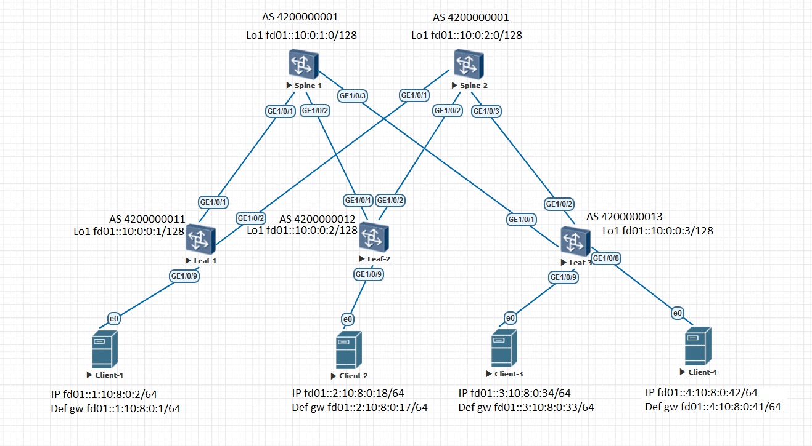

### Underlay BGP

### Цели:
- 1: Настроить BGP для Underlay сети

### Собрана топология:

Spine и Leaf - Huawei CE12800, Clients - Linux 

### Особенности настройки:
В качестве протокола динамической маршрутизации для Undelay выбран EBGP 
В качестве протокола сетевого уровня выбран IPv6 
На всех маршрутизаторах настроена аутентификация MD5 для BGP пиров . 
Уменьшены таймеры BGP - timer keepalive 3 hold 9. 
route-update-interval установлен =0 (по дефолту для EBGP было 30сек.) 

### IP план:
Device|Interface|IPv6 Address|Prefix
---|---|---|---
Spine-1|Lo1|fd01::10:0:1:0|/128
-|Lo2|fd01::10:2:1:0|/128
-|GE1/0/1|fd01::10:4:1:0|/127
-|GE1/0/2|fd01::10:4:1:2|/127
-|GE1/0/3|fd01::10:4:1:4|/127
Spine-2|Lo1|fd01::10:0:2:0|/128
-|Lo2|fd01::10:2:2:0|/128
-|GE1/0/1|fd01::10:4:2:0|/127
-|GE1/0/2|fd01::10:4:2:2|/127
-|GE1/0/3|fd01::10:4:2:4|/127
Leaf-1|Lo1|fd01::10:0:0:1|/128
-|Lo2|fd01::10:2:0:1|/128
-|GE1/0/1|fd01::10:4:1:1|/127
-|GE1/0/2|fd01::10:4:2:1|/127
-|GE1/0/9|fd01::1:10:8:0:1|/64
Leaf-2|Lo1|fd01::10:0:0:2|/128
-|Lo2|fd01::10:2:0:2|/128
-|GE1/0/1|fd01::10:4:1:3|/127
-|GE1/0/2|fd01::10:4:2:3|/127
-|GE1/0/9|fd01::2:10:8:0:17|/64
Leaf-3|Lo1|fd01::10:0:0:3|/128
-|Lo2|fd01::10:2:0:3|/128
-|GE1/0/1|fd01::10:4:1:5|/127
-|GE1/0/2|fd01::10:4:2:5|/127
-|GE1/0/9|fd01::3:10:8:0:33|/64
-|GE1/0/8|fd01::4:10:8:0:41|/64
Client-1|eth0|fd01::1:10:8:0:2|/64
Client-2|eth0|fd01::2:10:8:0:18|/64
Client-3|eth0|fd01::3:10:8:0:34|/64
Client-4|eth0|fd01::4:10:8:0:42|/64

#### Конфигурация на оборудовании Huawei

 Spine-1 

# 
sysname Spine-1 
# 
as-notation plain 
# 
interface GE1/0/1 
 undo portswitch 
 description to Leaf-1 
 undo shutdown 
 ipv6 enable 
 ipv6 address FD01::10:4:1:0/127 
# 
interface GE1/0/2 
 undo portswitch 
 description to Leaf-2 
 undo shutdown 
 ipv6 enable 
 ipv6 address FD01::10:4:1:2/127 
# 
interface GE1/0/3 
 undo portswitch 
 description to Leaf-3 
 undo shutdown 
 ipv6 enable 
 ipv6 address FD01::10:4:1:4/127 
# 
interface LoopBack1 
 ipv6 enable 
 ipv6 address FD01::10:0:1:0/128 
# 
interface LoopBack2 
 ipv6 enable 
 ipv6 address FD01::10:2:1:0/128 
# 
bgp 4200000001 
 router-id 10.0.1.0 
 timer keepalive 3 hold 9 
 peer FD01::10:4:1:1 as-number 4200000011 
 peer FD01::10:4:1:1 description Leaf-1 
 peer FD01::10:4:1:1 password cipher %^%#1`tQG=.lB1\i$"N|b&>=;B&sSzH*BQn9Fu;DL_@9%^%# 
 peer FD01::10:4:1:3 as-number 4200000012 
 peer FD01::10:4:1:3 description Leaf-2 
 peer FD01::10:4:1:3 password cipher %^%#rv[U&i:I8R]7;:&P97+H9G+`I3-gC,C4\T<3tQY%^%# 
 peer FD01::10:4:1:5 as-number 4200000013 
 peer FD01::10:4:1:5 description Leaf-3 
 peer FD01::10:4:1:5 password cipher %^%#t[RpO-[\I&6#5^1E=+@&DcI#KmwMa1K)/^,^mxqR%^%# 
 # 
 ipv6-family unicast 
  network FD01::10:0:1:0 128 
  network FD01::10:2:1:0 128 
  network FD01::10:4:1:0 127 
  network FD01::10:4:1:2 127 
  network FD01::10:4:1:4 127 
  peer FD01::10:4:1:1 enable 
  peer FD01::10:4:1:1 route-update-interval 0 
  peer FD01::10:4:1:3 enable 
  peer FD01::10:4:1:3 route-update-interval 0 
  peer FD01::10:4:1:5 enable 
  peer FD01::10:4:1:5 route-update-interval 0 
# 

 Spine-2 

# 
sysname Spine-2 
# 
as-notation plain 
# 
interface GE1/0/1 
 undo portswitch 
 description to Leaf-1 
 undo shutdown 
 ipv6 enable 
 ipv6 address FD01::10:4:2:0/127 
# 
interface GE1/0/2 
 undo portswitch 
 description to Leaf-2 
 undo shutdown 
 ipv6 enable 
 ipv6 address FD01::10:4:2:2/127 
# 
interface GE1/0/3 
 undo portswitch 
 description to Leaf-3 
 undo shutdown 
 ipv6 enable 
 ipv6 address FD01::10:4:2:4/127 
# 
interface LoopBack1 
 ipv6 enable 
 ipv6 address FD01::10:0:2:0/128 
# 
interface LoopBack2 
 ipv6 enable 
 ipv6 address FD01::10:2:2:0/128 
# 
bgp 4200000001 
 router-id 10.0.2.0 
 timer keepalive 3 hold 9 
 peer FD01::10:4:2:1 as-number 4200000011 
 peer FD01::10:4:2:1 description Leaf-1 
 peer FD01::10:4:2:1 password cipher %^%#_7Wk*6xNp3Sz!M;"bj"H{rbv.1SuA(M.YgBM0CW&%^%# 
 peer FD01::10:4:2:3 as-number 4200000012 
 peer FD01::10:4:2:3 description Leaf-2 
 peer FD01::10:4:2:3 password cipher %^%#hD]yHe4[8HCbN+%}ly~DGmC9C$QcxHsTVuV)z2dC%^%# 
 peer FD01::10:4:2:5 as-number 4200000013 
 peer FD01::10:4:2:5 description Leaf-3 
 peer FD01::10:4:2:5 password cipher %^%#=r|xFh(u$MKmhGS:9{mBB-3I:9X--PQ>eL-v@f}F%^%# 
 # 
 ipv4-family unicast 
 # 
 ipv6-family unicast 
  network FD01::10:0:2:0 128 
  network FD01::10:2:2:0 128 
  network FD01::10:4:2:0 127 
  network FD01::10:4:2:2 127 
  network FD01::10:4:2:4 127 
  peer FD01::10:4:2:1 enable 
  peer FD01::10:4:2:1 route-update-interval 0 
  peer FD01::10:4:2:3 enable 
  peer FD01::10:4:2:3 route-update-interval 0 
  peer FD01::10:4:2:5 enable 
  peer FD01::10:4:2:5 route-update-interval 0 
# 

