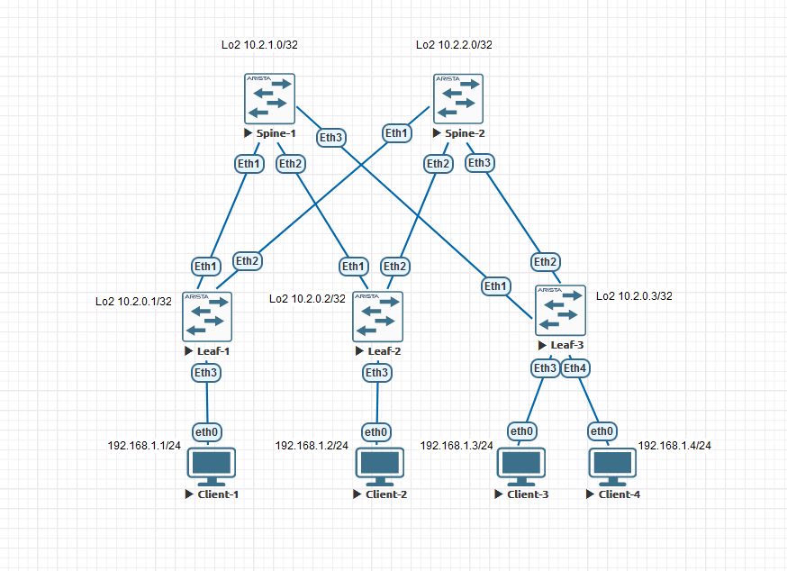

### VxLAN. L2 VNI.

### Цели:
- 1: Настроить Overlay на основе VxLAN EVPN для L2 связанности между клиентами.

### Собрана топология:

### Особенности настройки:
Uderlay OSPF. 
Overlay eBGP. 

### IP план:
Device|Interface|IP Address|Subnet Mask
---|---|---|---
Spine-1|Lo1|10.0.1.0|255.255.255.255
-|Lo2|10.2.1.0|255.255.255.255
-|Eth1|10.4.1.0|255.255.255.254
-|Eth2|10.4.1.2|255.255.255.254
-|Eth3|10.4.1.4|255.255.255.254
Spine-2|Lo1|10.0.2.0|255.255.255.255
-|Lo2|10.2.2.0|255.255.255.255
-|Eth1|10.4.2.0|255.255.255.254
-|Eth2|10.4.2.2|255.255.255.254
-|Eth3|10.4.2.4|255.255.255.254
Leaf-1|Lo1|10.0.0.1|255.255.255.255
-|Lo2|10.2.0.1|255.255.255.255
-|Eth1|10.4.1.1|255.255.255.254
-|Eth2|10.4.2.1|255.255.255.254
Leaf-2|Lo1|10.0.0.2|255.255.255.255
-|Lo2|10.2.0.2|255.255.255.255
-|Eth1|10.4.1.3|255.255.255.254
-|Eth2|10.4.2.3|255.255.255.254
Leaf-3|Lo1|10.0.0.3|255.255.255.255
-|Lo2|10.2.0.3|255.255.255.255
-|Eth1|10.4.1.5|255.255.255.254
-|Eth2|10.4.2.5|255.255.255.254
Client-1|eth0|192.168.1.1|255.255.255.0
Client-2|eth0|192.168.1.2|255.255.255.0
Client-3|eth0|192.168.1.3|255.255.255.0
Client-4|eth0|192.168.1.4|255.255.255.0

#### Конфигурация на оборудовании Arista.

 Spine-1 

# 
Spine-1#sh run 
! Command: show running-config 
! device: Spine-1 (vEOS-lab, EOS-4.29.2F) 
! 
! boot system flash:/vEOS-lab.swi 
! 
no aaa root 
! 
transceiver qsfp default-mode 4x10G 
! 
service routing protocols model multi-agent 
! 
hostname Spine-1 
! 
spanning-tree mode mstp 
! 
interface Ethernet1 
   description Leaf-1 | Eth1 
   mtu 9214 
   no switchport 
   ip address 10.4.1.0/31 
   ip ospf network point-to-point 
   ip ospf area 0.0.0.0 
! 
interface Ethernet2 
   description Leaf-2 | Eth1 
   mtu 9214 
   no switchport 
   ip address 10.4.1.2/31 
   ip ospf network point-to-point 
   ip ospf area 0.0.0.0 
! 
interface Ethernet3 
   description Leaf-3 | Eth1 
   mtu 9214 
   no switchport 
   ip address 10.4.1.4/31 
   ip ospf network point-to-point 
   ip ospf area 0.0.0.0 
! 
interface Loopback1 
   description Underlay 
   ip address 10.0.1.0/32 
   ip ospf area 0.0.0.0 
! 
interface Loopback2 
   description Overlay 
   ip address 10.2.1.0/32 
   ip ospf area 0.0.0.0 
! 
ip routing 
! 
router bgp 65000 
   neighbor evpn peer group 
   neighbor evpn next-hop-unchanged 
   neighbor evpn update-source Loopback2 
   neighbor evpn ebgp-multihop 3 
   neighbor evpn send-community extended 
   neighbor 10.2.0.1 peer group evpn 
   neighbor 10.2.0.1 remote-as 65001 
   neighbor 10.2.0.2 peer group evpn 
   neighbor 10.2.0.2 remote-as 65002 
   neighbor 10.2.0.3 peer group evpn 
   neighbor 10.2.0.3 remote-as 65003 
   ! 
   address-family evpn 
      neighbor evpn activate 
! 
router ospf 1 
   router-id 10.0.1.0 
   auto-cost reference-bandwidth 10000 
   passive-interface default 
   no passive-interface Ethernet1 
   no passive-interface Ethernet2 
   no passive-interface Ethernet3 
   network 0.0.0.0/0 area 0.0.0.0 
   max-lsa 12000 

 Spine-2 

# 
Spine-2#sh run 
! Command: show running-config 
! device: Spine-2 (vEOS-lab, EOS-4.29.2F) 
! 
! boot system flash:/vEOS-lab.swi 
! 
no aaa root 
! 
transceiver qsfp default-mode 4x10G 
! 
service routing protocols model multi-agent 
! 
hostname Spine-2 
! 
spanning-tree mode mstp 
! 
interface Ethernet1 
   description Leaf-1 | Eth1 
   mtu 9214 
   no switchport 
   ip address 10.4.2.0/31 
   ip ospf network point-to-point 
   ip ospf area 0.0.0.0 
! 
interface Ethernet2 
   description Leaf-2 | Eth1 
   mtu 9214 
   no switchport 
   ip address 10.4.2.2/31 
   ip ospf network point-to-point 
   ip ospf area 0.0.0.0 
! 
interface Ethernet3 
   description Leaf-3 | Eth1 
   mtu 9214 
   no switchport 
   ip address 10.4.2.4/31 
   ip ospf network point-to-point 
   ip ospf area 0.0.0.0 
! 
interface Loopback1 
   description Underlay 
   ip address 10.0.2.0/32 
   ip ospf area 0.0.0.0 
! 
interface Loopback2 
   description Overlay 
   ip address 10.2.2.0/32 
   ip ospf area 0.0.0.0 
! 
ip routing 
! 
router bgp 65000 
   neighbor evpn peer group 
   neighbor evpn next-hop-unchanged 
   neighbor evpn update-source Loopback2 
   neighbor evpn ebgp-multihop 3 
   neighbor evpn send-community extended 
   neighbor 10.2.0.1 peer group evpn 
   neighbor 10.2.0.1 remote-as 65001 
   neighbor 10.2.0.2 peer group evpn 
   neighbor 10.2.0.2 remote-as 65002 
   neighbor 10.2.0.3 peer group evpn 
   neighbor 10.2.0.3 remote-as 65003 
   ! 
   address-family evpn 
      neighbor evpn activate 
! 
router ospf 1 
   router-id 10.0.2.0 
   auto-cost reference-bandwidth 10000 
   passive-interface default 
   no passive-interface Ethernet1 
   no passive-interface Ethernet2 
   no passive-interface Ethernet3 
   network 0.0.0.0/0 area 0.0.0.0 
   max-lsa 12000 

