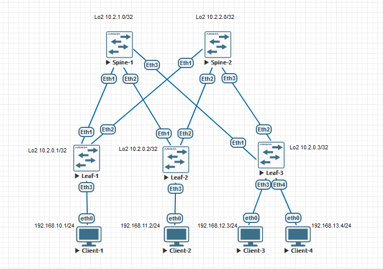

### VxLAN. L3 VNI.

### Цели:
- 1: Настроить Overlay на основе VxLAN EVPN для L3 связности между клиентами.

### Собрана топология:


### Особенности настройки:
На Leaf's на interface vlan назначен ip address virtual (VARP) as the anycast gateway IP и задан ip virtual-router mac-address 00:00:11:22:33:44.

### IP план:
Device|Interface|IP Address|Subnet Mask|Default GW
---|---|---|---|---
Spine-1|Lo1|10.0.1.0|255.255.255.255
-|Lo2|10.2.1.0|255.255.255.255
-|Eth1|10.4.1.0|255.255.255.254
-|Eth2|10.4.1.2|255.255.255.254
-|Eth3|10.4.1.4|255.255.255.254
Spine-2|Lo1|10.0.2.0|255.255.255.255
-|Lo2|10.2.2.0|255.255.255.255
-|Eth1|10.4.2.0|255.255.255.254
-|Eth2|10.4.2.2|255.255.255.254
-|Eth3|10.4.2.4|255.255.255.254
Leaf-1|Lo1|10.0.0.1|255.255.255.255
-|Lo2|10.2.0.1|255.255.255.255
-|Eth1|10.4.1.1|255.255.255.254
-|Eth2|10.4.2.1|255.255.255.254
Leaf-2|Lo1|10.0.0.2|255.255.255.255
-|Lo2|10.2.0.2|255.255.255.255
-|Eth1|10.4.1.3|255.255.255.254
-|Eth2|10.4.2.3|255.255.255.254
Leaf-3|Lo1|10.0.0.3|255.255.255.255
-|Lo2|10.2.0.3|255.255.255.255
-|Eth1|10.4.1.5|255.255.255.254
-|Eth2|10.4.2.5|255.255.255.254
Client-1|eth0|192.168.10.1|255.255.255.0|192.168.10.254
Client-2|eth0|192.168.11.2|255.255.255.0|192.168.11.254
Client-3|eth0|192.168.12.3|255.255.255.0|192.168.12.254
Client-4|eth0|192.168.13.4|255.255.255.0|192.168.13.254

#### Конфигурация на оборудовании Arista.
<details>
<summary> Spine-1 </summary>
#<br>
Spine-1#sh run<br>
! Command: show running-config<br>
! device: Spine-1 (vEOS-lab, EOS-4.29.2F)<br>
!<br>
! boot system flash:/vEOS-lab.swi<br>
!<br>
no aaa root<br>
!<br>
transceiver qsfp default-mode 4x10G<br>
!<br>
service routing protocols model multi-agent<br>
!<br>
hostname Spine-1<br>
!<br>
spanning-tree mode mstp<br>
!<br>
interface Ethernet1<br>
   description Leaf-1 | Eth1<br>
   mtu 9214<br>
   no switchport<br>
   ip address 10.4.1.0/31<br>
   ip ospf network point-to-point<br>
   ip ospf area 0.0.0.0<br>
!<br>
interface Ethernet2<br>
   description Leaf-2 | Eth1<br>
   mtu 9214<br>
   no switchport<br>
   ip address 10.4.1.2/31<br>
   ip ospf network point-to-point<br>
   ip ospf area 0.0.0.0<br>
!<br>
interface Ethernet3<br>
   description Leaf-3 | Eth1<br>
   mtu 9214<br>
   no switchport<br>
   ip address 10.4.1.4/31<br>
   ip ospf network point-to-point<br>
   ip ospf area 0.0.0.0<br>
!<br>
interface Loopback1<br>
   description Underlay<br>
   ip address 10.0.1.0/32<br>
   ip ospf area 0.0.0.0<br>
!<br>
interface Loopback2<br>
   description Overlay<br>
   ip address 10.2.1.0/32<br>
   ip ospf area 0.0.0.0<br>
!<br>
ip routing<br>
!<br>
router bgp 65000<br>
   neighbor evpn peer group<br>
   neighbor evpn next-hop-unchanged<br>
   neighbor evpn update-source Loopback2<br>
   neighbor evpn ebgp-multihop 3<br>
   neighbor evpn send-community extended<br>
   neighbor 10.2.0.1 peer group evpn<br>
   neighbor 10.2.0.1 remote-as 65001<br>
   neighbor 10.2.0.2 peer group evpn<br>
   neighbor 10.2.0.2 remote-as 65002<br>
   neighbor 10.2.0.3 peer group evpn<br>
   neighbor 10.2.0.3 remote-as 65003<br>
   !<br>
   address-family evpn<br>
      neighbor evpn activate<br>
!<br>
router ospf 1<br>
   router-id 10.0.1.0<br>
   auto-cost reference-bandwidth 10000<br>
   passive-interface default<br>
   no passive-interface Ethernet1<br>
   no passive-interface Ethernet2<br>
   no passive-interface Ethernet3<br>
   network 0.0.0.0/0 area 0.0.0.0<br>
   max-lsa 12000<br>
</details>
<details>
<summary> Spine-2 </summary>
#<br>
Spine-2#sh run<br>
! Command: show running-config<br>
! device: Spine-2 (vEOS-lab, EOS-4.29.2F)<br>
!<br>
! boot system flash:/vEOS-lab.swi<br>
!<br>
no aaa root<br>
!<br>
transceiver qsfp default-mode 4x10G<br>
!<br>
service routing protocols model multi-agent<br>
!<br>
hostname Spine-2<br>
!<br>
spanning-tree mode mstp<br>
!<br>
interface Ethernet1<br>
   description Leaf-1 | Eth1<br>
   mtu 9214<br>
   no switchport<br>
   ip address 10.4.2.0/31<br>
   ip ospf network point-to-point<br>
   ip ospf area 0.0.0.0<br>
!<br>
interface Ethernet2<br>
   description Leaf-2 | Eth1<br>
   mtu 9214<br>
   no switchport<br>
   ip address 10.4.2.2/31<br>
   ip ospf network point-to-point<br>
   ip ospf area 0.0.0.0<br>
!<br>
interface Ethernet3<br>
   description Leaf-3 | Eth1<br>
   mtu 9214<br>
   no switchport<br>
   ip address 10.4.2.4/31<br>
   ip ospf network point-to-point<br>
   ip ospf area 0.0.0.0<br>
!<br>
interface Loopback1<br>
   description Underlay<br>
   ip address 10.0.2.0/32<br>
   ip ospf area 0.0.0.0<br>
!<br>
interface Loopback2<br>
   description Overlay<br>
   ip address 10.2.2.0/32<br>
   ip ospf area 0.0.0.0<br>
!<br>
ip routing<br>
!<br>
router bgp 65000<br>
   neighbor evpn peer group<br>
   neighbor evpn next-hop-unchanged<br>
   neighbor evpn update-source Loopback2<br>
   neighbor evpn ebgp-multihop 3<br>
   neighbor evpn send-community extended<br>
   neighbor 10.2.0.1 peer group evpn<br>
   neighbor 10.2.0.1 remote-as 65001<br>
   neighbor 10.2.0.2 peer group evpn<br>
   neighbor 10.2.0.2 remote-as 65002<br>
   neighbor 10.2.0.3 peer group evpn<br>
   neighbor 10.2.0.3 remote-as 65003<br>
   !<br>
   address-family evpn<br>
      neighbor evpn activate<br>
!<br>
router ospf 1<br>
   router-id 10.0.2.0<br>
   auto-cost reference-bandwidth 10000<br>
   passive-interface default<br>
   no passive-interface Ethernet1<br>
   no passive-interface Ethernet2<br>
   no passive-interface Ethernet3<br>
   network 0.0.0.0/0 area 0.0.0.0<br>
   max-lsa 12000<br>
</details>
<details>
<summary> Leaf-1 </summary>
<br>
Leaf-1# sh run<br>
! Command: show running-config<br>
! device: Leaf-1 (vEOS-lab, EOS-4.29.2F)<br>
!<br>
! boot system flash:/vEOS-lab.swi<br>
!<br>
no aaa root<br>
!<br>
transceiver qsfp default-mode 4x10G<br>
!<br>
service routing protocols model multi-agent<br>
!<br>
hostname Leaf-1<br>
!<br>
spanning-tree mode mstp<br>
!<br>
vlan 10<br>
   name Client-1<br>
!<br>
vrf instance vrf-vxlan<br>
!<br>
interface Ethernet1<br>
   description Spine-1 | Eth1<br>
   mtu 9214<br>
   no switchport<br>
   ip address 10.4.1.1/31<br>
   ip ospf network point-to-point<br>
   ip ospf area 0.0.0.0<br>
!<br>
interface Ethernet2<br>
   description Spine-2 | Eth1<br>
   mtu 9214<br>
   no switchport<br>
   ip address 10.4.2.1/31<br>
   ip ospf network point-to-point<br>
   ip ospf area 0.0.0.0<br>
!<br>
interface Ethernet3<br>
   switchport access vlan 10<br>
!<br>
interface Loopback1<br>
   description Underlay<br>
   ip address 10.0.0.1/32<br>
   ip ospf area 0.0.0.0<br>
!<br>
interface Loopback2<br>
   description Overlay<br>
   ip address 10.2.0.1/32<br>
   ip ospf area 0.0.0.0<br>
!<br>
interface Vlan10<br>
   vrf vrf-vxlan<br>
   ip address virtual 192.168.10.254/24<br>
!<br>
interface Vxlan1<br>
   vxlan source-interface Loopback2<br>
   vxlan udp-port 4789<br>
   vxlan vlan 10 vni 1010<br>
   vxlan vrf vrf-vxlan vni 50000<br>
   vxlan learn-restrict any<br>
!<br>
ip virtual-router mac-address 00:00:11:22:33:44<br>
!<br>
ip routing<br>
ip routing vrf vrf-vxlan<br>
!<br>
router bgp 65001<br>
   neighbor evpn peer group<br>
   neighbor evpn remote-as 65000<br>
   neighbor evpn update-source Loopback2<br>
   neighbor evpn ebgp-multihop 3<br>
   neighbor evpn send-community extended<br>
   neighbor 10.2.1.0 peer group evpn<br>
   neighbor 10.2.2.0 peer group evpn<br>
   !<br>
   vlan 10<br>
      rd 65001:1010<br>
      route-target both 10:1010<br>
      redistribute learned<br>
   !<br>
   address-family evpn<br>
      neighbor evpn activate<br>
   !<br>
   vrf vrf-vxlan<br>
      rd 10.2.0.1:1<br>
      route-target import evpn 1:50000<br>
      route-target export evpn 1:50000<br>
      redistribute connected<br>
!<br>
router ospf 1<br>
   router-id 10.0.0.1<br>
   auto-cost reference-bandwidth 10000<br>
   passive-interface default<br>
   no passive-interface Ethernet1<br>
   no passive-interface Ethernet2<br>
   network 0.0.0.0/0 area 0.0.0.0<br>
   max-lsa 12000<br>
</details>
<details>
<summary> Leaf-2 </summary>
<br>
Leaf-2#sh run<br>
! Command: show running-config<br>
! device: Leaf-2 (vEOS-lab, EOS-4.29.2F)<br>
!<br>
! boot system flash:/vEOS-lab.swi<br>
!<br>
no aaa root<br>
!<br>
transceiver qsfp default-mode 4x10G<br>
!<br>
service routing protocols model multi-agent<br>
!<br>
hostname Leaf-2<br>
!<br>
spanning-tree mode mstp<br>
!<br>
vlan 11<br>
   name Client-2<br>
!<br>
vrf instance vrf-vxlan<br>
!<br>
interface Ethernet1<br>
   description Spine-1 | Eth2<br>
   mtu 9214<br>
   no switchport<br>
   ip address 10.4.1.3/31<br>
   ip ospf network point-to-point<br>
   ip ospf area 0.0.0.0<br>
!<br>
interface Ethernet2<br>
   description Spine-2 | Eth2<br>
   mtu 9214<br>
   no switchport<br>
   ip address 10.4.2.3/31<br>
   ip ospf network point-to-point<br>
   ip ospf area 0.0.0.0<br>
!<br>
interface Ethernet3<br>
   switchport access vlan 11<br>
!<br>
interface Loopback1<br>
   description Underlay<br>
   ip address 10.0.0.2/32<br>
   ip ospf area 0.0.0.0<br>
!<br>
interface Loopback2<br>
   description Overlay<br>
   ip address 10.2.0.2/32<br>
   ip ospf area 0.0.0.0<br>
!<br>
interface Vlan11<br>
   vrf vrf-vxlan<br>
   ip address virtual 192.168.11.254/24<br>
!<br>
interface Vxlan1<br>
   vxlan source-interface Loopback2<br>
   vxlan udp-port 4789<br>
   vxlan vlan 11 vni 1011<br>
   vxlan vrf vrf-vxlan vni 50000<br>
   vxlan learn-restrict any<br>
!<br>
ip virtual-router mac-address 00:00:11:22:33:44<br>
!<br>
ip routing<br>
ip routing vrf vrf-vxlan<br>
!<br>
router bgp 65002<br>
   neighbor evpn peer group<br>
   neighbor evpn remote-as 65000<br>
   neighbor evpn update-source Loopback2<br>
   neighbor evpn ebgp-multihop 3<br>
   neighbor evpn send-community extended<br>
   neighbor 10.2.1.0 peer group evpn<br>
   neighbor 10.2.2.0 peer group evpn<br>
   !<br>
   vlan 11<br>
      rd 65002:1011<br>
      route-target both 11:1011<br>
      redistribute learned<br>
   !<br>
   address-family evpn<br>
      neighbor evpn activate<br>
   !<br>
   vrf vrf-vxlan<br>
      rd 10.2.0.2:1<br>
      route-target import evpn 1:50000<br>
      route-target export evpn 1:50000<br>
      redistribute connected<br>
!<br>
router ospf 1<br>
   router-id 10.0.0.2<br>
   auto-cost reference-bandwidth 10000<br>
   passive-interface default<br>
   no passive-interface Ethernet1<br>
   no passive-interface Ethernet2<br>
   network 0.0.0.0/0 area 0.0.0.0<br>
   max-lsa 12000<br>
</details>
<details>
<summary> Leaf-3 </summary>
<br>
Leaf-3#sh run<br>
! Command: show running-config<br>
! device: Leaf-3 (vEOS-lab, EOS-4.29.2F)<br>
!<br>
! boot system flash:/vEOS-lab.swi<br>
!<br>
no aaa root<br>
!<br>
transceiver qsfp default-mode 4x10G<br>
!<br>
service routing protocols model multi-agent<br>
!<br>
hostname Leaf-3<br>
!<br>
spanning-tree mode mstp<br>
!<br>
vlan 12<br>
   name Client-3<br>
!<br>
vlan 13<br>
   name Client-4<br>
!<br>
vrf instance vrf-vxlan<br>
!<br>
interface Ethernet1<br>
   description Spine-1 | Eth1<br>
   mtu 9214<br>
   no switchport<br>
   ip address 10.4.1.5/31<br>
   ip ospf network point-to-point<br>
   ip ospf area 0.0.0.0<br>
!<br>
interface Ethernet2<br>
   description Spine-2 | Eth1<br>
   mtu 9214<br>
   no switchport<br>
   ip address 10.4.2.5/31<br>
   ip ospf network point-to-point<br>
   ip ospf area 0.0.0.0<br>
!<br>
interface Ethernet3<br>
   switchport access vlan 12<br>
!<br>
interface Ethernet4<br>
   switchport access vlan 13<br>
!<br>
interface Loopback1<br>
   description Underlay<br>
   ip address 10.0.0.3/32<br>
   ip ospf area 0.0.0.0<br>
!<br>
interface Loopback2<br>
   description Overlay<br>
   ip address 10.2.0.3/32<br>
   ip ospf area 0.0.0.0<br>
!<br>
interface Vlan12<br>
   vrf vrf-vxlan<br>
   ip address virtual 192.168.12.254/24<br>
!<br>
interface Vlan13<br>
   vrf vrf-vxlan<br>
   ip address virtual 192.168.13.254/24<br>
!<br>
interface Vxlan1<br>
   vxlan source-interface Loopback2<br>
   vxlan udp-port 4789<br>
   vxlan vlan 12 vni 1012<br>
   vxlan vlan 13 vni 1013<br>
   vxlan vrf vrf-vxlan vni 50000<br>
   vxlan learn-restrict any<br>
!<br>
ip virtual-router mac-address 00:00:11:22:33:44<br>
!<br>
ip routing<br>
ip routing vrf vrf-vxlan<br>
!<br>
router bgp 65003<br>
   neighbor evpn peer group<br>
   neighbor evpn remote-as 65000<br>
   neighbor evpn update-source Loopback2<br>
   neighbor evpn ebgp-multihop 3<br>
   neighbor evpn send-community extended<br>
   neighbor 10.2.1.0 peer group evpn<br>
   neighbor 10.2.2.0 peer group evpn<br>
   !<br>
   vlan 12<br>
      rd 65003:1012<br>
      route-target both 12:1012<br>
      redistribute learned<br>
   !<br>
   vlan 13<br>
      rd 65003:1013<br>
      route-target both 13:1013<br>
      redistribute learned<br>
   !<br>
   address-family evpn<br>
      neighbor evpn activate<br>
   !<br>
   vrf vrf-vxlan<br>
      rd 10.2.0.3:1<br>
      route-target import evpn 1:50000<br>
      route-target export evpn 1:50000<br>
      redistribute connected<br>
!<br>
router ospf 1<br>
   router-id 10.0.0.3<br>
   auto-cost reference-bandwidth 10000<br>
   passive-interface default<br>
   no passive-interface Ethernet1<br>
   no passive-interface Ethernet2<br>
   network 0.0.0.0/0 area 0.0.0.0<br>
   max-lsa 12000<br>
</details>
#### Диагностика Spine/Leaf

<details>
<summary> Spine-1 diag </summary>
 
 ```
Spine-1#show bgp evpn summary
BGP summary information for VRF default
Router identifier 10.2.1.0, local AS number 65000
Neighbor Status Codes: m - Under maintenance
  Neighbor V AS           MsgRcvd   MsgSent  InQ OutQ  Up/Down State   PfxRcd PfxAcc
  10.2.0.1 4 65001           3800      3758    0    0    2d03h Estab   4      4
  10.2.0.2 4 65002           3798      3756    0    0    2d03h Estab   4      4
  10.2.0.3 4 65003           3798      3754    0    0    2d03h Estab   8      8

Spine-1#show bgp evpn
BGP routing table information for VRF default
Router identifier 10.2.1.0, local AS number 65000
Route status codes: * - valid, > - active, S - Stale, E - ECMP head, e - ECMP
                    c - Contributing to ECMP, % - Pending BGP convergence
Origin codes: i - IGP, e - EGP, ? - incomplete
AS Path Attributes: Or-ID - Originator ID, C-LST - Cluster List, LL Nexthop - Link Local Nexthop

          Network                Next Hop              Metric  LocPref Weight  Path
 * >      RD: 65001:1010 mac-ip 0050.7966.6806
                                 10.2.0.1              -       100     0       65001 i
 * >      RD: 65001:1010 mac-ip 0050.7966.6806 192.168.10.1
                                 10.2.0.1              -       100     0       65001 i
 * >      RD: 65002:1011 mac-ip 0050.7966.6807
                                 10.2.0.2              -       100     0       65002 i
 * >      RD: 65002:1011 mac-ip 0050.7966.6807 192.168.11.2
                                 10.2.0.2              -       100     0       65002 i
 * >      RD: 65003:1012 mac-ip 0050.7966.6808
                                 10.2.0.3              -       100     0       65003 i
 * >      RD: 65003:1012 mac-ip 0050.7966.6808 192.168.12.3
                                 10.2.0.3              -       100     0       65003 i
 * >      RD: 65003:1013 mac-ip 0050.7966.6809
                                 10.2.0.3              -       100     0       65003 i
 * >      RD: 65003:1013 mac-ip 0050.7966.6809 192.168.13.4
                                 10.2.0.3              -       100     0       65003 i
 * >      RD: 65001:1010 imet 10.2.0.1
                                 10.2.0.1              -       100     0       65001 i
 * >      RD: 65002:1011 imet 10.2.0.2
                                 10.2.0.2              -       100     0       65002 i
 * >      RD: 65003:1012 imet 10.2.0.3
                                 10.2.0.3              -       100     0       65003 i
 * >      RD: 65003:1013 imet 10.2.0.3
                                 10.2.0.3              -       100     0       65003 i
 * >      RD: 10.2.0.1:1 ip-prefix 192.168.10.0/24
                                 10.2.0.1              -       100     0       65001 i
 * >      RD: 10.2.0.2:1 ip-prefix 192.168.11.0/24
                                 10.2.0.2              -       100     0       65002 i
 * >      RD: 10.2.0.3:1 ip-prefix 192.168.12.0/24
                                 10.2.0.3              -       100     0       65003 i
 * >      RD: 10.2.0.3:1 ip-prefix 192.168.13.0/24
                                 10.2.0.3              -       100     0       65003 i

```
</details>

<details>
<summary> Spine-2 diag </summary>

 ```
Spine-2#show bgp evpn summary
BGP summary information for VRF default
Router identifier 10.2.2.0, local AS number 65000
Neighbor Status Codes: m - Under maintenance
  Neighbor V AS           MsgRcvd   MsgSent  InQ OutQ  Up/Down State   PfxRcd PfxAcc
  10.2.0.1 4 65001           3806      3759    0    0    2d03h Estab   4      4
  10.2.0.2 4 65002           3800      3766    0    0    2d03h Estab   4      4
  10.2.0.3 4 65003           3802      3751    0    0    2d03h Estab   8      8

Spine-2#show bgp evpn
BGP routing table information for VRF default
Router identifier 10.2.2.0, local AS number 65000
Route status codes: * - valid, > - active, S - Stale, E - ECMP head, e - ECMP
                    c - Contributing to ECMP, % - Pending BGP convergence
Origin codes: i - IGP, e - EGP, ? - incomplete
AS Path Attributes: Or-ID - Originator ID, C-LST - Cluster List, LL Nexthop - Link Local Nexthop

          Network                Next Hop              Metric  LocPref Weight  Path
 * >      RD: 65001:1010 mac-ip 0050.7966.6806
                                 10.2.0.1              -       100     0       65001 i
 * >      RD: 65001:1010 mac-ip 0050.7966.6806 192.168.10.1
                                 10.2.0.1              -       100     0       65001 i
 * >      RD: 65002:1011 mac-ip 0050.7966.6807
                                 10.2.0.2              -       100     0       65002 i
 * >      RD: 65002:1011 mac-ip 0050.7966.6807 192.168.11.2
                                 10.2.0.2              -       100     0       65002 i
 * >      RD: 65003:1012 mac-ip 0050.7966.6808
                                 10.2.0.3              -       100     0       65003 i
 * >      RD: 65003:1012 mac-ip 0050.7966.6808 192.168.12.3
                                 10.2.0.3              -       100     0       65003 i
 * >      RD: 65003:1013 mac-ip 0050.7966.6809
                                 10.2.0.3              -       100     0       65003 i
 * >      RD: 65003:1013 mac-ip 0050.7966.6809 192.168.13.4
                                 10.2.0.3              -       100     0       65003 i
 * >      RD: 65001:1010 imet 10.2.0.1
                                 10.2.0.1              -       100     0       65001 i
 * >      RD: 65002:1011 imet 10.2.0.2
                                 10.2.0.2              -       100     0       65002 i
 * >      RD: 65003:1012 imet 10.2.0.3
                                 10.2.0.3              -       100     0       65003 i
 * >      RD: 65003:1013 imet 10.2.0.3
                                 10.2.0.3              -       100     0       65003 i
 * >      RD: 10.2.0.1:1 ip-prefix 192.168.10.0/24
                                 10.2.0.1              -       100     0       65001 i
 * >      RD: 10.2.0.2:1 ip-prefix 192.168.11.0/24
                                 10.2.0.2              -       100     0       65002 i
 * >      RD: 10.2.0.3:1 ip-prefix 192.168.12.0/24
                                 10.2.0.3              -       100     0       65003 i
 * >      RD: 10.2.0.3:1 ip-prefix 192.168.13.0/24
                                 10.2.0.3              -       100     0       65003 i

```
</details>
<details>
<summary> Leaf-1 diag </summary>

 ```
Leaf-1#show ip route vrf vrf-vxlan

VRF: vrf-vxlan
Codes: C - connected, S - static, K - kernel,
       O - OSPF, IA - OSPF inter area, E1 - OSPF external type 1,
       E2 - OSPF external type 2, N1 - OSPF NSSA external type 1,
       N2 - OSPF NSSA external type2, B - Other BGP Routes,
       B I - iBGP, B E - eBGP, R - RIP, I L1 - IS-IS level 1,
       I L2 - IS-IS level 2, O3 - OSPFv3, A B - BGP Aggregate,
       A O - OSPF Summary, NG - Nexthop Group Static Route,
       V - VXLAN Control Service, M - Martian,
       DH - DHCP client installed default route,
       DP - Dynamic Policy Route, L - VRF Leaked,
       G  - gRIBI, RC - Route Cache Route

Gateway of last resort is not set

 C        192.168.10.0/24 is directly connected, Vlan10
 B E      192.168.11.2/32 [200/0] via VTEP 10.2.0.2 VNI 50000 router-mac 50:00:00:03:37:66 local-interface Vxlan1
 B E      192.168.11.0/24 [200/0] via VTEP 10.2.0.2 VNI 50000 router-mac 50:00:00:03:37:66 local-interface Vxlan1
 B E      192.168.12.3/32 [200/0] via VTEP 10.2.0.3 VNI 50000 router-mac 50:00:00:15:f4:e8 local-interface Vxlan1
 B E      192.168.12.0/24 [200/0] via VTEP 10.2.0.3 VNI 50000 router-mac 50:00:00:15:f4:e8 local-interface Vxlan1
 B E      192.168.13.4/32 [200/0] via VTEP 10.2.0.3 VNI 50000 router-mac 50:00:00:15:f4:e8 local-interface Vxlan1
 B E      192.168.13.0/24 [200/0] via VTEP 10.2.0.3 VNI 50000 router-mac 50:00:00:15:f4:e8 local-interface Vxlan1

Leaf-1#show mac address-table
          Mac Address Table
------------------------------------------------------------------

Vlan    Mac Address       Type        Ports      Moves   Last Move
----    -----------       ----        -----      -----   ---------
   1    0000.1122.3344    STATIC      Cpu
  10    0000.1122.3344    STATIC      Cpu
  10    0050.7966.6806    DYNAMIC     Et3        1       0:01:34 ago
4094    0000.1122.3344    STATIC      Cpu
4094    5000.0003.3766    DYNAMIC     Vx1        1       17:12:45 ago
4094    5000.0015.f4e8    DYNAMIC     Vx1        1       17:06:45 ago
Total Mac Addresses for this criterion: 6

Leaf-1#show vxlan address-table
          Vxlan Mac Address Table
----------------------------------------------------------------------

VLAN  Mac Address     Type      Prt  VTEP             Moves   Last Move
----  -----------     ----      ---  ----             -----   ---------
4094  5000.0003.3766  EVPN      Vx1  10.2.0.2         1       17:29:39 ago
4094  5000.0015.f4e8  EVPN      Vx1  10.2.0.3         1       17:23:38 ago
Total Remote Mac Addresses for this criterion: 2

Leaf-1#show vxlan vtep
Remote VTEPS for Vxlan1:

VTEP           Tunnel Type(s)
-------------- --------------
10.2.0.2       unicast
10.2.0.3       unicast

Total number of remote VTEPS:  2

Leaf-1#show interfaces vxlan 1
Vxlan1 is up, line protocol is up (connected)
  Hardware is Vxlan
  Source interface is Loopback2 and is active with 10.2.0.1
  Listening on UDP port 4789
  Replication/Flood Mode is headend with Flood List Source: EVPN
  Remote MAC learning via EVPN
  VNI mapping to VLANs
  Static VLAN to VNI mapping is
    [10, 1010]
  Dynamic VLAN to VNI mapping for 'evpn' is
    [4094, 50000]
  Note: All Dynamic VLANs used by VCS are internal VLANs.
        Use 'show vxlan vni' for details.
  Static VRF to VNI mapping is
   [vrf-vxlan, 50000]
  Shared Router MAC is 0000.0000.0000

Leaf-1#show bgp evpn summary
BGP summary information for VRF default
Router identifier 10.2.0.1, local AS number 65001
Neighbor Status Codes: m - Under maintenance
  Neighbor V AS           MsgRcvd   MsgSent  InQ OutQ  Up/Down State   PfxRcd PfxAcc
  10.2.1.0 4 65000           3776      3819    0    0    2d04h Estab   12     12
  10.2.2.0 4 65000           3774      3825    0    0    2d04h Estab   12     12

Leaf-1#show bgp evpn
BGP routing table information for VRF default
Router identifier 10.2.0.1, local AS number 65001
Route status codes: * - valid, > - active, S - Stale, E - ECMP head, e - ECMP
                    c - Contributing to ECMP, % - Pending BGP convergence
Origin codes: i - IGP, e - EGP, ? - incomplete
AS Path Attributes: Or-ID - Originator ID, C-LST - Cluster List, LL Nexthop - Link Local Nexthop

          Network                Next Hop              Metric  LocPref Weight  Path
 * >      RD: 65001:1010 mac-ip 0050.7966.6806
                                 -                     -       -       0       i
 * >      RD: 65001:1010 mac-ip 0050.7966.6806 192.168.10.1
                                 -                     -       -       0       i
 * >Ec    RD: 65002:1011 mac-ip 0050.7966.6807
                                 10.2.0.2              -       100     0       65000 65002 i
 *  ec    RD: 65002:1011 mac-ip 0050.7966.6807
                                 10.2.0.2              -       100     0       65000 65002 i
 * >Ec    RD: 65002:1011 mac-ip 0050.7966.6807 192.168.11.2
                                 10.2.0.2              -       100     0       65000 65002 i
 *  ec    RD: 65002:1011 mac-ip 0050.7966.6807 192.168.11.2
                                 10.2.0.2              -       100     0       65000 65002 i
 * >Ec    RD: 65003:1012 mac-ip 0050.7966.6808
                                 10.2.0.3              -       100     0       65000 65003 i
 *  ec    RD: 65003:1012 mac-ip 0050.7966.6808
                                 10.2.0.3              -       100     0       65000 65003 i
 * >Ec    RD: 65003:1012 mac-ip 0050.7966.6808 192.168.12.3
                                 10.2.0.3              -       100     0       65000 65003 i
 *  ec    RD: 65003:1012 mac-ip 0050.7966.6808 192.168.12.3
                                 10.2.0.3              -       100     0       65000 65003 i
 * >Ec    RD: 65003:1013 mac-ip 0050.7966.6809
                                 10.2.0.3              -       100     0       65000 65003 i
 *  ec    RD: 65003:1013 mac-ip 0050.7966.6809
                                 10.2.0.3              -       100     0       65000 65003 i
 * >Ec    RD: 65003:1013 mac-ip 0050.7966.6809 192.168.13.4
                                 10.2.0.3              -       100     0       65000 65003 i
 *  ec    RD: 65003:1013 mac-ip 0050.7966.6809 192.168.13.4
                                 10.2.0.3              -       100     0       65000 65003 i
 * >      RD: 65001:1010 imet 10.2.0.1
                                 -                     -       -       0       i
 * >Ec    RD: 65002:1011 imet 10.2.0.2
                                 10.2.0.2              -       100     0       65000 65002 i
 *  ec    RD: 65002:1011 imet 10.2.0.2
                                 10.2.0.2              -       100     0       65000 65002 i
 * >Ec    RD: 65003:1012 imet 10.2.0.3
                                 10.2.0.3              -       100     0       65000 65003 i
 *  ec    RD: 65003:1012 imet 10.2.0.3
                                 10.2.0.3              -       100     0       65000 65003 i
 * >Ec    RD: 65003:1013 imet 10.2.0.3
                                 10.2.0.3              -       100     0       65000 65003 i
 *  ec    RD: 65003:1013 imet 10.2.0.3
                                 10.2.0.3              -       100     0       65000 65003 i
 * >      RD: 10.2.0.1:1 ip-prefix 192.168.10.0/24
                                 -                     -       -       0       i
 * >      RD: 10.2.0.2:1 ip-prefix 192.168.11.0/24
                                 10.2.0.2              -       100     0       65000 65002 i
 *        RD: 10.2.0.2:1 ip-prefix 192.168.11.0/24
                                 10.2.0.2              -       100     0       65000 65002 i
 * >      RD: 10.2.0.3:1 ip-prefix 192.168.12.0/24
                                 10.2.0.3              -       100     0       65000 65003 i
 *        RD: 10.2.0.3:1 ip-prefix 192.168.12.0/24
                                 10.2.0.3              -       100     0       65000 65003 i
 * >      RD: 10.2.0.3:1 ip-prefix 192.168.13.0/24
                                 10.2.0.3              -       100     0       65000 65003 i
 *        RD: 10.2.0.3:1 ip-prefix 192.168.13.0/24
                                 10.2.0.3              -       100     0       65000 65003 i
```
</details>
<details>
<summary> Leaf-2 diag </summary>

 ```
Leaf-2#show ip route vrf vrf-vxlan

VRF: vrf-vxlan
Codes: C - connected, S - static, K - kernel,
       O - OSPF, IA - OSPF inter area, E1 - OSPF external type 1,
       E2 - OSPF external type 2, N1 - OSPF NSSA external type 1,
       N2 - OSPF NSSA external type2, B - Other BGP Routes,
       B I - iBGP, B E - eBGP, R - RIP, I L1 - IS-IS level 1,
       I L2 - IS-IS level 2, O3 - OSPFv3, A B - BGP Aggregate,
       A O - OSPF Summary, NG - Nexthop Group Static Route,
       V - VXLAN Control Service, M - Martian,
       DH - DHCP client installed default route,
       DP - Dynamic Policy Route, L - VRF Leaked,
       G  - gRIBI, RC - Route Cache Route

Gateway of last resort is not set

 B E      192.168.10.1/32 [200/0] via VTEP 10.2.0.1 VNI 50000 router-mac 50:00:00:d5:5d:c0 local-interface Vxlan1
 B E      192.168.10.0/24 [200/0] via VTEP 10.2.0.1 VNI 50000 router-mac 50:00:00:d5:5d:c0 local-interface Vxlan1
 C        192.168.11.0/24 is directly connected, Vlan11
 B E      192.168.12.3/32 [200/0] via VTEP 10.2.0.3 VNI 50000 router-mac 50:00:00:15:f4:e8 local-interface Vxlan1
 B E      192.168.12.0/24 [200/0] via VTEP 10.2.0.3 VNI 50000 router-mac 50:00:00:15:f4:e8 local-interface Vxlan1
 B E      192.168.13.4/32 [200/0] via VTEP 10.2.0.3 VNI 50000 router-mac 50:00:00:15:f4:e8 local-interface Vxlan1
 B E      192.168.13.0/24 [200/0] via VTEP 10.2.0.3 VNI 50000 router-mac 50:00:00:15:f4:e8 local-interface Vxlan1

Leaf-2#show mac address-table
          Mac Address Table
------------------------------------------------------------------

Vlan    Mac Address       Type        Ports      Moves   Last Move
----    -----------       ----        -----      -----   ---------
   1    0000.1122.3344    STATIC      Cpu
  11    0000.1122.3344    STATIC      Cpu
  11    0050.7966.6807    DYNAMIC     Et3        1       0:02:58 ago
4094    0000.1122.3344    STATIC      Cpu
4094    5000.0015.f4e8    DYNAMIC     Vx1        1       19:48:33 ago
4094    5000.00d5.5dc0    DYNAMIC     Vx1        1       16:53:15 ago
Total Mac Addresses for this criterion: 6

Leaf-2#show vxlan address-table
          Vxlan Mac Address Table
----------------------------------------------------------------------

VLAN  Mac Address     Type      Prt  VTEP             Moves   Last Move
----  -----------     ----      ---  ----             -----   ---------
4094  5000.0015.f4e8  EVPN      Vx1  10.2.0.3         1       19:48:49 ago
4094  5000.00d5.5dc0  EVPN      Vx1  10.2.0.1         1       16:53:31 ago
Total Remote Mac Addresses for this criterion: 2

Leaf-2#show vxlan vtep
Remote VTEPS for Vxlan1:

VTEP           Tunnel Type(s)
-------------- --------------
10.2.0.1       unicast
10.2.0.3       unicast

Total number of remote VTEPS:  2

Leaf-2#show interfaces vxlan 1
Vxlan1 is up, line protocol is up (connected)
  Hardware is Vxlan
  Source interface is Loopback2 and is active with 10.2.0.2
  Listening on UDP port 4789
  Replication/Flood Mode is headend with Flood List Source: EVPN
  Remote MAC learning via EVPN
  VNI mapping to VLANs
  Static VLAN to VNI mapping is
    [11, 1011]
  Dynamic VLAN to VNI mapping for 'evpn' is
    [4094, 50000]
  Note: All Dynamic VLANs used by VCS are internal VLANs.
        Use 'show vxlan vni' for details.
  Static VRF to VNI mapping is
   [vrf-vxlan, 50000]
  Shared Router MAC is 0000.0000.0000

Leaf-2#show bgp evpn summary
BGP summary information for VRF default
Router identifier 10.2.0.2, local AS number 65002
Neighbor Status Codes: m - Under maintenance
  Neighbor V AS           MsgRcvd   MsgSent  InQ OutQ  Up/Down State   PfxRcd PfxAcc
  10.2.1.0 4 65000           4004      4062    0    0    2d06h Estab   12     12
  10.2.2.0 4 65000           4012      4059    0    0    2d06h Estab   12     12

Leaf-2#show bgp evpn
BGP routing table information for VRF default
Router identifier 10.2.0.2, local AS number 65002
Route status codes: * - valid, > - active, S - Stale, E - ECMP head, e - ECMP
                    c - Contributing to ECMP, % - Pending BGP convergence
Origin codes: i - IGP, e - EGP, ? - incomplete
AS Path Attributes: Or-ID - Originator ID, C-LST - Cluster List, LL Nexthop - Link Local Nexthop

          Network                Next Hop              Metric  LocPref Weight  Path
 * >Ec    RD: 65003:1013 mac-ip 0050.7966.6809
                                 10.2.0.3              -       100     0       65000 65003 i
 *  ec    RD: 65003:1013 mac-ip 0050.7966.6809
                                 10.2.0.3              -       100     0       65000 65003 i
 * >Ec    RD: 65003:1013 mac-ip 0050.7966.6809 192.168.13.4
                                 10.2.0.3              -       100     0       65000 65003 i
 *  ec    RD: 65003:1013 mac-ip 0050.7966.6809 192.168.13.4
                                 10.2.0.3              -       100     0       65000 65003 i
 * >Ec    RD: 65001:1010 imet 10.2.0.1
                                 10.2.0.1              -       100     0       65000 65001 i
 *  ec    RD: 65001:1010 imet 10.2.0.1
                                 10.2.0.1              -       100     0       65000 65001 i
 * >      RD: 65002:1011 imet 10.2.0.2
                                 -                     -       -       0       i
 * >Ec    RD: 65003:1012 imet 10.2.0.3
                                 10.2.0.3              -       100     0       65000 65003 i
 *  ec    RD: 65003:1012 imet 10.2.0.3
                                 10.2.0.3              -       100     0       65000 65003 i
 * >Ec    RD: 65003:1013 imet 10.2.0.3
                                 10.2.0.3              -       100     0       65000 65003 i
 *  ec    RD: 65003:1013 imet 10.2.0.3
                                 10.2.0.3              -       100     0       65000 65003 i
 * >      RD: 10.2.0.1:1 ip-prefix 192.168.10.0/24
                                 10.2.0.1              -       100     0       65000 65001 i
 *        RD: 10.2.0.1:1 ip-prefix 192.168.10.0/24
                                 10.2.0.1              -       100     0       65000 65001 i
 * >      RD: 10.2.0.2:1 ip-prefix 192.168.11.0/24
                                 -                     -       -       0       i
 * >      RD: 10.2.0.3:1 ip-prefix 192.168.12.0/24
                                 10.2.0.3              -       100     0       65000 65003 i
 *        RD: 10.2.0.3:1 ip-prefix 192.168.12.0/24
                                 10.2.0.3              -       100     0       65000 65003 i
 * >      RD: 10.2.0.3:1 ip-prefix 192.168.13.0/24
                                 10.2.0.3              -       100     0       65000 65003 i
 *        RD: 10.2.0.3:1 ip-prefix 192.168.13.0/24
                                 10.2.0.3              -       100     0       65000 65003 i

```
</details>
<details>
<summary> Leaf-3 diag </summary>

 ```
Leaf-3#show ip route vrf vrf-vxlan

VRF: vrf-vxlan
Codes: C - connected, S - static, K - kernel,
       O - OSPF, IA - OSPF inter area, E1 - OSPF external type 1,
       E2 - OSPF external type 2, N1 - OSPF NSSA external type 1,
       N2 - OSPF NSSA external type2, B - Other BGP Routes,
       B I - iBGP, B E - eBGP, R - RIP, I L1 - IS-IS level 1,
       I L2 - IS-IS level 2, O3 - OSPFv3, A B - BGP Aggregate,
       A O - OSPF Summary, NG - Nexthop Group Static Route,
       V - VXLAN Control Service, M - Martian,
       DH - DHCP client installed default route,
       DP - Dynamic Policy Route, L - VRF Leaked,
       G  - gRIBI, RC - Route Cache Route

Gateway of last resort is not set

 B E      192.168.10.1/32 [200/0] via VTEP 10.2.0.1 VNI 50000 router-mac 50:00:00:d5:5d:c0 local-interface Vxlan1
 B E      192.168.10.0/24 [200/0] via VTEP 10.2.0.1 VNI 50000 router-mac 50:00:00:d5:5d:c0 local-interface Vxlan1
 B E      192.168.11.2/32 [200/0] via VTEP 10.2.0.2 VNI 50000 router-mac 50:00:00:03:37:66 local-interface Vxlan1
 B E      192.168.11.0/24 [200/0] via VTEP 10.2.0.2 VNI 50000 router-mac 50:00:00:03:37:66 local-interface Vxlan1
 C        192.168.12.0/24 is directly connected, Vlan12
 C        192.168.13.0/24 is directly connected, Vlan13

Leaf-3#show mac address-table
          Mac Address Table
------------------------------------------------------------------

Vlan    Mac Address       Type        Ports      Moves   Last Move
----    -----------       ----        -----      -----   ---------
   1    0000.1122.3344    STATIC      Cpu
  12    0000.1122.3344    STATIC      Cpu
  12    0050.7966.6808    DYNAMIC     Et3        1       0:01:14 ago
  13    0000.1122.3344    STATIC      Cpu
  13    0050.7966.6809    DYNAMIC     Et4        1       0:01:41 ago
4094    0000.1122.3344    STATIC      Cpu
4094    5000.0003.3766    DYNAMIC     Vx1        1       20:04:44 ago
4094    5000.00d5.5dc0    DYNAMIC     Vx1        1       17:03:26 ago
Total Mac Addresses for this criterion: 8

Leaf-3#show vxlan address-table
          Vxlan Mac Address Table
----------------------------------------------------------------------

VLAN  Mac Address     Type      Prt  VTEP             Moves   Last Move
----  -----------     ----      ---  ----             -----   ---------
4094  5000.0003.3766  EVPN      Vx1  10.2.0.2         1       20:04:53 ago
4094  5000.00d5.5dc0  EVPN      Vx1  10.2.0.1         1       17:03:35 ago
Total Remote Mac Addresses for this criterion: 2
Leaf-3#show vxlan vtep
Remote VTEPS for Vxlan1:

VTEP           Tunnel Type(s)
-------------- --------------
10.2.0.1       unicast
10.2.0.2       unicast

Total number of remote VTEPS:  2

Leaf-3#show interfaces vxlan 1
Vxlan1 is up, line protocol is up (connected)
  Hardware is Vxlan
  Source interface is Loopback2 and is active with 10.2.0.3
  Listening on UDP port 4789
  Replication/Flood Mode is headend with Flood List Source: EVPN
  Remote MAC learning via EVPN
  VNI mapping to VLANs
  Static VLAN to VNI mapping is
    [12, 1012]        [13, 1013]
  Dynamic VLAN to VNI mapping for 'evpn' is
    [4094, 50000]
  Note: All Dynamic VLANs used by VCS are internal VLANs.
        Use 'show vxlan vni' for details.
  Static VRF to VNI mapping is
   [vrf-vxlan, 50000]
  Shared Router MAC is 0000.0000.0000

Leaf-3#show bgp evpn summary
BGP summary information for VRF default
Router identifier 10.2.0.3, local AS number 65003
Neighbor Status Codes: m - Under maintenance
  Neighbor V AS           MsgRcvd   MsgSent  InQ OutQ  Up/Down State   PfxRcd PfxAcc
  10.2.1.0 4 65000           4005      4090    0    0    2d06h Estab   8      8
  10.2.2.0 4 65000           4001      4085    0    0    2d06h Estab   8      8

Leaf-3#show bgp evpn
BGP routing table information for VRF default
Router identifier 10.2.0.3, local AS number 65003
Route status codes: * - valid, > - active, S - Stale, E - ECMP head, e - ECMP
                    c - Contributing to ECMP, % - Pending BGP convergence
Origin codes: i - IGP, e - EGP, ? - incomplete
AS Path Attributes: Or-ID - Originator ID, C-LST - Cluster List, LL Nexthop - Link Local Nexthop

          Network                Next Hop              Metric  LocPref Weight  Path
 * >Ec    RD: 65001:1010 mac-ip 0050.7966.6806
                                 10.2.0.1              -       100     0       65000 65001 i
 *  ec    RD: 65001:1010 mac-ip 0050.7966.6806
                                 10.2.0.1              -       100     0       65000 65001 i
 * >Ec    RD: 65001:1010 mac-ip 0050.7966.6806 192.168.10.1
                                 10.2.0.1              -       100     0       65000 65001 i
 *  ec    RD: 65001:1010 mac-ip 0050.7966.6806 192.168.10.1
                                 10.2.0.1              -       100     0       65000 65001 i
 * >Ec    RD: 65002:1011 mac-ip 0050.7966.6807
                                 10.2.0.2              -       100     0       65000 65002 i
 *  ec    RD: 65002:1011 mac-ip 0050.7966.6807
                                 10.2.0.2              -       100     0       65000 65002 i
 * >Ec    RD: 65002:1011 mac-ip 0050.7966.6807 192.168.11.2
                                 10.2.0.2              -       100     0       65000 65002 i
 *  ec    RD: 65002:1011 mac-ip 0050.7966.6807 192.168.11.2
                                 10.2.0.2              -       100     0       65000 65002 i
 * >      RD: 65003:1012 mac-ip 0050.7966.6808
                                 -                     -       -       0       i
 * >      RD: 65003:1012 mac-ip 0050.7966.6808 192.168.12.3
                                 -                     -       -       0       i
 * >      RD: 65003:1013 mac-ip 0050.7966.6809
                                 -                     -       -       0       i
 * >      RD: 65003:1013 mac-ip 0050.7966.6809 192.168.13.4
                                 -                     -       -       0       i
 * >Ec    RD: 65001:1010 imet 10.2.0.1
                                 10.2.0.1              -       100     0       65000 65001 i
 *  ec    RD: 65001:1010 imet 10.2.0.1
                                 10.2.0.1              -       100     0       65000 65001 i
 * >Ec    RD: 65002:1011 imet 10.2.0.2
                                 10.2.0.2              -       100     0       65000 65002 i
 *  ec    RD: 65002:1011 imet 10.2.0.2
                                 10.2.0.2              -       100     0       65000 65002 i
 * >      RD: 65003:1012 imet 10.2.0.3
                                 -                     -       -       0       i
 * >      RD: 65003:1013 imet 10.2.0.3
                                 -                     -       -       0       i
 * >      RD: 10.2.0.1:1 ip-prefix 192.168.10.0/24
                                 10.2.0.1              -       100     0       65000 65001 i
 *        RD: 10.2.0.1:1 ip-prefix 192.168.10.0/24
                                 10.2.0.1              -       100     0       65000 65001 i
 * >      RD: 10.2.0.2:1 ip-prefix 192.168.11.0/24
                                 10.2.0.2              -       100     0       65000 65002 i
 *        RD: 10.2.0.2:1 ip-prefix 192.168.11.0/24
                                 10.2.0.2              -       100     0       65000 65002 i
 * >      RD: 10.2.0.3:1 ip-prefix 192.168.12.0/24
                                 -                     -       -       0       i
 * >      RD: 10.2.0.3:1 ip-prefix 192.168.13.0/24
                                 -                     -       -       0       i

```
</details>
<details>
<summary> Client-1 diag </summary>
 
 ```
Cl-1> show ip

NAME        : Cl-1[1]
IP/MASK     : 192.168.10.1/24
GATEWAY     : 192.168.10.254
DNS         :
MAC         : 00:50:79:66:68:06
LPORT       : 20000
RHOST:PORT  : 127.0.0.1:30000
MTU         : 1500

Cl-1> show arp

00:00:11:22:33:44  192.168.10.254 expires in 102 seconds

```
</details>

<details>
<summary> Client-2 diag </summary>
 
 ```
Cl-2> show ip

NAME        : Cl-2[1]
IP/MASK     : 192.168.11.2/24
GATEWAY     : 192.168.11.254
DNS         :
MAC         : 00:50:79:66:68:07
LPORT       : 20000
RHOST:PORT  : 127.0.0.1:30000
MTU         : 1500

Cl-2> show arp

00:00:11:22:33:44  192.168.11.254 expires in 107 seconds

```
</details>

<details>
<summary> Client-3 diag </summary>
 
 ```
Cl-3> show ip

NAME        : Cl-3[1]
IP/MASK     : 192.168.12.3/24
GATEWAY     : 192.168.12.254
DNS         :
MAC         : 00:50:79:66:68:08
LPORT       : 20000
RHOST:PORT  : 127.0.0.1:30000
MTU         : 1500

Cl-3> show arp

00:00:11:22:33:44  192.168.12.254 expires in 113 seconds

```
</details>

<details>
<summary> Client-4 diag </summary>
 
 ```
Cl-4> show ip

NAME        : Cl-4[1]
IP/MASK     : 192.168.13.4/24
GATEWAY     : 192.168.13.254
DNS         :
MAC         : 00:50:79:66:68:09
LPORT       : 20000
RHOST:PORT  : 127.0.0.1:30000
MTU         : 1500

Cl-4> show arp

00:00:11:22:33:44  192.168.13.254 expires in 108 seconds

```
</details>
