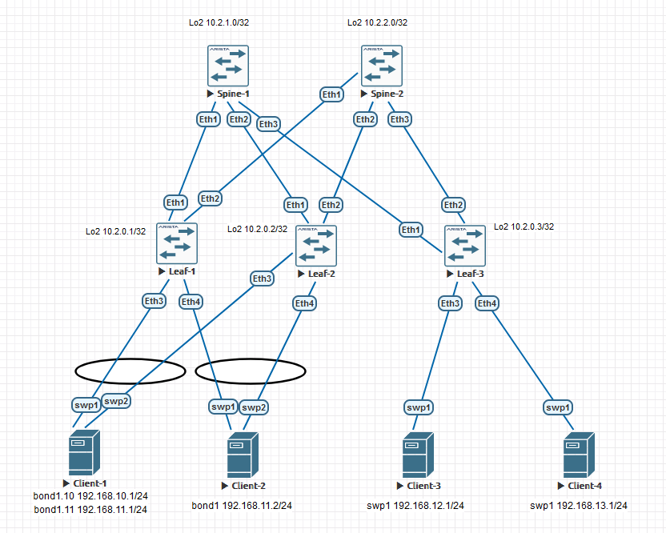

### VxLAN. Аналоги VPC.

### Цели:
- 1: Настроить отказоустойчивое подключение клиентов с использованием EVPN Multihoming.
- 2: Протестировать отказоустойчивость - убедиться, что связность не теряется при отключении одного из линков

### Собрана топология:

### Особенности настройки:
Настройки underlay и overlay для L2 и L3 VNI унаследованы с предыдущей лабы №6. 
На Leaf-1 и Leaf-2 настроен ESI LAG, 1-й портченнел в сторону Client-1 в режиме trunk для двух vlan 10 и 11, 2-й портченнел в сторону Client-2 в режиме access vlan 11. 
Client-3 и Client-4 имеют single homed подключения в vlan 12 и vlan 13 соответственно. 
Spine/Leaf - Arista, Clients - Cumulus linux.

### IP план:
Device|Interface|IP Address|Subnet Mask|Default GW
---|---|---|---|---
Spine-1|Lo1|10.0.1.0|255.255.255.255
-|Lo2|10.2.1.0|255.255.255.255
-|Eth1|10.4.1.0|255.255.255.254
-|Eth2|10.4.1.2|255.255.255.254
-|Eth3|10.4.1.4|255.255.255.254
Spine-2|Lo1|10.0.2.0|255.255.255.255
-|Lo2|10.2.2.0|255.255.255.255
-|Eth1|10.4.2.0|255.255.255.254
-|Eth2|10.4.2.2|255.255.255.254
-|Eth3|10.4.2.4|255.255.255.254
Leaf-1|Lo1|10.0.0.1|255.255.255.255
-|Lo2|10.2.0.1|255.255.255.255
-|Eth1|10.4.1.1|255.255.255.254
-|Eth2|10.4.2.1|255.255.255.254
-|vlan10|192.168.10.254|255.255.255.0
-|vlan11|192.168.11.254|255.255.255.0
Leaf-2|Lo1|10.0.0.2|255.255.255.255
-|Lo2|10.2.0.2|255.255.255.255
-|Eth1|10.4.1.3|255.255.255.254
-|Eth2|10.4.2.3|255.255.255.254
-|vlan10|192.168.10.254|255.255.255.0
-|vlan11|192.168.11.254|255.255.255.0
Leaf-3|Lo1|10.0.0.3|255.255.255.255
-|Lo2|10.2.0.3|255.255.255.255
-|Eth1|10.4.1.5|255.255.255.254
-|Eth2|10.4.2.5|255.255.255.254
-|vlan12|192.168.12.254|255.255.255.0
-|vlan13|192.168.13.254|255.255.255.0
Client-1|bond1.10|192.168.10.1|255.255.255.0|192.168.10.254
-|bond1.11|192.168.11.1|255.255.255.0|192.168.11.254
Client-2|bond1|192.168.11.2|255.255.255.0|192.168.11.254
Client-3|swp1|192.168.12.1|255.255.255.0|192.168.12.254
Client-4|swp1|192.168.13.1|255.255.255.0|192.168.13.254

#### Конфигурация на оборудовании Arista.

 Spine-1 

# 
Spine-1#sh run 
! Command: show running-config 
! device: Spine-1 (vEOS-lab, EOS-4.29.2F) 
! 
! boot system flash:/vEOS-lab.swi 
! 
no aaa root 
! 
transceiver qsfp default-mode 4x10G 
! 
service routing protocols model multi-agent 
! 
hostname Spine-1 
! 
spanning-tree mode mstp 
! 
interface Ethernet1 
   description Leaf-1 | Eth1 
   mtu 9214 
   no switchport 
   ip address 10.4.1.0/31 
   ip ospf network point-to-point 
   ip ospf area 0.0.0.0 
! 
interface Ethernet2 
   description Leaf-2 | Eth1 
   mtu 9214 
   no switchport 
   ip address 10.4.1.2/31 
   ip ospf network point-to-point 
   ip ospf area 0.0.0.0 
! 
interface Ethernet3 
   description Leaf-3 | Eth1 
   mtu 9214 
   no switchport 
   ip address 10.4.1.4/31 
   ip ospf network point-to-point 
   ip ospf area 0.0.0.0 
! 
interface Loopback1 
   description Underlay 
   ip address 10.0.1.0/32 
   ip ospf area 0.0.0.0 
! 
interface Loopback2 
   description Overlay 
   ip address 10.2.1.0/32 
   ip ospf area 0.0.0.0 
! 
ip routing 
! 
router bgp 65000 
   neighbor evpn peer group 
   neighbor evpn next-hop-unchanged 
   neighbor evpn update-source Loopback2 
   neighbor evpn ebgp-multihop 3 
   neighbor evpn send-community extended 
   neighbor 10.2.0.1 peer group evpn 
   neighbor 10.2.0.1 remote-as 65001 
   neighbor 10.2.0.2 peer group evpn 
   neighbor 10.2.0.2 remote-as 65002 
   neighbor 10.2.0.3 peer group evpn 
   neighbor 10.2.0.3 remote-as 65003 
   ! 
   address-family evpn 
      neighbor evpn activate 
! 
router ospf 1 
   router-id 10.0.1.0 
   auto-cost reference-bandwidth 10000 
   passive-interface default 
   no passive-interface Ethernet1 
   no passive-interface Ethernet2 
   no passive-interface Ethernet3 
   network 0.0.0.0/0 area 0.0.0.0 
   max-lsa 12000 

 Spine-2 

# 
Spine-2#sh run 
! Command: show running-config 
! device: Spine-2 (vEOS-lab, EOS-4.29.2F) 
! 
! boot system flash:/vEOS-lab.swi 
! 
no aaa root 
! 
transceiver qsfp default-mode 4x10G 
! 
service routing protocols model multi-agent 
! 
hostname Spine-2 
! 
spanning-tree mode mstp 
! 
interface Ethernet1 
   description Leaf-1 | Eth1 
   mtu 9214 
   no switchport 
   ip address 10.4.2.0/31 
   ip ospf network point-to-point 
   ip ospf area 0.0.0.0 
! 
interface Ethernet2 
   description Leaf-2 | Eth1 
   mtu 9214 
   no switchport 
   ip address 10.4.2.2/31 
   ip ospf network point-to-point 
   ip ospf area 0.0.0.0 
! 
interface Ethernet3 
   description Leaf-3 | Eth1 
   mtu 9214 
   no switchport 
   ip address 10.4.2.4/31 
   ip ospf network point-to-point 
   ip ospf area 0.0.0.0 
! 
interface Loopback1 
   description Underlay 
   ip address 10.0.2.0/32 
   ip ospf area 0.0.0.0 
! 
interface Loopback2 
   description Overlay 
   ip address 10.2.2.0/32 
   ip ospf area 0.0.0.0 
! 
ip routing 
! 
router bgp 65000 
   neighbor evpn peer group 
   neighbor evpn next-hop-unchanged 
   neighbor evpn update-source Loopback2 
   neighbor evpn ebgp-multihop 3 
   neighbor evpn send-community extended 
   neighbor 10.2.0.1 peer group evpn 
   neighbor 10.2.0.1 remote-as 65001 
   neighbor 10.2.0.2 peer group evpn 
   neighbor 10.2.0.2 remote-as 65002 
   neighbor 10.2.0.3 peer group evpn 
   neighbor 10.2.0.3 remote-as 65003 
   ! 
   address-family evpn 
      neighbor evpn activate 
! 
router ospf 1 
   router-id 10.0.2.0 
   auto-cost reference-bandwidth 10000 
   passive-interface default 
   no passive-interface Ethernet1 
   no passive-interface Ethernet2 
   no passive-interface Ethernet3 
   network 0.0.0.0/0 area 0.0.0.0 
   max-lsa 12000 

 Leaf-1 

 
Leaf-1#show running-config  
! Command: show running-config 
! device: Leaf-1 (vEOS-lab, EOS-4.29.2F) 
! 
! boot system flash:/vEOS-lab.swi 
! 
no aaa root 
! 
transceiver qsfp default-mode 4x10G 
! 
service routing protocols model multi-agent 
! 
hostname Leaf-1 
! 
spanning-tree mode mstp 
! 
vlan 10 
   name data1 
! 
vlan 11 
   name data2 
! 
vrf instance vrf-vxlan 
! 
interface Port-Channel1 
   switchport trunk allowed vlan 10-11 
   switchport mode trunk 
   ! 
   evpn ethernet-segment 
      identifier 00cc:cccc:cccc:cccc:cccc 
      route-target import cc:cc:cc:cc:cc:cc 
   lacp system-id 1111.1111.1111 
! 
interface Port-Channel2 
   switchport access vlan 11 
   ! 
   evpn ethernet-segment 
      identifier 00dd:dddd:dddd:dddd:dddd 
      route-target import dd:dd:dd:dd:dd:dd 
   lacp system-id 1111.1111.1111 
! 
interface Ethernet1 
   description Spine-1 | Eth1 
   mtu 9214 
   no switchport 
   ip address 10.4.1.1/31 
   ip ospf network point-to-point 
   ip ospf area 0.0.0.0 
! 
interface Ethernet2 
   description Spine-2 | Eth1 
   mtu 9214 
   no switchport 
   ip address 10.4.2.1/31 
   ip ospf network point-to-point 
   ip ospf area 0.0.0.0 
! 
interface Ethernet3 
   channel-group 1 mode active 
! 
interface Ethernet4 
   channel-group 2 mode active 
! 
interface Loopback1 
   description Underlay 
   ip address 10.0.0.1/32 
   ip ospf area 0.0.0.0 
! 
interface Loopback2 
   description Overlay 
   ip address 10.2.0.1/32 
   ip ospf area 0.0.0.0 
! 
interface Vlan10 
   vrf vrf-vxlan 
   ip address virtual 192.168.10.254/24 
! 
interface Vlan11 
   vrf vrf-vxlan 
   ip address virtual 192.168.11.254/24 
! 
interface Vxlan1 
   vxlan source-interface Loopback2 
   vxlan udp-port 4789 
   vxlan vlan 10 vni 1010 
   vxlan vlan 11 vni 1011 
   vxlan vrf vrf-vxlan vni 50000 
   vxlan learn-restrict any 
! 
ip virtual-router mac-address 00:00:11:22:33:44 
! 
ip routing 
ip routing vrf vrf-vxlan 
! 
router bgp 65001 
   neighbor evpn peer group 
   neighbor evpn remote-as 65000 
   neighbor evpn update-source Loopback2 
   neighbor evpn ebgp-multihop 3 
   neighbor evpn send-community extended 
   neighbor 10.2.1.0 peer group evpn 
   neighbor 10.2.2.0 peer group evpn 
   ! 
   vlan 10 
      rd 65001:1010 
      route-target both 10:1010 
      redistribute learned 
   ! 
   vlan 11 
      rd 65001:1011 
      route-target both 11:1011 
      redistribute learned 
   ! 
   address-family evpn 
      neighbor evpn activate 
   ! 
   vrf vrf-vxlan 
      rd 10.2.0.1:1 
      route-target import evpn 1:50000 
      route-target export evpn 1:50000 
      redistribute connected 
! 
router ospf 1 
   router-id 10.0.0.1 
   auto-cost reference-bandwidth 10000 
   passive-interface default 
   no passive-interface Ethernet1 
   no passive-interface Ethernet2 
   network 0.0.0.0/0 area 0.0.0.0 
   max-lsa 12000 

 Leaf-2 

 
Leaf-2#show run 
! Command: show running-config 
! device: Leaf-2 (vEOS-lab, EOS-4.29.2F) 
! 
! boot system flash:/vEOS-lab.swi 
! 
no aaa root 
! 
transceiver qsfp default-mode 4x10G 
! 
service routing protocols model multi-agent 
! 
hostname Leaf-2 
! 
spanning-tree mode mstp 
! 
vlan 10 
   name data1 
! 
vlan 11 
   name data2 
! 
vrf instance vrf-vxlan 
! 
interface Port-Channel1 
   switchport trunk allowed vlan 10-11 
   switchport mode trunk 
   ! 
   evpn ethernet-segment 
      identifier 00cc:cccc:cccc:cccc:cccc 
      route-target import cc:cc:cc:cc:cc:cc 
   lacp system-id 1111.1111.1111 
! 
interface Port-Channel2 
   switchport access vlan 11 
   ! 
   evpn ethernet-segment 
      identifier 00dd:dddd:dddd:dddd:dddd 
      route-target import dd:dd:dd:dd:dd:dd 
   lacp system-id 1111.1111.1111 
! 
interface Ethernet1 
   description Spine-1 | Eth2 
   mtu 9214 
   no switchport 
   ip address 10.4.1.3/31 
   ip ospf network point-to-point 
   ip ospf area 0.0.0.0 
! 
interface Ethernet2 
   description Spine-2 | Eth2 
   mtu 9214 
   no switchport 
   ip address 10.4.2.3/31 
   ip ospf network point-to-point 
   ip ospf area 0.0.0.0 
! 
interface Ethernet3 
   channel-group 1 mode active 
! 
interface Ethernet4 
   channel-group 2 mode active 
! 
interface Ethernet5 
! 
interface Ethernet6 
! 
interface Ethernet7 
! 
interface Ethernet8 
! 
interface Loopback1 
   description Underlay 
   ip address 10.0.0.2/32 
   ip ospf area 0.0.0.0 
! 
interface Loopback2 
   description Overlay 
   ip address 10.2.0.2/32 
   ip ospf area 0.0.0.0 
! 
interface Management1 
! 
interface Vlan10 
   vrf vrf-vxlan 
   ip address virtual 192.168.10.254/24 
! 
interface Vlan11 
   vrf vrf-vxlan 
   ip address virtual 192.168.11.254/24 
! 
interface Vxlan1 
   vxlan source-interface Loopback2 
   vxlan udp-port 4789 
   vxlan vlan 10 vni 1010 
   vxlan vlan 11 vni 1011 
   vxlan vrf vrf-vxlan vni 50000 
   vxlan learn-restrict any 
! 
ip virtual-router mac-address 00:00:11:22:33:44 
! 
ip routing 
ip routing vrf vrf-vxlan 
! 
router bgp 65002 
   neighbor evpn peer group 
   neighbor evpn remote-as 65000 
   neighbor evpn update-source Loopback2 
   neighbor evpn ebgp-multihop 3 
   neighbor evpn send-community extended 
   neighbor 10.2.1.0 peer group evpn 
   neighbor 10.2.2.0 peer group evpn 
   ! 
   vlan 10 
      rd 65002:1010 
      route-target both 10:1010 
      redistribute learned 
   ! 
   vlan 11 
      rd 65002:1011 
      route-target both 11:1011 
      redistribute learned 
   ! 
   address-family evpn 
      neighbor evpn activate 
   ! 
   vrf vrf-vxlan 
      rd 10.2.0.2:1 
      route-target import evpn 1:50000 
      route-target export evpn 1:50000 
      redistribute connected 
! 
router ospf 1 
   router-id 10.0.0.2 
   auto-cost reference-bandwidth 10000 
   passive-interface default 
   no passive-interface Ethernet1 
   no passive-interface Ethernet2 
   network 0.0.0.0/0 area 0.0.0.0 
   max-lsa 12000 

 Leaf-3 

 
Leaf-3#show running-config  
! Command: show running-config 
! device: Leaf-3 (vEOS-lab, EOS-4.29.2F) 
! 
! boot system flash:/vEOS-lab.swi 
! 
no aaa root 
! 
transceiver qsfp default-mode 4x10G 
! 
service routing protocols model multi-agent 
! 
hostname Leaf-3 
! 
spanning-tree mode mstp 
! 
vlan 12 
   name Client-3 
! 
vlan 13 
   name Client-4 
! 
vrf instance vrf-vxlan 
! 
interface Ethernet1 
   description Spine-1 | Eth1 
   mtu 9214 
   no switchport 
   ip address 10.4.1.5/31 
   ip ospf network point-to-point 
   ip ospf area 0.0.0.0 
! 
interface Ethernet2 
   description Spine-2 | Eth1 
   mtu 9214 
   no switchport 
   ip address 10.4.2.5/31 
   ip ospf network point-to-point 
   ip ospf area 0.0.0.0 
! 
interface Ethernet3 
   switchport access vlan 12 
! 
interface Ethernet4 
   switchport access vlan 13 
! 
interface Loopback1 
   description Underlay 
   ip address 10.0.0.3/32 
   ip ospf area 0.0.0.0 
! 
interface Loopback2 
   description Overlay 
   ip address 10.2.0.3/32 
   ip ospf area 0.0.0.0 
! 
interface Vlan12 
   vrf vrf-vxlan 
   ip address virtual 192.168.12.254/24 
! 
interface Vlan13 
   vrf vrf-vxlan 
   ip address virtual 192.168.13.254/24 
! 
interface Vxlan1 
   vxlan source-interface Loopback2 
   vxlan udp-port 4789 
   vxlan vlan 12 vni 1012 
   vxlan vlan 13 vni 1013 
   vxlan vrf vrf-vxlan vni 50000 
   vxlan learn-restrict any 
! 
ip virtual-router mac-address 00:00:11:22:33:44 
! 
ip routing 
ip routing vrf vrf-vxlan 
! 
router bgp 65003 
   neighbor evpn peer group 
   neighbor evpn remote-as 65000 
   neighbor evpn update-source Loopback2 
   neighbor evpn ebgp-multihop 3 
   neighbor evpn send-community extended 
   neighbor 10.2.1.0 peer group evpn 
   neighbor 10.2.2.0 peer group evpn 
   ! 
   vlan 12 
      rd 65003:1012 
      route-target both 12:1012 
      redistribute learned 
   ! 
   vlan 13 
      rd 65003:1013 
      route-target both 13:1013 
      redistribute learned 
   ! 
   address-family evpn 
      neighbor evpn activate 
   ! 
   vrf vrf-vxlan 
      rd 10.2.0.3:1 
      route-target import evpn 1:50000 
      route-target export evpn 1:50000 
      redistribute connected 
! 
router ospf 1 
   router-id 10.0.0.3 
   auto-cost reference-bandwidth 10000 
   passive-interface default 
   no passive-interface Ethernet1 
   no passive-interface Ethernet2 
   network 0.0.0.0/0 area 0.0.0.0 
   max-lsa 12000 

