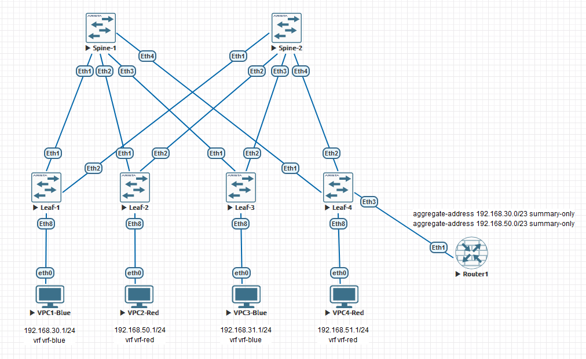

### VxLAN. Routing.

### Цели:
- 1: Реализовать передачу суммарных префиксов через EVPN route-type 5.

### Собрана топология:

### Особенности настройки:
Настройки underlay OSPF и overlay eBGP. 
На Leaf-4 настроены BGP сессии в address-family ipv4 в vrf vrf-blue и vrf-red с Router-1. 
Настроена опция allowas-in 2 на Leaf-4, allowas-in 1 на Spine-1, Spine-2. 
На Router-1 настроены суммарные маршруты и анонс только суммарных префиксов: 
aggregate-address 192.168.30.0/23 summary-only 
aggregate-address 192.168.50.0/23 summary-only 

### IP план:
